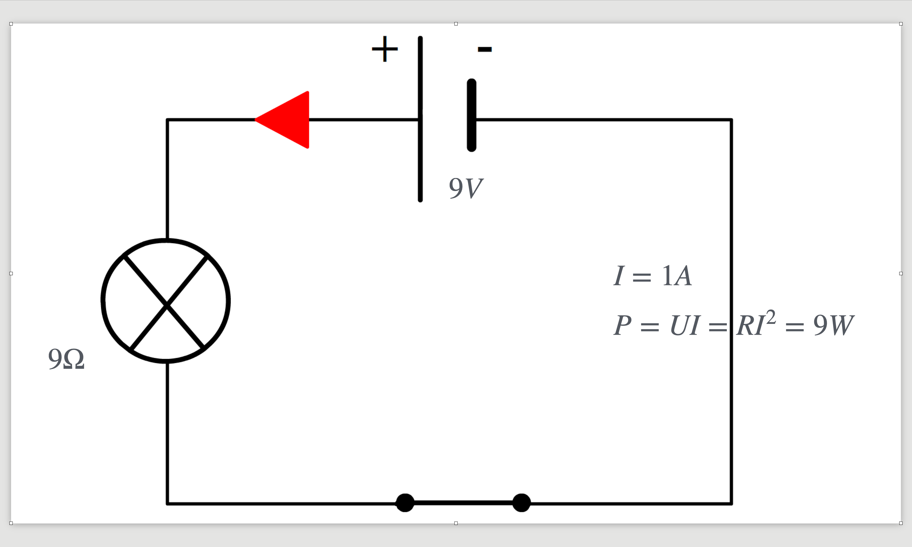

# CAP Elec 1.02 AC : DC
## Foley Services Elec - [Programme 1ère partie](../README.md)

### 1.02 AC : DC

- **Accès à la vidéo** [1.02 AC : DC](https://youtu.be/ZubeDL4bBZ0)

#### Intro

Leçon sur l'électricité en général, courant alternatif, courant continu

Electricité = mouvement des électrons dans la matière (conducteur)

- Effets de l'électricité sur les appareils, qui sont au nombre de trois:
 - Effet thermique: filamemnt d'une ampoule incandescent qui produit un effet de brillance,
 - Effet magnétique: courant qui passe dans une bobine qui crée un mouvement
 - Effet chimique: comme c'est le cas si on plonge deux pièces métalliques dan sun citron

#### Courant alternatif

- Comment produire l'électricité, on parle essentiellement d'aimants
 - On utilise un mouvement entrainant une révolution de l'aimant, avec des moyens hydrauliques ou thermiques (charbon)
 - La révolution de l'aimant (elle tourne sur elle-même, entraînée par la force hydaulique, par exemple) induit dans une bonie un champ magnétique, qui à son tour provoque un mouvement des électrons dan sla bobnie et dans le conducteur attaché au bout de celle-ci. La différence de potentiel est fonction de la position de l'aimant par rapport à la bobine et est maximum lorsque la bobine ets perpendiculaire à la bobine. En tenant compte de l'orientation (une fois que laimant a effectué un demi-tour), la courbe décrivant la différence de potentiel est sinusoïdale.
 - [Voir cette animation](https://www.youtube.com/watch?v=OcxibZt9wu8&ab_channel=Hachette%C3%89ducation)
 - La vitesse de révolution de l'aimant donne la "fréquence du réseau". En France la fréquence du réseau est de 50Hz (50 révolutions par seconde), donc la période de révolution est de 20ms (puisque 1 sec = 1000ms, et que 50 * 20 = 1000).
 - On est ici face à un cournt alternatif puisque la révolution de l'aimant induit un mouvement des électrons dan sun sens (dans le filament de l'ampoule, disons), puis dans l'autre, et ainsi de suite.
 - Dans le cas d'une amoule incandescente, le filament n'a pas le temps de "s'éteindre" puisqu'il s'agit d'un phénomène thermique. A la différence des ampoules LED ou fluorescentes (effet stroboscopique, à venir).

#### Courant continu

- Remarque historique sur le débat entre Tesla (tenant du courant alternatif, plus pratique pour changer la tension à l'iade de transformateurs) et Edison (tenant du courant continu).

- On utilise une "source" (une pile, par exemple). La tension est déterminée par la source.
- Pile, batterie, ou plus généralement accumulateurs (panneaux photovoltaïques).
 - Exemple des appareils portatifs (visseuse, perceuse sans fil, etc.). Remarque sur les chargeurs qui doivent convertir le courant alternatif en courant continu afin de recharger les piles (ça viendra plus tard).

- Démonstration de l'égalité de la puissance produite par les deux systèmes, alternatif ou continu. On considère le seuil = tension effective (dans l'exemple 9V). L'aire sous la courbe (mais au-dessus du seuil, coincide avec les région sous le seuil mais au-dessus de la courbe. Dans le cas du courant continu, la piuissance est égale à l'aire du rectangle (continu = tension constante), et par un jeu de "compensation" coincide avec  l'aire sous la courbe (avec les correspondances etc.). Les deux système sont même puissance.

