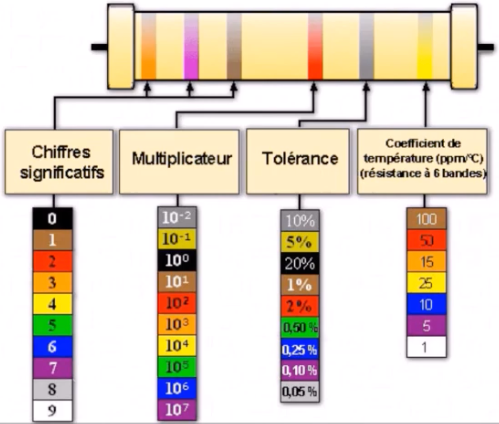
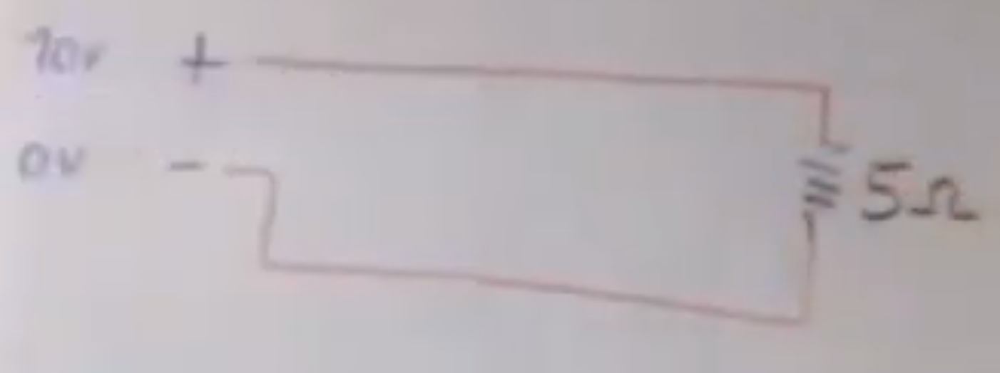
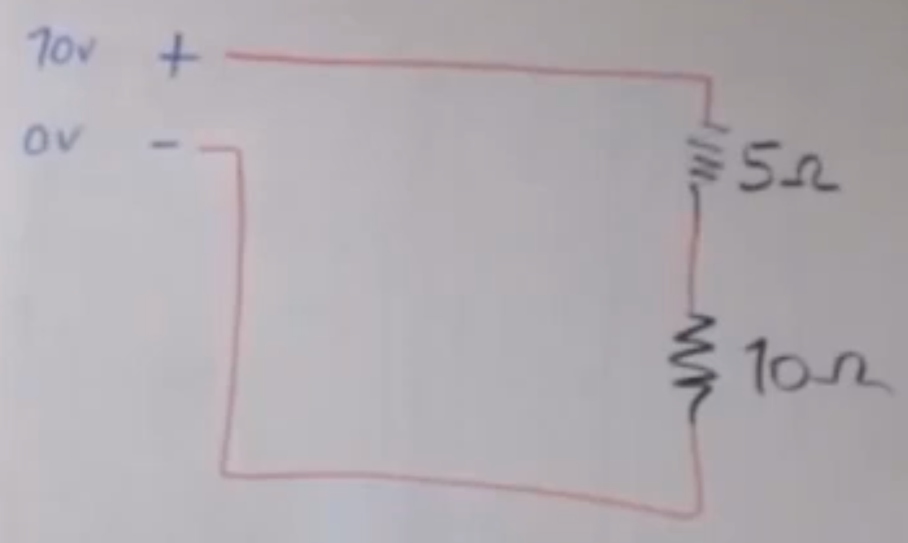
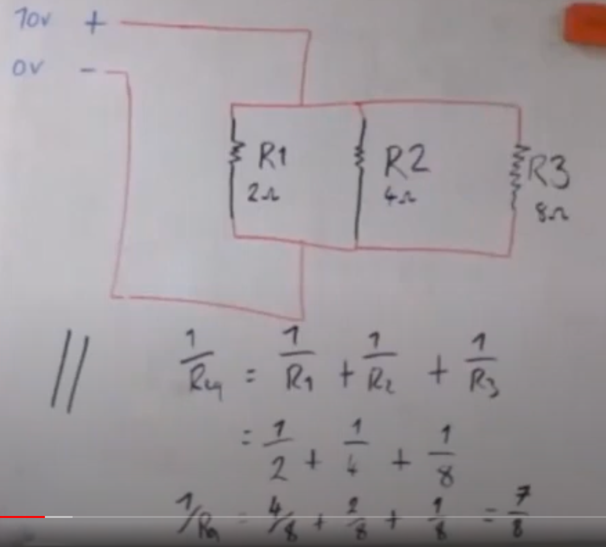
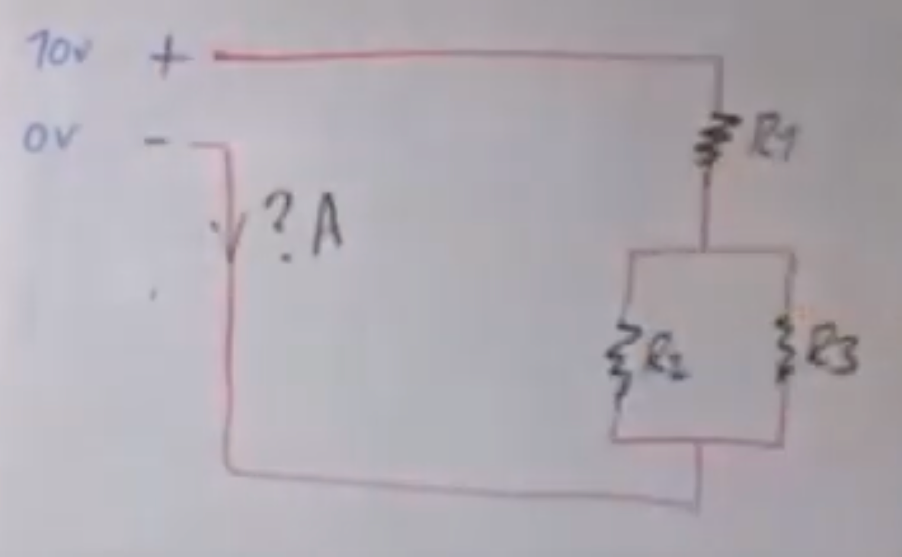
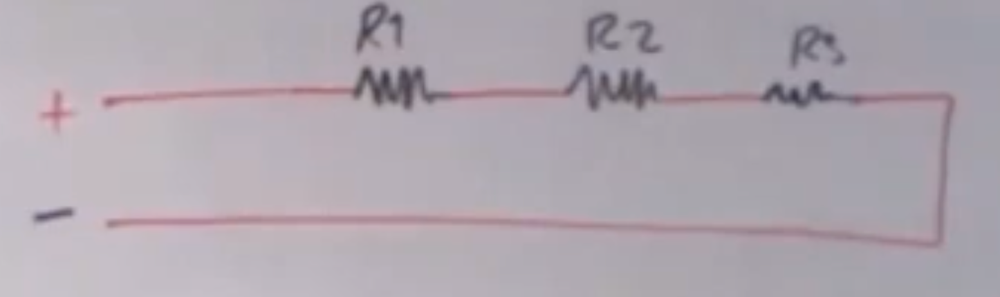
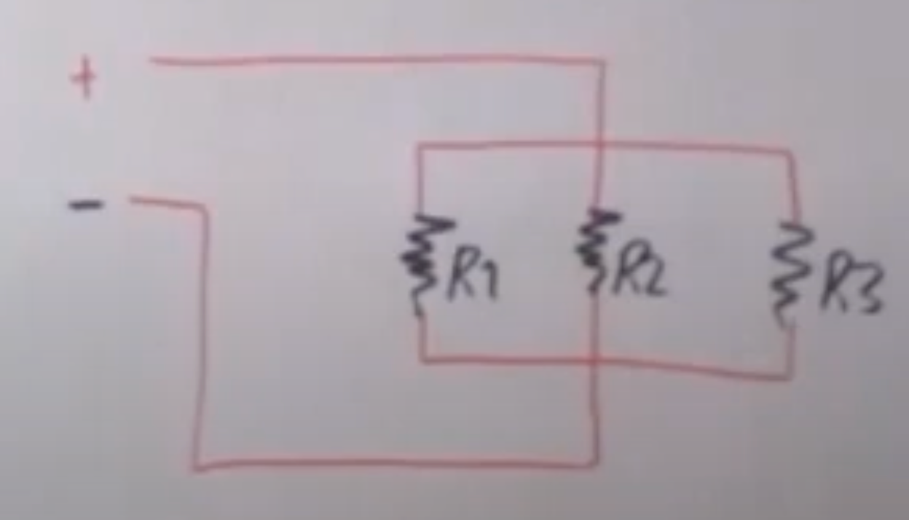

# CAP Elec 1.03 Résistances
## Foley Services Elec - [Programme 1ère partie](CAP Elec.md)

### 1.03 Résistances

- **Accès à la vidéo** [1.03 Résistances](https://youtu.be/ngCHGVHVL3k)

#### Intro

Exemple de résistance sur carte électronique (reconnaissable au code couleur) 

#### Circuit et résistances

Cas simple, une seule résistance. Donnés la valeur de la résistance ($$R = 5\Omega$$) et la différence de potentiel (les bornes - et + d'une source à $$0 V$$ et $$10 V$$ respectivement, donc une différence de potentiel de $$U = 10 V$$), on a donc un courant d'une intensité de $$2A = I = U/R$$.

**Deux résistances en série**

*Remarque*. Sens conventionnel de circulation du courant dan un circuit: de la borne négative vers la borne positive (alors qu'on a longtemps pensé le contraire, jusqu'à ce qu'ont puisse réellement observé le mouvement des électrons).

Résistance totale ou résistance équivalent: si deux résistances $$R1, R2$$ sont en série alors la résistance totale est $$R_{totale} = R_1 + R_2$$.

Dans l'exemple, l'intensité du courant est donc de $$I = U/R = \frac{U}{R1 + R2} = 10/15 = 2/3$$.

Ainsi, la résistance totale est donc toujours supérieur à la résistance maximum présente dans le circuit puisque $$R_1 + R_2 \geq \max(R_1, R_2)$$ dès lors que $$R_1, R_2 \geq 0$$.

Dans un circuit avec $$k$$ résistances de même valeur $$R$$, la résistance totale est de $$k \cdot R$$.

**Deux résistances en parallèle**

Analogie avec le flux d'un cours d'eau qui se partage entre deux chemins. 

Chacune des résistances est alors soumise à la même différence de potentiel, celle du circuit (dans l'exemple $$U = 10 V$$).

On peut calculer l'intensité dans chacune des "bracnehs" du circuit en appliquant la formule $$I_1 = U/R_1$$, $$I_2 = U/R_2$$. L'intensité du circuit est alors égale à la somme $$I_1 + I_2 = U \cdot \frac{R_1 \cdot R_2}{R_1 + R_2}$$.

Dans l'exemple, si $$R_1 = 2\Omega$$ et $$R_2 = 8\Omega$$, puisque la différence de potentiel est de $$U = 10V$$, on trouve une intensité de $$I_1 + I_2 = 5A + 1.25A = 6.25A$$.

**Trois résistances en parallèle**

Dans le cas à deux résistances en parallèle, cela suit de $$\frac{R_1 \cdot R_2}{R_1 + R_2} \leq R_1$$ et $$\frac{R_1 \cdot R_2}{R_1 + R_2} \leq R_2$$, puisque $$\frac{R_1}{R_1 + R_2} \leq 1$$ et $$\frac{R_2}{R_1 + R_2} \leq 1$$.

On a: $$I_1 = U/R_1$$, $$I_2 = U/R_2$$, $$I_3 = U/R_3$$

D'où: $$I = I_1 + I_2 + I_3 = U \cdot (\frac{1}{R_1} + \frac{1}{R_2} + \frac{1}{R_3})$$ et donc $$\frac{1}{R} = (\frac{1}{R_1} + \frac{1}{R_2} + \frac{1}{R_3})$$.

Dans l'exemple, $$R_1 = 2\Omega, R_2 = 4\Omega, R_3 = 8\Omega$$, on trouve $$R_{eq} = 8/7 = 1.14\Omega$$, et donc $$I = U/R_{eq} = 8,75A$$.

***Cas particulier*** de $$k$$ résistances en parallèle de même valeur $$R$$, on a alors $$R_{eq} = R/k$$.

*Remarque*. Dans un circuit en parallèle, la résistance totale est inférieure au minimum des résistances présentes dans le circuit, ou de manière équivalente $$1/R_{eq} > 1/\min(R_i)$$.

Cela suit de $$1/R_{eq} > 1/R_i$$ pour tout $$i$$, en particulier lorsque $$R_i = \min(R_1, \ldots, R_k)$$.

**Résistances en série et parallèle dans un même circuit**

On traite le circuit de manière "modulaire", en calculant le résistance équivalent des parties en parallèle, qui sont ensuite vues comme une résistance en série avec les autres résistances du circuit.

Dans l'exemple, on a le résistance équivalent de la partie en parallèle est $$\frac{R_2 \cdot R_3}{R_2+R_3}$$, en série avec
la résistance $$R_1$$. Le résistance équivalent du circuit est donc $$R_1 + \frac{R_2 \cdot R_3}{R_2+R_3}$$.

**Comment se distribue la tension le long d'un corcuit**

Cela suit des équatiosn qui définissent le résistance équivalent.

Les différences de potentiel aux extrémités de chacun des résistances $$U_1, U_2, U_3$$, parce que l'intensité est la même dans tout le circuit ($$I = I_1 = I_2 = I_3$$), sont telles que $$U = U_1 + U_2 + U_3$$. (On généralise à $$k$$ résistances.) La différence de potentielle aux extrémités de deux résistances est égale à $$U_1 + U_2$$ (pour $$R_1$$ et $$R_2$$). Etc.

Dans le cas de résistance en parallèle, on a la même tension aux bornes de chacune des résistances $$U = U_1 = U_2 = U_3$$ (c'est ce qu'on veut typiquement dans une installation domestique, par exemple).

Dans ce cas, l'intensité se "distribue" entre les résistances, c'est-à-dire qu'on a $$I = I_1 + I_2 + I_3$$. La différence de potentielle étant la même aux bornes de chaque résistance, on a donc $$I_1 = U/R_1$$, $$I_2 = U/R_2$$ et $$I_3 = U/R_3$$.