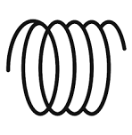
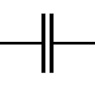

# CAP Elec 1.03B Impédance
## Foley Services Elec - [Programme 1ère partie](../1ere_partie/README.md)

### 1.03B Impédance

- **Accès à la vidéo** [1.03B Impédance](https://youtu.be/2CV95VA8dQQ)

#### Intro

Les résistances s'opposent au passage du courant, on les trouve naturellement dans les circuits (c'est souvent l'objet du circuit, la résistance apporte l'éclairage ou le chauffage, etc.)

Il existe aussi d'autres composants qui opposent une résistance et qui sont:

-  les bobines, présent dans les télérupteurs, par exemple
 - On note $$X_L$$ la *réactance* d'une bobine

-  les condensateurs, présents en électronique mais aussi dans certains appareils (éclairage fluorescent, par exemple).
 - On note $$X_C$$ la *réactance* d'un condensateur

Les résistances induites par ces différents éléments ne s'additionnent pas (comme on l'a fait pour les résistances dans la leçon précédente), bien qu'on puisse calculer la résistance totale qu'amène ces dispositifds dans un circuit à l'aide de la formule:

$$Z = \sqrt{R^2 + (X_L - X_C)^2)}$$

L'***impédance***, qu'on désigne par la lettre $$Z$$, est la valeur (en Ohms $$\Omega$$) induite par l'ensemble de ces dispostifs dans un circuit.