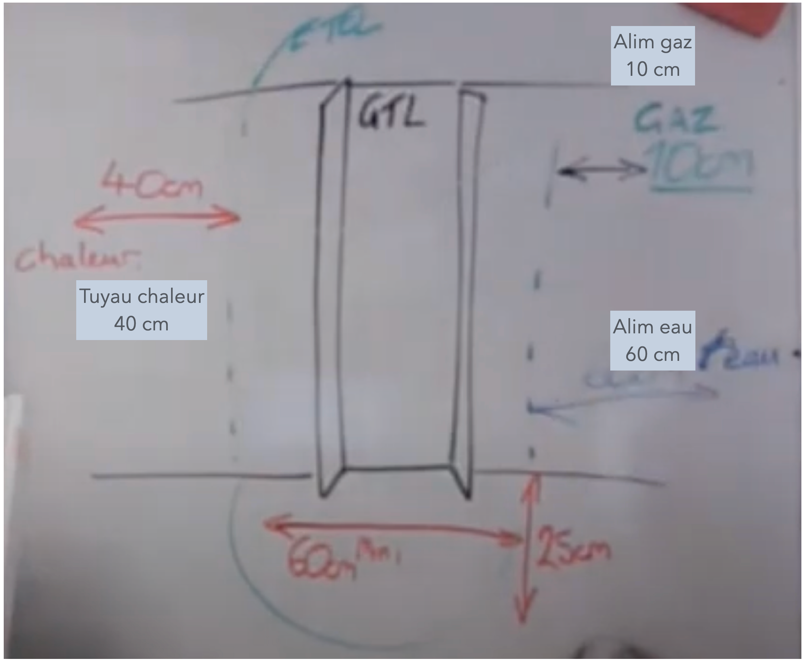
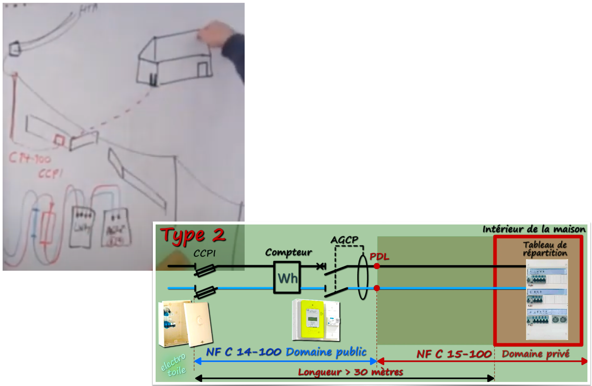

# CAP Elec 1.04 GTL & ETEL
## Foley Services Elec - [Programme 1ère partie](../1ere_partie/README.md)

### 1.04 GTL & ETEL

- **Accès à la vidéo** [1.04 GTL & ETEL](https://youtu.be/xuFOlUG-MCU)

#### Intro

- GTL : gaine technique du logement
- ETEL: espace technique électrique du logement, destiné à contenir la gaine technique du logement (GTL)

#### GTL

La GTL est ***obligatoire*** dans toute installation privée. La norme oblige à ce que le passage des câbles (coureant faible, courant fort) soit logée dans une gaine (jusqu'au tableau).

Les fabricants jouent d'une ambiguité, avec ce qui est appelée la ***goulotte*** technique de logement (GTL). Mais la goulotte n'est pas obligatoire, les câbles pourraient très bien être logés derrière une plaque de placo-plâtre sconstituant la gaine technique de logement (pas forcément la meilleure solution ...).

La GTL est souvent proposée en deux sections pour faciliter le transport (par qu'elel fait jusqu'à 2,60m pour couvrir le mur sur toute la hauteur). Certains modèles sont équipés de ressort aux pieds pour faciliter le plaquage dela GTL au niveau du plafond lors de son installation.

Les deux sections seront être installées pour "couvrir le mur où se font les arrivées de câbles, le tableau venant se fixer sur la GTL. L'arrivée du fournisseur arrive souvent par le bas, l'alimentaiton du portail, extérieur etc. repart (souvent) vers le bas, alors que l'alimentaiton des différentes pièces du logement vont repartir vers le haut (dans le combles). On a parfois des gaines de gros diamètre à loger dans la gaine, pour lesquels les fabricants ont prévus des "avaloirs" qui élargissent les extrémités haute ou basse de la GTL.

Remarques concernant la fixation du tableau sur la GTL, de manière à éviter que les vis de fixation ne gêne ultérieurement.

#### Tableau et GTL

La norme impose au minimum l'utilisation de deux rangées, et de deux disjoncteurs différentiels.

Remarques sur le couvercle des tableaux Legrand versus Hager autres marques, qui exigent de prévoir un écart entre deux tableaux superposés au moment de la pose.

##### Hauteur du tableau

"""

Il faut consulter la section dédiée de la norme NF C 15-100. Celle-ci indique les hauteurs réglementaires d’accessibilité et de sécurité.

Voici ce qu’elle dit à propos du positionnement du tableau électrique :

La manette du disjoncteur d’abonné, aussi appelé dispositif de coupure d’urgence, doit être située à une hauteur comprise entre 0,90 m et 1,80 m.
Les manettes des disjoncteurs divisionnaires (installés sur le tableau électrique) doivent être situées à une hauteur comprise entre 1 m et 1,80 m, mais la hauteur minimale est ramenée à 0,50 m lorsque le coffret électrique est protégé par une porte.

Ces indications de hauteur ont un but de protection. Les manettes des disjoncteurs doivent être aisément accessibles aux adultes, tout en étant protégées des manipulations par les enfants. C’est pourquoi une hauteur minimale de 1 m est spécifiée, et 0,50 m si une porte sécurise l’accès au coffret.

À cela, le décret accessibilité ajoute des spécificités pour les locaux habités par des personnes handicapées ou âgées. Ainsi :

la hauteur maximale réglementaire passe à 1,30 m pour le disjoncteur général ;
elle est située entre 0,90 m et 1,30 m pour tous les dispositifs de commande dont les manettes des disjoncteurs du tableau électrique.

Cela, dans le but de faciliter l’accessibilité des dispositifs de commande. Des règles idoines s’appliquent pour le coffret de communication, avec une hauteur maximale recommandée de 1,30 m pour ses dispositifs, dans tous les cas de figure.

"""

([Tiré du site Legrand](https://www.legrand.fr/questions-frequentes/a-quelle-hauteur-doit-on-installer-un-tableau-electrique#:~:text=Les%20manettes%20des%20disjoncteurs%20divisionnaires,est%20prot%C3%A9g%C3%A9%20par%20une%20porte.))

#### ETEL

Cet espace exclut toute autre occupation que par du matériel concernant l'installation  électrique, et en pratique il assure d'un esapce minimum pour avoir accès à la GTL et au tableau(x).

Exemple de l'ETEL et GTL au fond du placard. La norme n'interdit pas que l'ETEL soit dans un placard, mais le tableau doit être en fon dde placard et non pas sur le côté (pour éviter que des choses bloquent l'accès facile à la façade du tableau).

**Interdictions** (Promotelec) Il est interdit d'installer le tableau:

- dans la salle d'eau / salle de bain (volume 0, 1, 2, volume caché)
- au dessus ou au-dessous d'un point d'eau
- au dessus ou au-dessous d'un appareil de cuisson
- au dessus ou au-dessous d'un appareil de chauffage

Il est déconseillé d'installer le tableau:

- dans la salle d'eau (hors volume)
- dans les volées d'escalier
- WC
- placard, penderie

Installation dans un garage:

- Problème avec certains équipements, notamment électronique, qui souffrent des écarts de température, humidité ambiante, etc.
- Il est interdit d'installer le GTL dans le garage si celui-ci n'est pas accessible depuis l'intérieur de l'habitation.

- (Promotelec - Voisinnage de l'ETEL) Restrictions sur la proximité de canalisations de l'ETEL (gaz, eau chaude), distance à respecter ***par rapport à l'ETEL***

#### Arrivée alimentaiton depuis le réseau - équipement type 2

- CCPI (coupe-circuit protection individuel) en amont du comptage
- Position du compteur Linky par raport au réseau et à l'habitation
- AGCP (appareil général de coupure/commande et protection) qui juxtapose le compteur (disjoncteur différentiel)

#### Positionnement du tableau

Pour faciliter l'accès aux équipements et protection,

- La rangée du haut doit être à moins de 1,80m, et à plus de 90cm de hauteur (accès difficile aux enfants de bas âge)