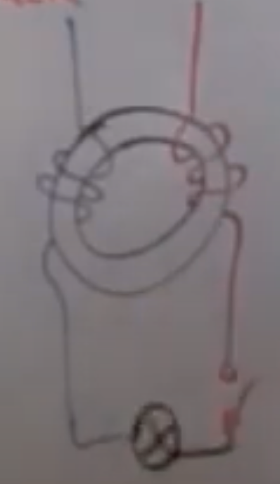
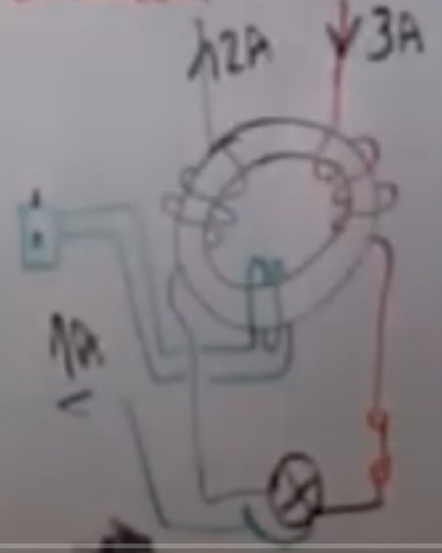
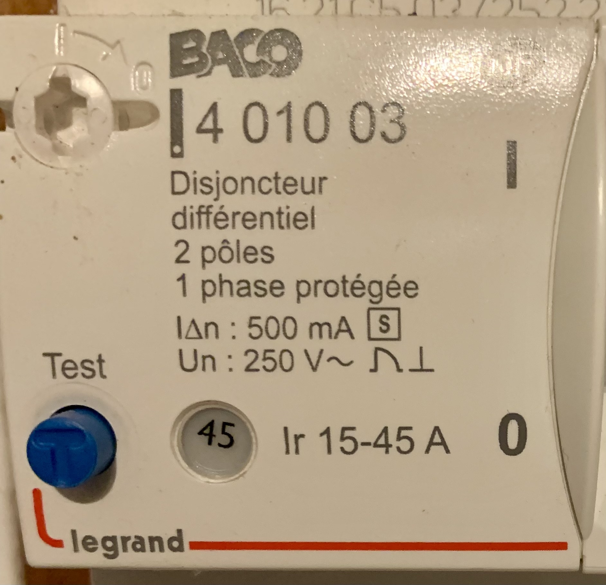
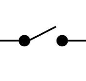
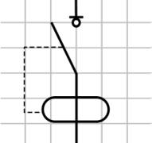
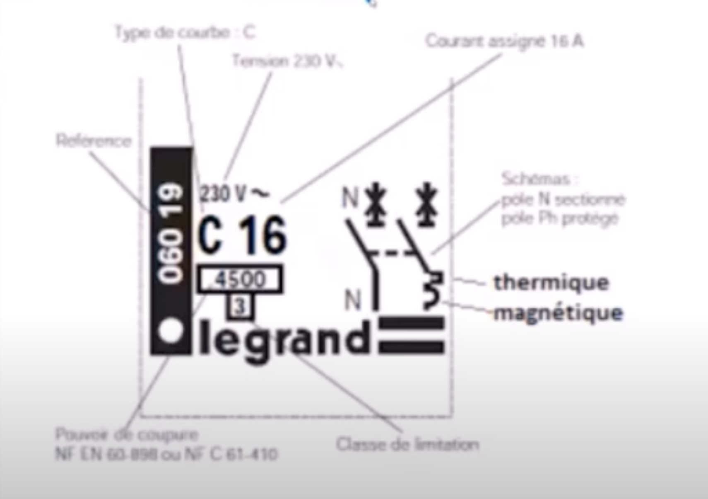
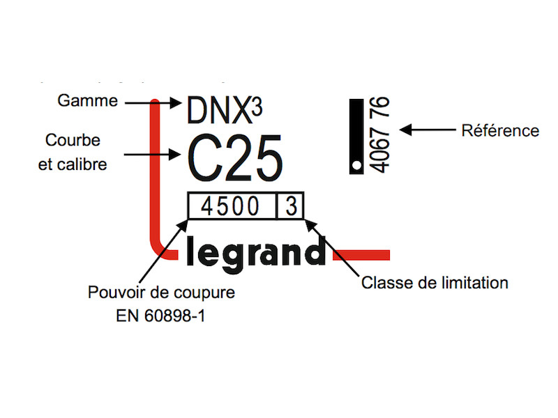
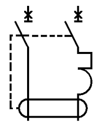

# CAP Elec 1.07 Protections 2
## Foley Services Elec - [Programme 1ère partie](../README.md)

### 1.07 Protections 2

- **Accès à la vidéo** [1.07 Protections 2](https://youtu.be/JUcMXK3wq50)

#### Intro

Protections domestiques (2ème partie).

On protège les équipements contre les surcharge (dispositif thermique), contre les courts-circuits (dispositf magnétique).

L'intensité I est dangereuse pour l'humain à partir de 10mA = 0.01A,

qui provoque une contraction musculaire volontaire. AU contact d'un chareg élecrique, les muscles se contractent et empêchent de relâcher la source électrique qui provoque la contraction. Ce qui peut entraîner des séquelles au niveau du système neurologique.

Plus petit interrupteur différentiel en domesique: 2A (comme pour une VMC) = 200 fois ce qui déjà présente un danger. Moralité: les interrupteurs différentiels ne protège pas les personnes, mais seulement le matériel.

#### Interrupteur différentiel

L***'interrupteur différentiel*** permet de protéger les personnes. Ilutilise aussi l'effet magnétique pour réaliser cette protection.

La protection s'appuie sur la réalisation d'un dispositf magnétique:

- Neutre et phases sont enroulés autour d'un anneau (de plastique. Ces petites bobines induisent chacune un champ magnétique.ces champs magnétiques sont de même force, mais opposés, puisque en condition normale les intensité du neutre et de la phase sont identiques.

- L'exmple illustre ce montage, imaginant phase et neutre qui prennent origine depuis le AGCP, et alimentant une lampe, disons.

- Imaginons une autre bobine, qui est deplus connectée à un dispositif électronique capable d'actionner un petit levier (le picot noir de Sean). Si les intensités différent (lorsque par exemple, il y a une petite fuite sur la terre comme dans l'exemple) alors la différence entre les champs magnétique permet à la troisième bobine d'induire un courant électrique qui va actionner le levier et va ouvrir l'interrupteur différentiel.

- [Cette vidéo reprend l'explication de Sean (le schéma)](https://www.youtube.com/watch?v=kDtADAecaLc&ab_channel=MGElec).

- La sensibilité minimale d'un interrupteur différentiel est de 30mA (techniquement difficile d'atteindre une sensibilité de 10mA tout en garantissant la stabiilité du dispositif).

- ***N.B.*** L'interrupteur différentiel nécessite toutefois la présence d'une prise de terre.

- L'arrivée neutre et phase sur un interrupteur différentiel ***se fait obligatoirement à l'aide d'un peigne*** (et pas d'un fil. Un schéma sur l'interrupteur différentiel le rappelle.

#### Disjoncteur différentiel

Le AGCP est un disjoncteur qui joue trois rôles

- Détection des surcharges
- Détection des courts-circuits
- Détection d'un différentiel au niveau de l'intensité du courant

Interrupteur: interrompre le passage du courant normal (interrupteur "ordinaire" pour commander une lampe, par exemple, ou interrupteur différentiel). L'interrupteur différentiel ne réagit que lorsqu'il y a une différence d'intensité entre phase et neutre.

Disjoncteur différentiel: il détecte les trois situations (surcharge, court-circuit et différence d'intensité) et assure la protection dans ces trois situations.

A noter que son seuil de sensibilité est cependant de 500mA.

L'intensité maximum indiqué sur un ***interrupteur différentiel*** indique ***l'intensité maximum qu'il peut supporter lorsqu'il ouvre le circuit***, sans être abîmer. Il est important de noter qu'il ne détecte pas les situations de surcharge. Si l'intensité maximale indiquée sur l'interrupteur est de 25A, le circuit pourra "tirer" plus de 25A sans provoquer d'ouverture du circuit de sa part, mais il sera afecté par cette surcharge.

Symbole interrupteur

Symbole interrupteur différentiel

#### Installation simple: interrupteur différentiel & disjoncteur 16A

Les interrupteurs et disjoncteurs donnent de plus des indications sur leur capacité à détecter ou réagir aux surcharges, courts-circuits ou différence d'intensité.

