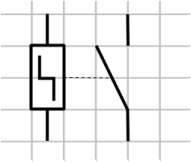

# CAP Elec 1.08 Eclairage 1 - SA, DA, VV, TL
## Foley Services Elec - [Programme 1ère partie](../1ere_partie/README.md)

### 1.08 Eclairage 1 - SA, DA, VV et permutateur, TL

- **Accès à la vidéo** [1.08 Eclairage 1](https://youtu.be/CJScY8vPzTY)

#### Commandes d'éclairage 1:

- SA (simple allumgae),
- DA (double allumage),
- VV (va-et-vient) + permutateur,
- [TL (télérupteur)](#Télérupteur)

Schéma développé: plusieurs façons de faire, phase et neutre à l'horizontale ou à la verticale ...

Rappel schémas et symboles décrivant les propriétés des disjoncteurs.

[Voir ce cours (Jean-Jacques Fraçois, BTS Dieppe) sur les schémas électriques pour voir les symboles utilisés.](https://lefrancoisjj.fr/BTS_ET/schemas_electriques/Les_schemas_electriques.html?IV2Appareilsdeprotection.html)

Commande simple allumage (en saillie, encastrée, étanche), l'interrupteur interromp le passage du courant. Il est limité en intensité, et en tension.

N.B. Parfois l'interrupteur ouvre à la fois phase et neutre (cas des disjoncteurs).

*Spécification 10AX 250V*: 10 ampères (A) macimum (X) sous une ntension de 250V.

Simple allumage typiquement utilisé dans une pièce avec un seul accès. La norme oblige dans chaque pièce un simple allumage avec un point lumineux au plafond.

---

---

---

---

#### Double allumage - plusieurs points lumineux

Schéma:

Norme et couleur des câbles:

- Neutre <-> bleu clair, terre <-> vert-jaune.
- Phase: toutes les autres couleurs.

Convention:

- Rouge = phase qui n'est pas coupée par une commande
- Retour en orange

#### Va-et-vient

Schéma:

Convention couleur: les navettes des va-et-vient sont violettes

Usage fréquent: haut/bas escalier, accès porte et proximité couchage, par exemple.

#### Permutateur

Lorsqu'on souhaite avoir plus de deux points de commande. On introduit dans le circuit va-et-vient un dispositif qui permute (échange) les chemins le long des navettes d'un va-et-vient.

#### Télérupteur

Qui est une option qu'on préfère aux points de commande multiples. Un ***télérupteur*** est un "interrupteur télé-commandé". Plutôt que d'agir mécaniquement l'interrupteur, on le commande à distance par des boutons poussoirs.

[Voir le schéma de branchement dans la vidéo (à partir de 1:02:07)](https://www.youtube.com/watch?v=CJScY8vPzTY&t=1h2m7s)

Le schéma de cablage d'un télérupteur:

- La phase passe du point 1 au point 2
- Son passage est contrôlée par le télérupteur qui reçoit l'impulsion A1 (retour bouton poussoir orange) et le neutre A2