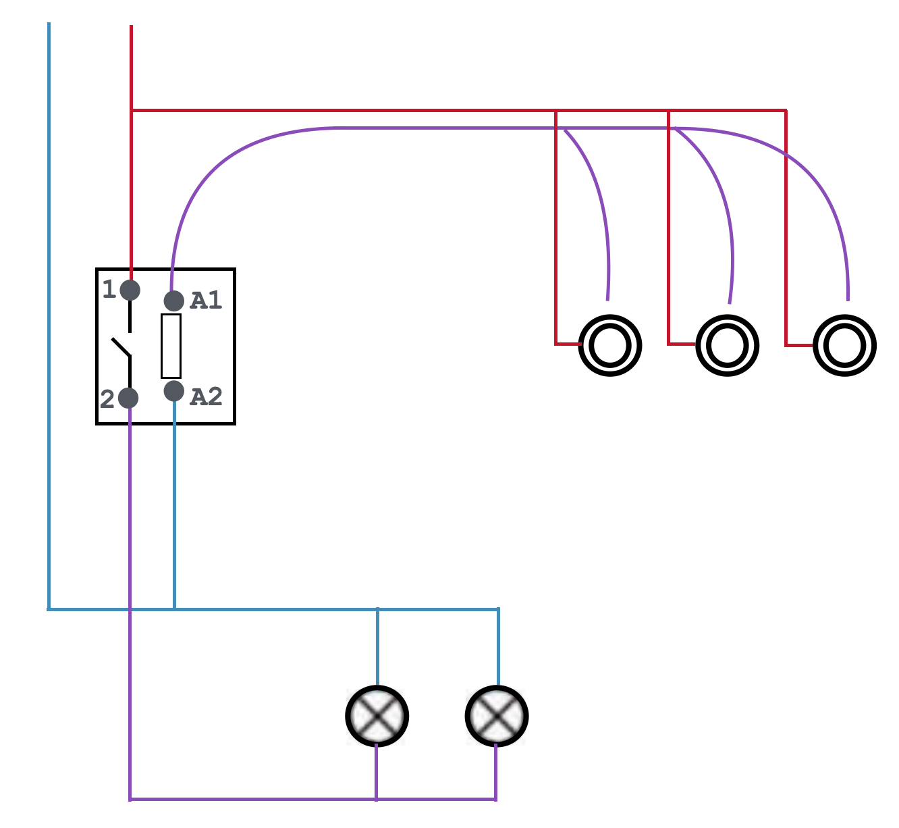
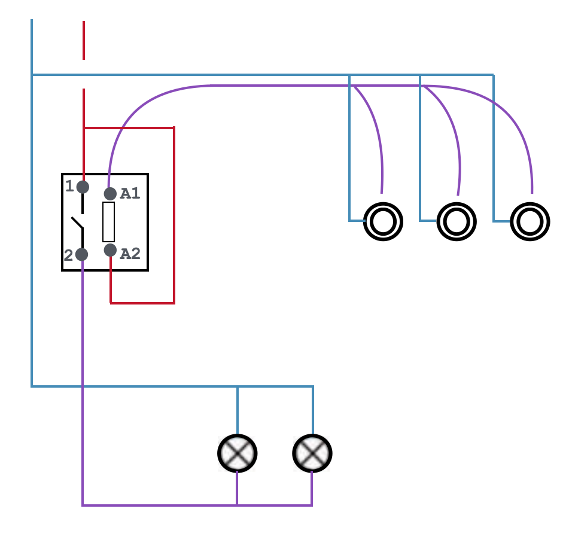
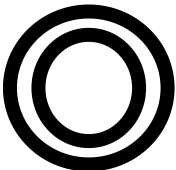
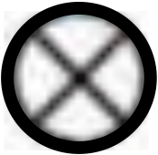

# CAP Elec 1.08 Eclairage 1 - SA, DA, VV, TL - annexe
## Foley Services Elec - [Programme 1ère partie](../1ere_partie/README.md)

### 1.08 Eclairage 1 - SA, DA, VV et permutateur, TL - annexe

- **Accès à la vidéo** [1.08 Eclairage 1](https://youtu.be/CJScY8vPzTY)

(Ce doc annexe reprend la réponse de [Max Aviat-Colas](https://www.facebook.com/groups/476879141274627/user/1019814109) sur [le groupe FB à une question posée la veille](https://www.facebook.com/groups/476879141274627).)

### Télérupteur

Le *télérupteur* est en quelque sorte un contacteur, une bobine actionne un contact dès qu’elle est activée (« excitée » ?). L’activation suit d’une impulsion libérée par la pression sur un bouton poussoir qui, fermant un circuit agit sur le contact et inverse sa position.

Le télérupteur consiste donc en deux dispositifs qui sont agencés:

- le contacteur, et
- le dispositif ouvrant ou fermant le circuit d’alimentation (des lampes),

expliquant la présence de quatre points de connexions le module.

Ces points sont souvent désignés:

- A1 et A2 ce sont les points d’alimentation de la bobine (qui crée le champ magnétique, déclenchant l’action d’inversion du contact)
- 1 reçoit la phase en entrée du circuit,
- 2 est le retour lampe (qui conduit la phase vers l’éclairage.

Le câblage du télérupteur peut donc suivre la logique:

- la phase (arrivant du disjoncteur de protection du circuit) sur 1;
- le retour lampe sur le 2;
- (une phase doit par ailleurs être acheminée vers les boutons poussoirs (qui peuvent être connectés en série);
- le retour des boutons poussoirs vers A1;
- un neutre (arrivant du disjoncteur de protection du circuit) sur 2;
- A noter que les connexions sur les points A1 et A2 peuvent être inversées.

### Boutons poussoirs connectés sur le neutre

Le principe étant explicité, on peut imaginer un autre schémas de connexion, notamment lorsque les boutons poussoirs sont connectés au neutre.

- Dans ce cas, le points de connexion A2 doit accueillir la phase (arrivant depuis le disjoncteur de protection du circuit)

- A noter que dans cette configuration, le rôle du contacteur est *toujours* d'acheminer la phase vers le circuit d'éclairage;
- Que le télérupteur est donc en quelque sorte connecté à la phase (si on inclut le retour lampe) en trois points (1, 2 et A2;
- A noter encore une fois que le rôle des points A1 et A2 peut être inversé.

### Dénominations des points de connexion

On trouve certains modules télérupteurs dont les points de connexions sont désignés par des icônes, qu'on peut faire correspondre aux dénominations précédentes:

| Point de connexion | Icône | Correspondance |
|--------------------|-------|----------------|
| Phase | P | 1 |
| Neutre | N | A2 | 
| Retour bouton poussoir |  | A1 |
| Retour lampe |  | 2 |

Cette dénomination par "icône" porte à confusion lorsque les boutons poussoirs sont connectés au neutre comme dans la figure précédente, puisqu'il faut alors connectés une phase sur le point de connexion marqué "N" du télérupteur ...
