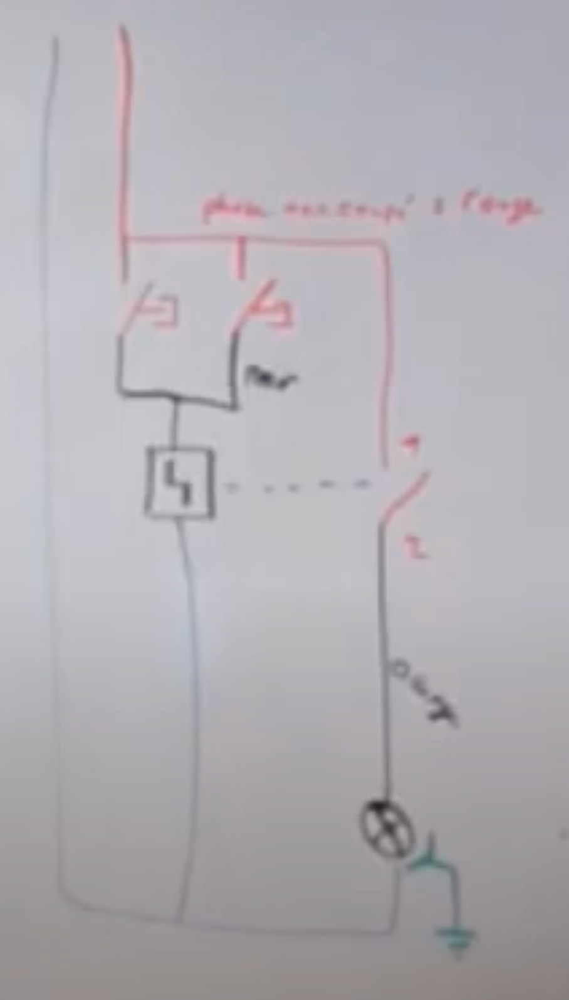
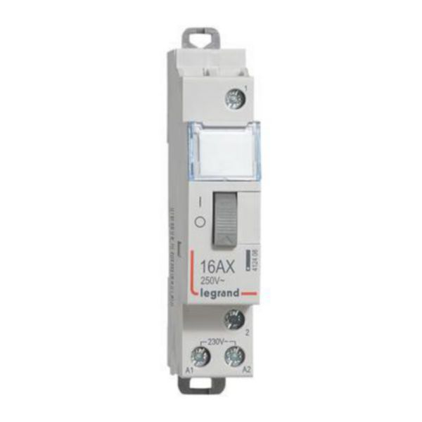
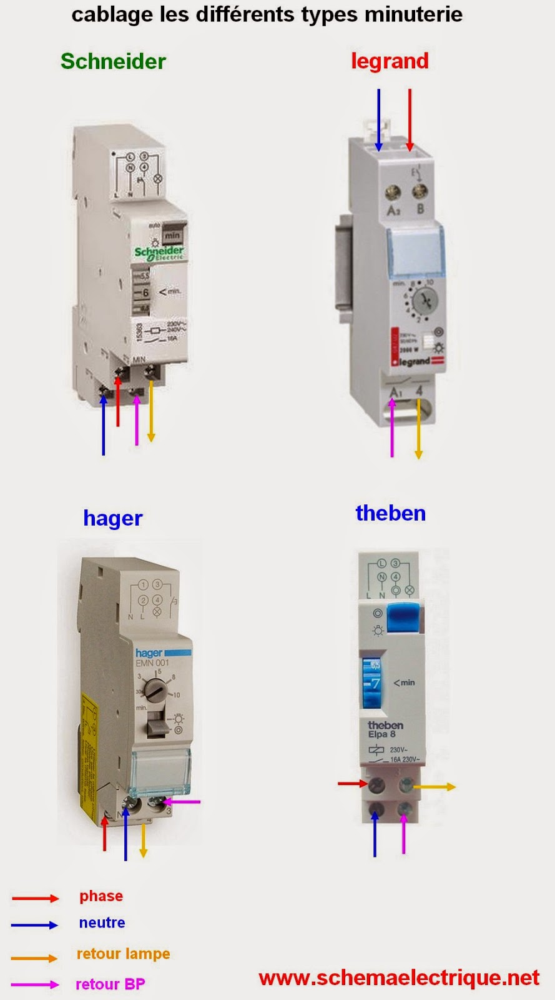
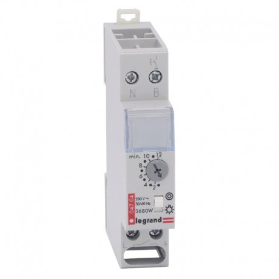

# CAP Elec 1.09 Eclairage 2 - Minuterie
## Foley Services Elec - [Programme 1ère partie](../1ere_partie/README.md)

### 1.09 Eclairage 2 Minuterie

- **Accès à la vidéo** [1.09 Eclairage 2](https://youtu.be/HF4ajbxFd2o)

#### Cablage d'un télérupteur

Retour sur le cablage des télérupteurs (voir [leçon 1.08](./CAP_Elec_1_08.md)), retour sur les conventions de couleurs des cables:

- Vert-jaune = terre (imposé par la norme)
- Bleu clair = neutre (imposé par la norme)
- Rouge = phase non coupée (celle qui prend origine dans le tableau) 
- Orange = retour lampe (depuis un interrupteur vers la lampe, par exemple)
- Violet = navettes va-et-vient

Cablâge:

- La phase (rouge) va sur le contact (ouvert/fermé) et sur les boutons-poussoirs
- Les retours des boutons poussoirs (noir) vont vers le télérupteur
 - N.B. Le télérupteur et le contact sont parfois solidaires et intégrés à un même élément à placer dans le tableau au voisinnage du disjoncteur du circuit commandé par le télérupteur (et les boutons-poussoirs). [Voir le schéma sur schema-electrique.net](https://www.schema-electrique.net/schema-electrique-telerupteur-unipolaire.html)
 - Les points de connexion sont marqués A1 et A2, alors que les points de connexion du contact sont marqués 1 et 2
- Le retour du contact (violet) va vers la (les) lampe(s)
- Le neutre va vers le télérupteur et la (les) lampe(s)
- La terre va de la lampe vers le tableau

#### Télérupteur et minuterie

Télérupteur et minuterie sont câbles exactement de la même manière (voir schéma au-dessus). Le télérupteur est remplacé par un dispositif qui fait minuterie.

Sur le dispositif de minuterie, les points de connexion sont plutôt marqués A1 et A2 pour la minuterie et les points de connexion du contact sont marqués 1 et 4.

***Remarque annexe***. Pour que les connexions dans une boite de dérivation soient conformes, il faut qu'elles soient accessibles et qu'elles soient protégéer mécaniquement.

Le schéma de connexion apparait souvent directement sur le dispositif.

Dispositif Legrand avec le réglage additionnel du préavis d'extinction (A, B, C, ..., F)

Télérupteur temporisé, dans un local qui stocke du matériel (cartouches imprimantes, etc.): on appuie pour allumer, on appuie pour éteindre, mais si on oublie d'appuyer pour éteindre, le dispositif s'éteint de lui-même.
