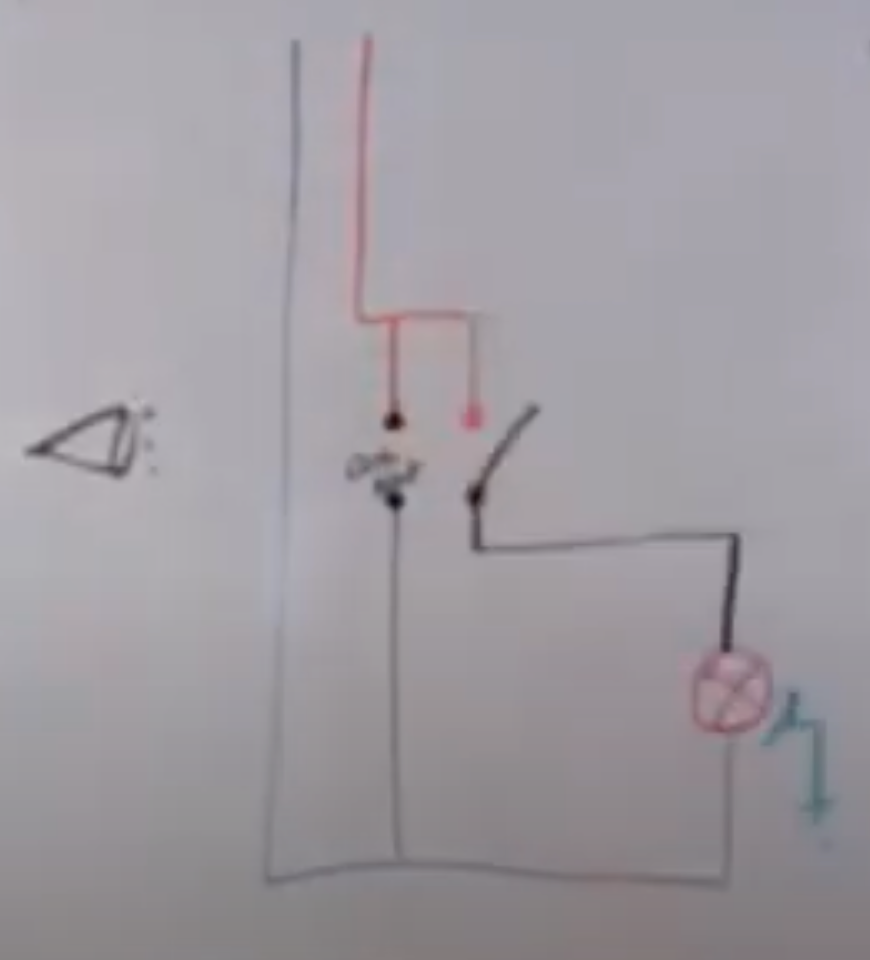

# CAP Elec 1.10 Eclairage 3 Détecteur de mouvement
## Foley Services Elec - [Programme 1ère partie](../1ere_partie/README.md)

### 1.10 Eclairage 3 - Détecteur de mouvement

- **Accès à la vidéo** [1.10 Eclairage 2](https://youtu.be/4gUAQGN9zc8)

#### Détecteur de mouvement

***Dispositif infra-rouge passif***, qui détecte un signal infra-rouge produite par une source tierce (par opposition à un dispositif qui détecte un signal infra-rouge qu'il produit lui-même, comme les commandes de portails).

Discussion sur la capacité d'un détecteur passif à détecter le mouvemnt, qui doit être perçu dans le plan XY "orthogonal au faisceau". Si la source de chaleur avance vers le détecteur selon un axe orthogonal à son orientation, bien que la source grandisse en surface (et en intensité de chaleur infra-rouge), le mouvement ne sera pas détecté.

#### Principe du câblage d'un détecteur de mouvement

- Une phase qui va vers le onctact, le retour lampe, une pahse qui va vers la carte électronique qui contrôle le contact
- - Une neutre qui va vers la lampe, un neutre vers la carte électronique qui contrôle le contact

Le schéma est simplifié: L (phase), L1 (retour lampe), N (neutre)

#### Réglages

- Temps d'allumage
- Eclairage ambiant (mode jour/nuit)
- Sensibilité (ampleur du champ infra-rouge capté, petits animaux versus humains, ...)

#### Indice de protection des dispositifs IP44, IP20, ...

IPxy

- $$0 \leq x \leq 6$$ le premier chiffre de l’indice de protection mesure la résistance d’un dispositif d’éclairage aux corps solides (comme de la poussière)
- $$0 \leq x \leq 6$$ le second chiffre de l’indice de protection mesure la résistance d’un dispositif d’éclairage aux corps liquides (comme de l’eau ou de l’humidité)