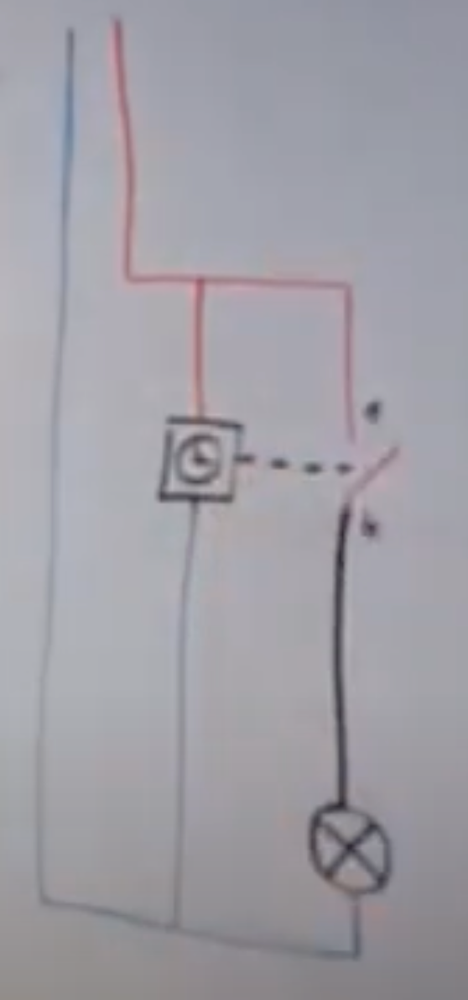
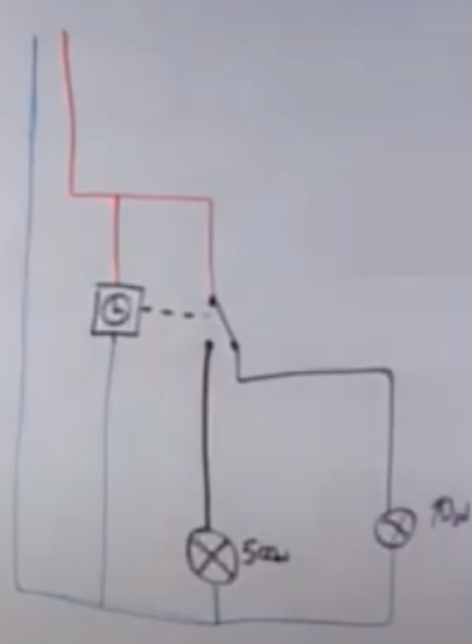
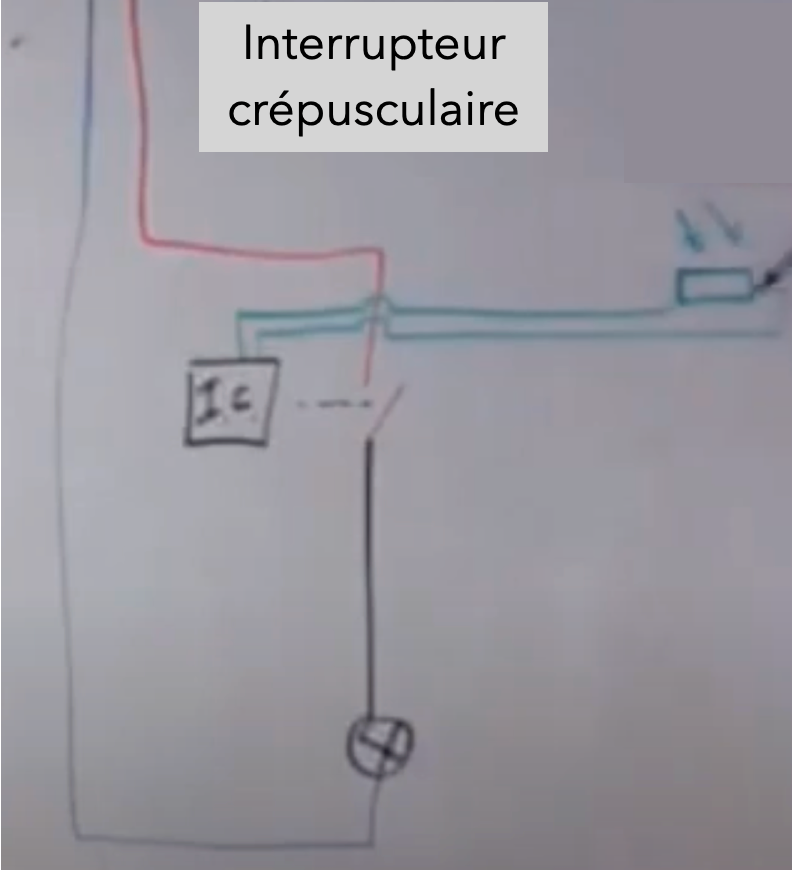
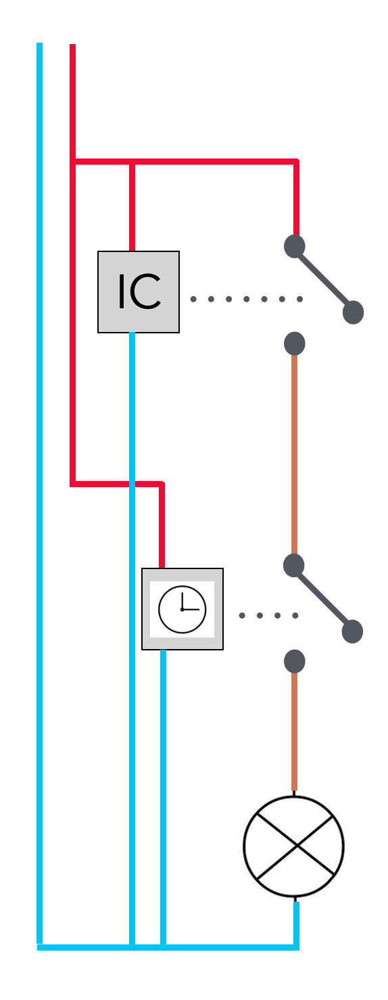

# CAP Elec 1.11 Eclairage 4 - Interrrupteur horaire, crépusculaire, astronomique
## Foley Services Elec - [Programme 1ère partie](../1ere_partie/README.md)

### 1.11 Eclairage 4 - Interrrupteur horaire, crépusculaire, astro

- **Accès à la vidéo** [1.11 Eclairage 4 - Interrrupteur horaire, crépusculaire, astronomique](https://youtu.be/Tcn99FxoUyU)

#### Interrrupteur horaire

Interrrupteur piloté par une horloge. Schéma de cablage d'un saimple allumage auquel s'adjoint l'alimentation du "moteur".

Réglage, comme les blocs prises programmables, par exemple.

Remarque: les dispositifs comportent souvent une *réserve de marche*, qui évite que le réglage soit décalé lors d'interventions. Marque Theben, possibilité de programme plus sophistiqué et différencié pour chacun de sjours de la semaine, qu'une simple programme journalier qui se répète systématiquement tous les jours de la semaine.

Variation avec la possibiolité de basculer le contact vers un autre éclairage.

#### Interrrupteur crépusculaire

Dispositif qui comporte un capteur photocellulaire qui capte le niveau de luminosité ambiante.

On a donc un circuit d'allumage dont le contact ets piloté par un interrupteur crépusculaire. Ce dernier reçoit entrée un signal qui correspond à la luminosité captée par la cellule, qui se traduit par une résisitance variable (en fonciton de la luminosité). L'interrupteur déclenche alors seulement lorsque la résistance franchit un seuil.

Ce type d'interrupteur combine donc les avantages d'un éclairage soumis à des contraintes horaires && de luminosité.

- Connexion en parallèle == ou logique (peu importe le bouton poussoir qui est activé, il y a contact)
- Connexion en série == et logique (toutes les conditions doivent être réunies pour activé le contact)

Ce dispositif ne se fait plus, mais on peut malgré tout le rencontrer lors de dépannage.

#### Interrupteur astronomique

Il gère les cycles de lune, pré-programmé en usine sur les cycles de lever, coucher de soleil dans une centaine de villes dans le monde (!). Cela évite le montage exhibé à la section précédente.

Du coup, le cablage se ramène à celui d'un simple interrupteur horaire.

