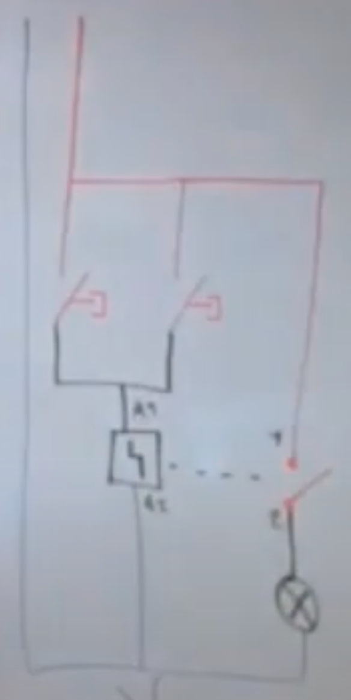
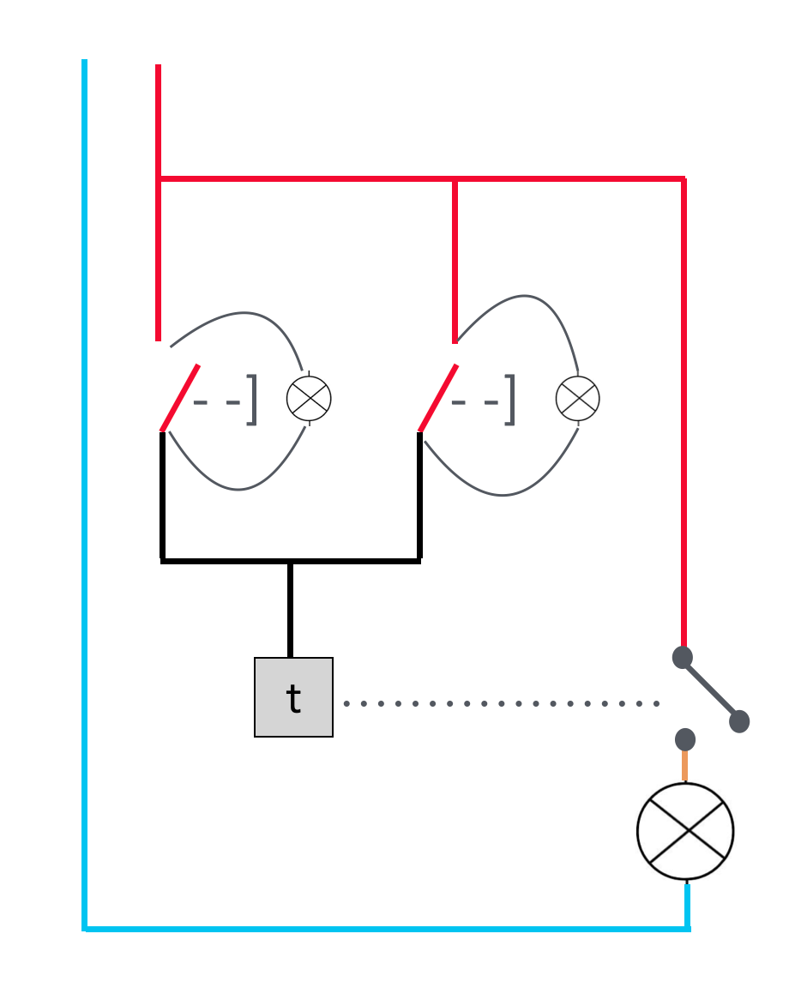
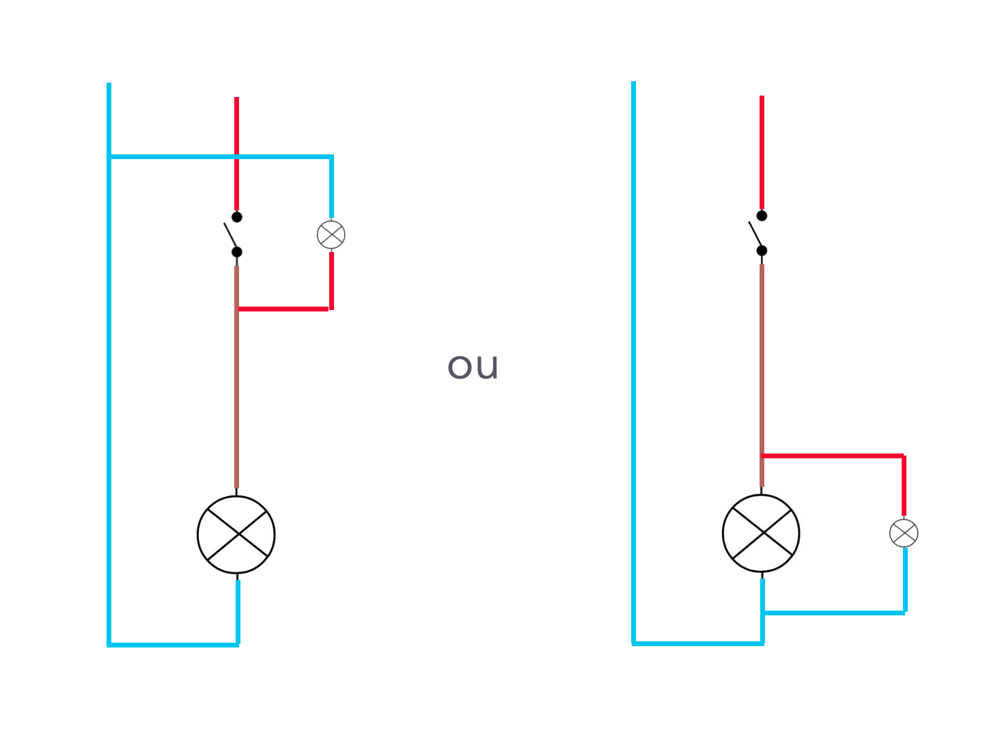
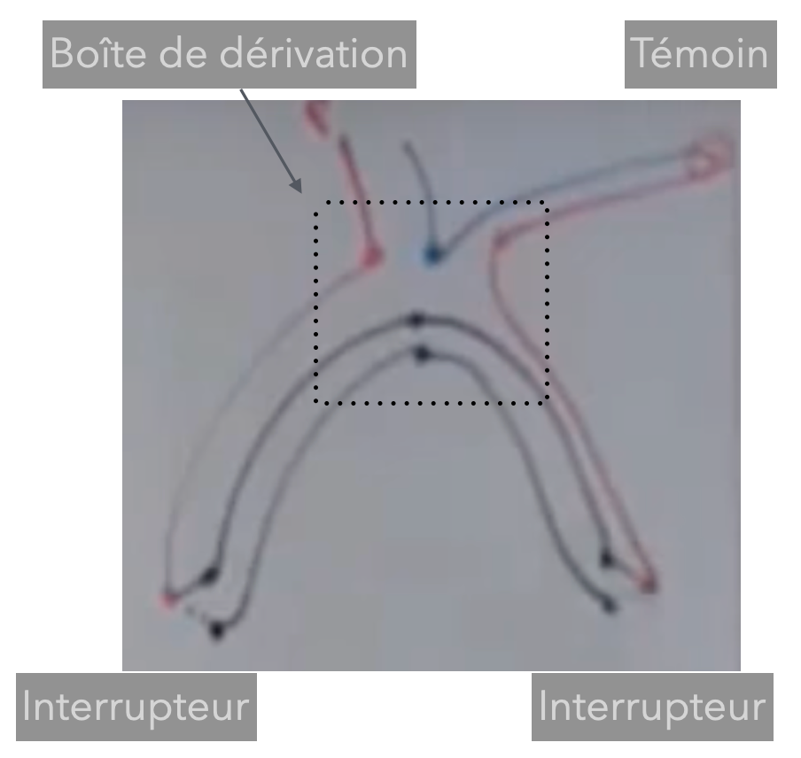
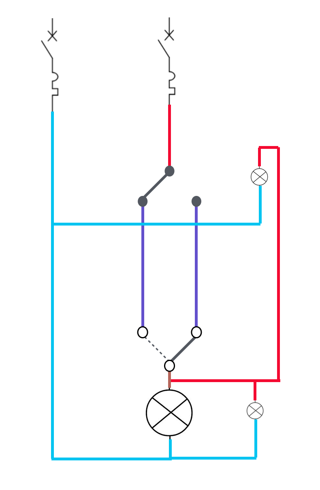

# CAP Elec 1.12 Eclairage 5 - Voyants lumineux et témoins
## Foley Services Elec - [Programme 1ère partie](../1ere_partie/README.md)

### 1.12 Eclairage 5 - Voyants lumineux et témoins

- **Accès à la vidéo** [1.12 Eclairage 5 - Voyants lumineux et témoins](https://youtu.be/MtHUoRPuUdQ)

#### Voyants lumineux

Dispositif spécifique pour toruver des boutons poussoirs dans l'obscurtité.

##### Schéma de cablage

Rappel du schéma de cablage de bouton poussoirs qui commande un télérupteur:

Le voyant est connectée aux bornes du bouton poussoir et est alimenté par un courant très faible.

--

Exemple d'un dispositif (Mosaic Legrand) qui prévoit l'arrivée des pahses et neutres à l'arrière avec 4 trous dont 2 trous qui sont inutilisés. Le voyant se pose devant (en prenant soin d'inverser gaucje/droite des positions phase/neutre à l'arrière).

Sur le modèle Plexo Legrand, phase et neutre sont alignés, idem pour le voyant qu'il suffit de pousser au niveau du bouton poussoir.

***Attention à bien brancher sur les bornes qui forme un circuit "normalement ouvert", typiquement L et 1.*** Pour éviter d'alimenter en permanence le voyant.

***N.B. Dans un cage d'escalier, la présence de voyant sur les boutons poussoirs est obligatoire.***

#### Voyant témoin

Voyant témoin sur un interrupteur (par opposition à un bouton poussoir). Exemple d'application, l'éclairage qui n'est pas dans la pièce où se trouve l'interrupteur (cave, extérieur, comble, ...).

***Cas des petites salles de bain, avec la règle des volume squi empêche d'installer un interrupteur dans la pièce.***

Le témoin peut prendre sa phase depuis le retour de la lampe -- puisqu'il doit s'allumer lorsque la lampe est allumée, mais puisqu'il est sur le 230V, il doit avoir un neutre, qu'il faut reprendre du circuit qui alimente la lampe.

Réservation dans les interrupteurs avec voyant. Les voyants sont rarement (jamais) compatible entre les marques.

Les dispositifs plus récents prévoit une réservation pour le neutre qui se trouve "embarquer" dans l'interrupteur, facilitant l'installation d'un témoin – qui suit une logique similaire aux voyants lumineux.

##### Avec un va-et-vient ...

Le témoin prend sa phase du retour lampe après le second interrupteur, et le neutre depuis la boîte de dérivation.

Et si on veut un témoin au niveau des deux interrupteurs, il faut ramener la phase sur le témoin de la première lampe *depuis* le reoutr lampe au niveau du second interrupteur.

Pas besoin de mettre la terre sur les voyants qui ne sont pas considérer comme des récepteurs mais comme des commandes.
