# CAP Elec 1.13 Eclairage 6 - Variateurs
## Foley Services Elec - [Programme 1ère partie](../1ere_partie/README.md)

### 1.13 Eclairage 6 - Variateurs

- **Accès à la vidéo** [1.13 Eclairage 6 - Variateurs](https://youtu.be/dws48fPJQ7I)

#### Variateurs anciens modèles

On utilisait autrefois une résistance variable, connecté en série avec la lampe. Marche bine avec les lampes halogènes et incandescentes.

Ces dispositifs ne sont plus utilisés aujourd'hui. Ils sont plutôt électroniques. Eclairage fluorescent ou à LED ne s'allume pas tout le temps (effet stroboscopique).

Rappel courant alternatif, la valeur de la tension suit une courbe sinusoïdale, de tension effective 230V (qui n'est pas la valeur de crête), à une fréquence de 50Hz. Une période dure donc 20ms.

Le filament d'une lampe incandescente, chauffe au passage des électrons. La continuité de l'éclairage suit de l'inertie du filament à refroidir, et de l'incapacité de l'oeil à percevoir ce mouvement à cette fréquence. Voir image.

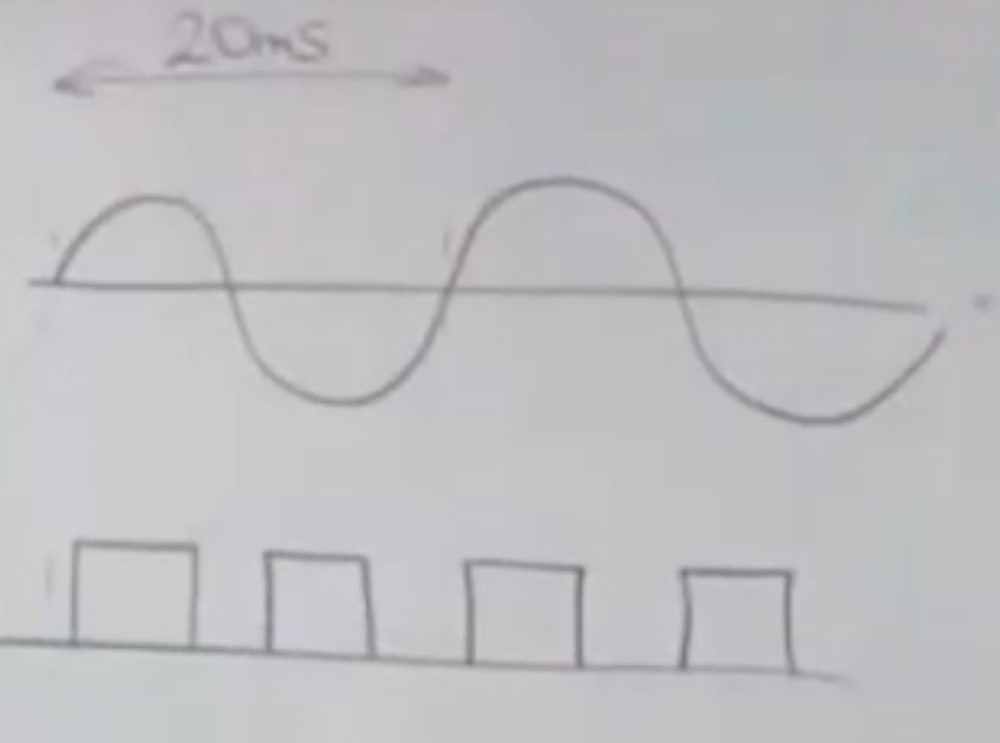

Fluorescent ou LED (diagramme du bas dans l'image), parce qu'il faut une intensité minimale pour les électrons "sautent dans le tube".

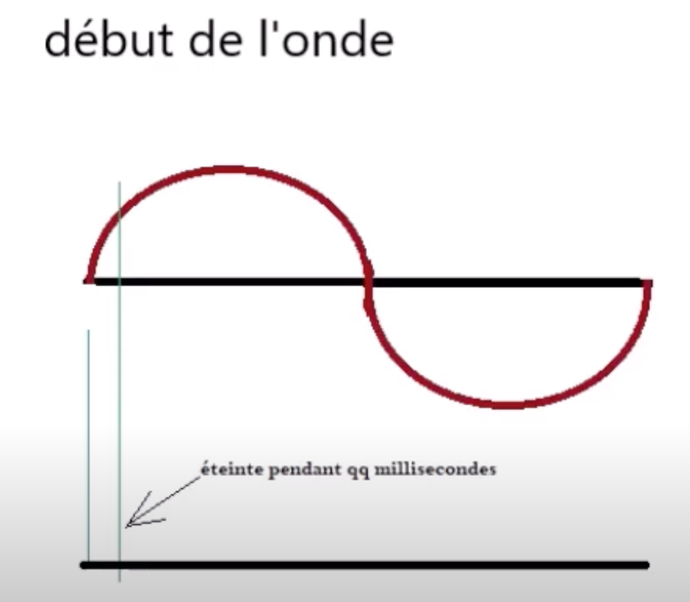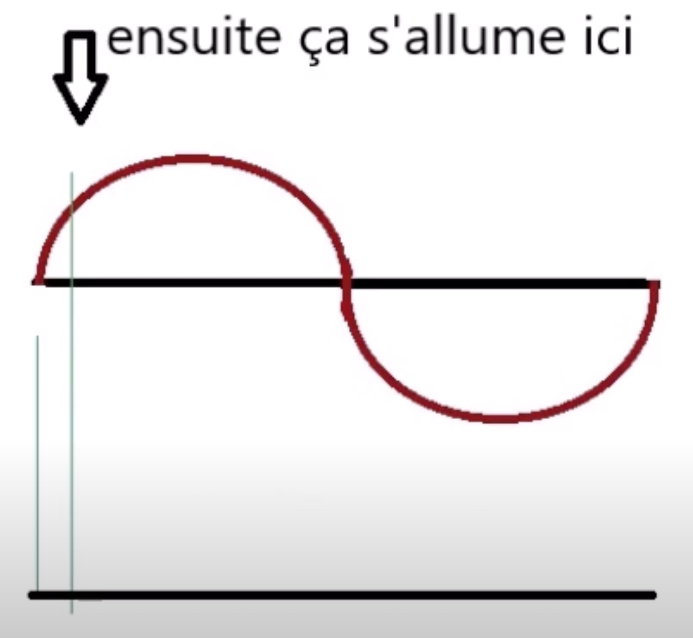

L'effet stroboscopique peut empêcher de perceoir le mouvement d'un appareil (exemple dans les vidéos à 14'). En milieu industriel, on peut éviter l'effet stroboscopique quand on utlise du courant triphasé. 

Discussion sur les modifications apportées à l'onde (courbe sinusoidale), soit en trée d'onde, soit en sortié, limitant le temps pendant lequel une lampe est allumée.

On diminue ainsi le nombre de lumens projetés dans une pièce, dont l'éclairage.

Symbole indiquant si une ampoule est "variable" (peut être combiné avec un variateur).

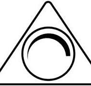

N.B. Les LED fonctionne en courant continu, et requière donc qu'un convertisseur soit branché en amont (sur lequel pourra agir un variateur).

#### Branchement

Premier exemple, variateur rotatif ou à bouton.

Boitier marqué des symboles B, icône onde sinusoidale, L. Il faut porter attention à l'ordre des branchements (ils ne sont pas interchangeables comme pour un simple allumage).

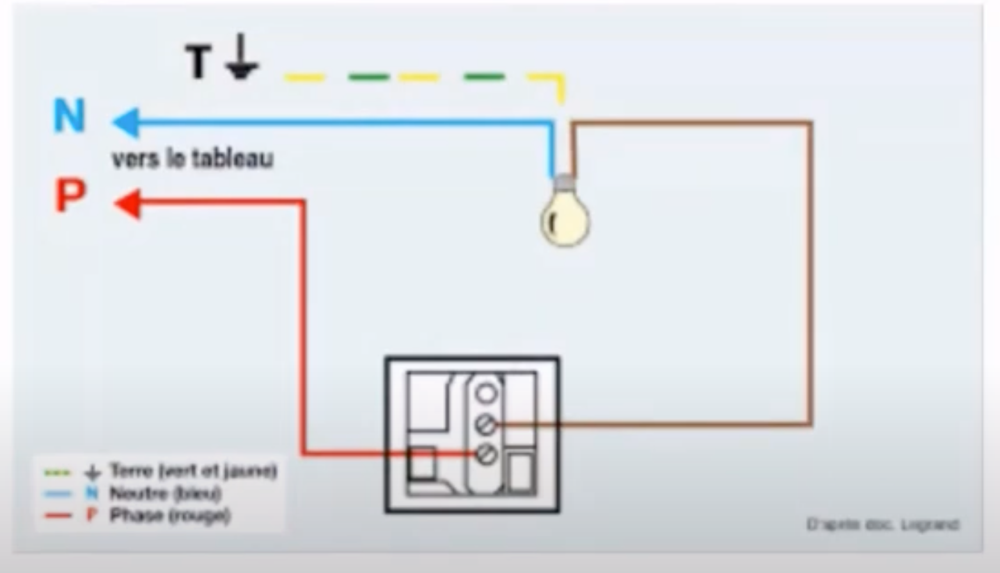

Et le bornier B ? Elle est utilisée si on veut avoir plus d'un point de commande à l'aide de bouton poussoir. On pourra varier l'intensité avec des boutons poussoir connecté depuis la borne B et vers les bornes 1 des boutons poussoir - la phase arrivant directement sur les boutons poussoir.

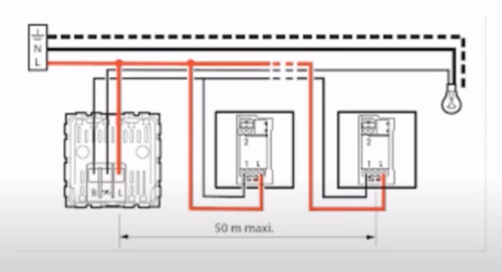

Le dispositif de variateur peut aussi être installé dans le "pot" du bouton poussoir (il n'est pas exposé en soi), avec le smêmes branchements.

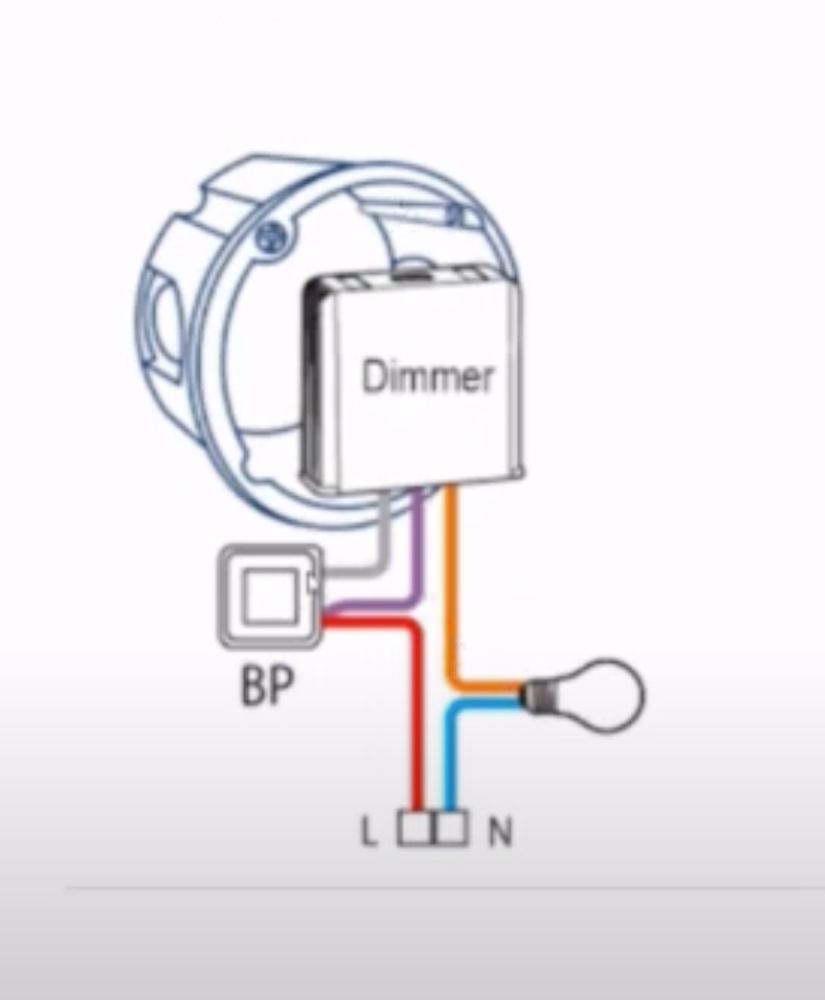

Il existe aussi des dispositifs modulaires installés au niveau du tableau, comme le dispositif Yokis.

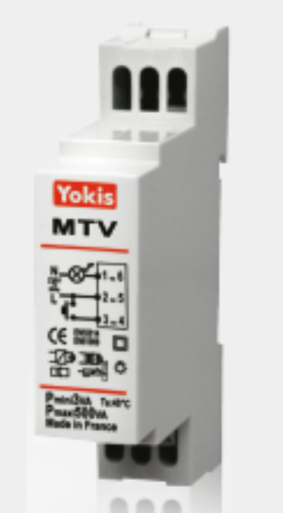

#### Variateur avec un driver 0-10V

CIrcuit de base d'un variateur 0-10V, boitier de variation connecté à la lampe, autres points de commandes avec des boutons poussoirs.

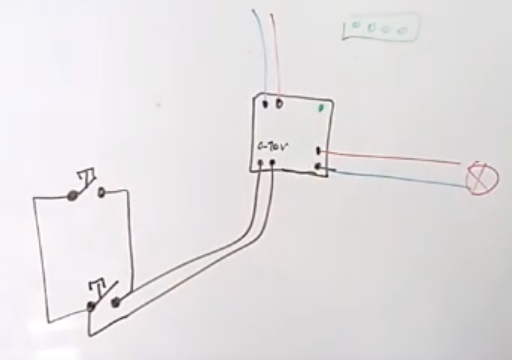

Aujourd'hui, certains appareils d'éclairage intègrent ces modules et présentent alors 5 bornes de connexions: phase, neutre, terre, et deux bornes pour aller vers des boutons possoirs.

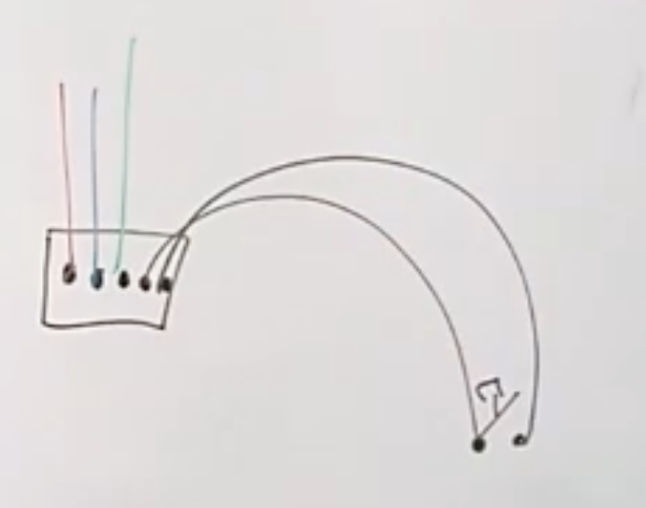

Mais il faut alors amené au niveau de l'éclairage 5 x 1.5G, depuis un boitier de dérivation (par exemple), sur lequel les boutons poussoirs vont pouvoir se connecter.

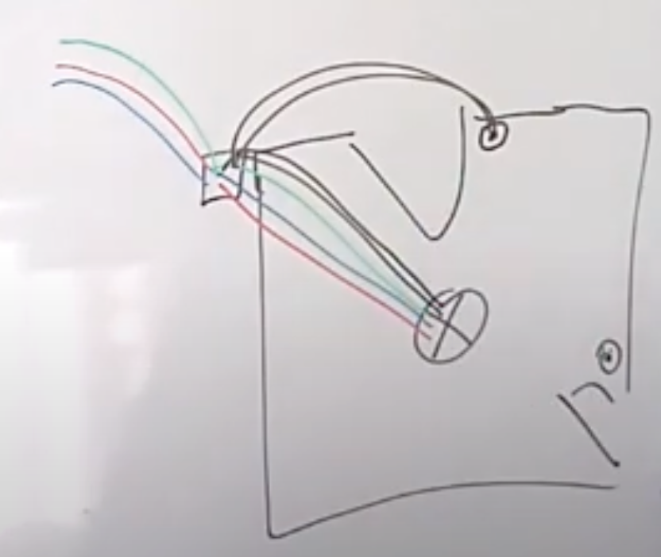

