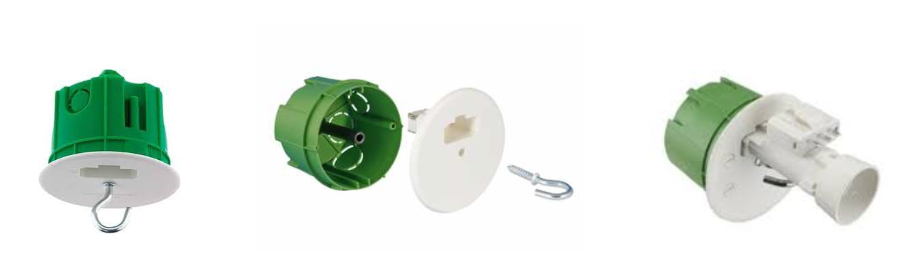
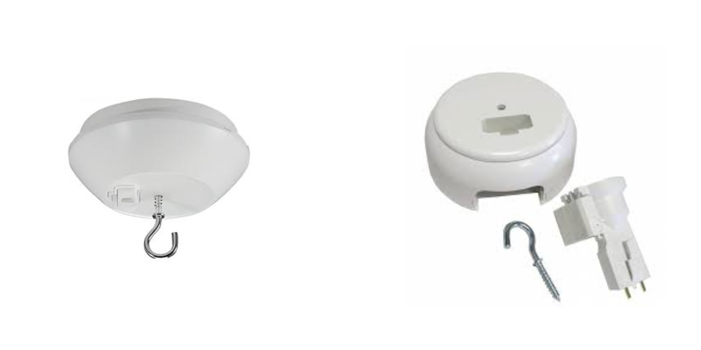
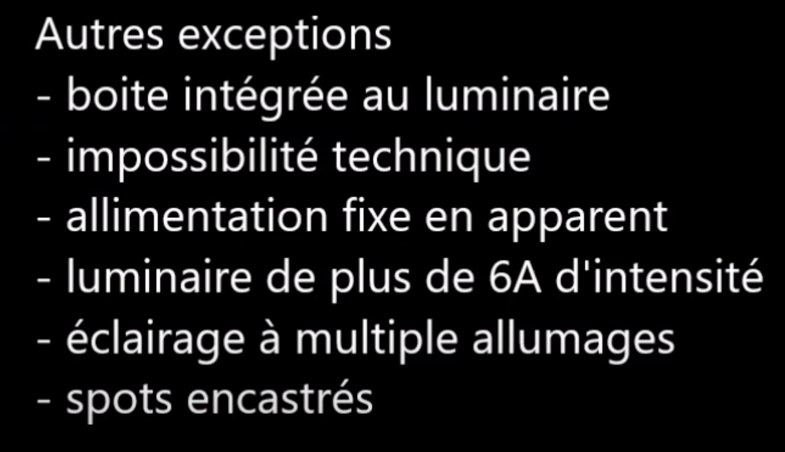

# CAP Elec 1.14 Eclairage 7 - DCL
## Foley Services Elec - [Programme 1ère partie](../1ere_partie/README.md)

### 1.14 Eclairage 7 - DCL

- **Accès à la vidéo** [1.14 Eclairage 7 - DCL](https://youtu.be/3oMIf79VHwU)

#### DCL Dispositif de Connexion Luminaire

Considérations de sécurité qui suivent de mauvaise "habitudes" lors de changement d'occupants (douille, fils coupés, raccourcisssements des fils arrivant au niveau des plafonniers, etc.)

DCL une "prise éclairage" par analogie à une "prise de courant", qui existe en mode encastrée

ou en saillie

--

La norme impose l'installation d'un DCL. Voir Promotelec page 251 (édition janvier 2022).

Il existe des cas où la pose d'un DCL n'est pas impérative. Vidéo à 6' 35''

