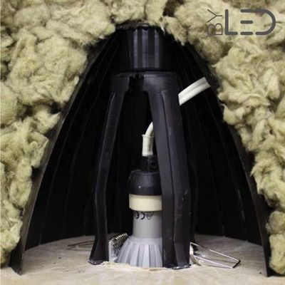
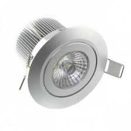

# CAP Elec 1.15 Eclairage 8 - Spots encastrés
## Foley Services Elec - [Programme 1ère partie](../1ere_partie/README.md)

### 1.15 Eclairage 8 - Spots encastrés

- **Accès à la vidéo** [1.15 Eclairage 8 - Spots encastrés](https://youtu.be/hgDzZm1hEZg)

#### Spots encastrés en plafond

Deux questions se posent:

- quelle type d'isolation est posée (au niveau du plafond) ?
- les spots sont-ils accessibles par-dessus leplafond (via les combles par exemple) ?

LA difficulté tient au contact possible entre la partie encastrée du spot et l'isolation. L'usage de "pot de fleur" pour créer une "cheminée crée un pont thermique qui laisse fuire la chaleur depuis l'intérieur.

On peut plutôt créer un vide autour du spot et s'assurer du'un isolant qui vient "envelopper" ce vide. On évite le contact mais on maintient l'isolation.

Utilisation de "fouchette" que l'on glisse par le trou qui reçoit le spot, pour pousser la laine de verre et créer un espace oùle spot ira se loger sans qu'il n'y ait contact avec l'isolant.

Exemples de spots avec des "radiateurs" permettant à la chaleur de se diffuser, radiateurs qui ne doivent absolument pas être en contact de l'isolant.

Différentes astuces pour installer les spots et assurer de disposer de l'espace de diffusion de la chaleur générée par le spot.

