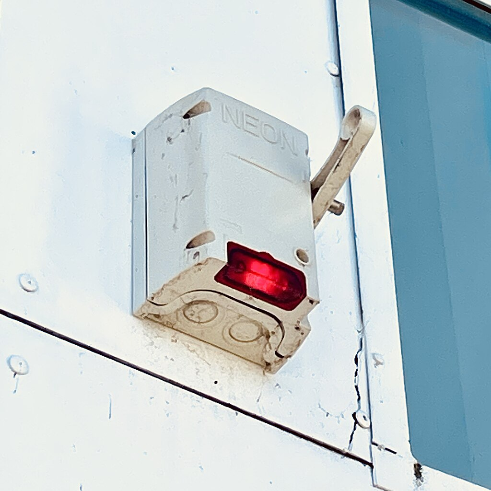

# CAP Elec 1.16 Eclairage 9 - Inter Pompier
## Foley Services Elec - [Programme 1ère partie](../1ere_partie/README.md)

### 1.16 Eclairage 9 - Inter Pompier

- **Accès à la vidéo** [1.16 Eclairage 9 - Inter Pompier](https://youtu.be/TU4D8IpbF-Y)

#### Interrupteur / Coupure Pompier

Un peu d'histoire. Enseignes autrefois fabriqué à l'aide de néon (tube contenant du gaz néon, alimenté HTA 2000-2500V). Les pompiers pouvait accéder au dispositif Inter Pompier pour éteindre l'enseigne.

Installé à 2,80m ou 3m, il ne peut être attteint sans perche, mais ne nécessite pas des pompiers autre chose que la perche pour mettre le circuit hors tension.

Bien que les néons ont tendance à disparaître, la norme s'impose pour tout dispositif d'éclairage susceptible d'être en marche alors que le bâtiment est innocupé (typiquement, une enseigne d'un commerce).

Le dispositif est un interrupteur bipolaire (il coupe la phase ET le neutre). L'appareil compte un voyant qui permet de constater si l'aval de l'appareil est alimenté.

Le boitier doit être étanche (IP44 minimum). Les branchements qui arrivent au boitier et éventuellement le quittent nécessitent l'usage de presse-étoupes.