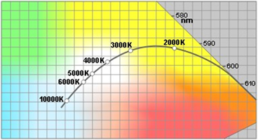

# CAP Elec 1.16B Eclairage 10 - Anciennes technologies
## Foley Services Elec - [Programme 1ère partie](../1ere_partie/README.md)

### 1.16B Eclairage 10 - Anciennes technologies

- **Accès à la vidéo** [1.16B Eclairage 10 - Anciennes technologies](https://youtu.be/gmlp44cK7Yk)

#### Anciennes technologies vs LED

- Iodure
- Sodium
- Mercure

(Sodium et mercure en haute ou basse pression). Ces tehcnologies ont tendance à disparaître - ils étaient surtout présents en milieu industriel et pour l'éclairage publique.

--

- Fluorescence (durée de vie ~ 6 à 15 Kheures)
- Halogène (durée de vie ~ 2 à 3 Kheures)

La technologie des éclairages fluorecents elle aussi tend à disparaître, bien q'uon la retrouve en milieu tertiaire (bureaux, magasins, ...). Même les lampes halogènes disparaissent, au profit des éclairages LED dont les prix ont beaucoup chuté.

La durée de vie des LED surpassent les anciennes technologies avec ***une durée de vie de 30 à 50 Kheures***.

Sur un simple allumage, il ne faut pas mélanger un spot halogène qui repose sur un transformateur électro-magnétique et un éclairage LED et son "driver" (élecrtronique) au risque d'abîmer ou détruire le dispositif électronique LED.

Halogène et LED peuvent être sur le même circuit (même disjoncteur au tableau) mais pas la même commande d'allumage.

#### Lumens - Lux -- Degré Kelvin

- Lumens = flux lumineux (d'une ampoule)
- Lux = éclairement d'une surface
- Degré Kelvin = couleur d'un éclairage
  - 3000 oK = couleur chaude
  - 4500 oK, plus neutre
  - 6000 oK, lumière froide (blanche)

En magasin - de vêtements - un éclairage de 3000 oK fausserait la perception des couleurs des vêtements (t-shirt blanc qui a une teinte chaude un peu jaune).

