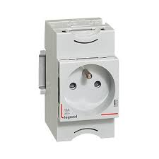

# CAP Elec 1.17 Prises de courant
## Foley Services Elec - [Programme 1ère partie](../1ere_partie/README.md)

### 1.17 Prises de courant

- **Accès à la vidéo** [1.17 Prises de courant](https://youtu.be/M5BVPGbeiAw)

#### Prises, fils, intensité du courant

| Départ | Nb de fils | Section mm2 (min) | Disjoncteur (max) | Type (et coefficient) interrupteur différentiel | Nb points max |
|--------------|---------------|----------|---------|---------|---------- |
| Eclairage | 3 | 1,5 mm2 | 10A (16A) | - | 8 |

N.B. La préconisation à une intensité max de 16A sur un circuit éclairage est revue à la baisse pour 10A:

- La plupart des interrupteurs sur le marché sont limités à 10A
- Une autre raison au dimensionnement de l'interrupteur différentiel (pas encore vu, à suivre)

Plexo prise de courant, le "bloc contact" ne nécessite pas l'usage d'un tournevis pour être inséré/retiré.

Limite inscrite sur le module de prise: 16A / 250V, le fabricant indique souvent 16A - 2 heures max (passé ce délai l'appareil chauffe)

| Départ | Nb de fils | Section mm2 (min) | Disjoncteur (max) | Type (et coefficient) interrupteur différentiel | Nb points max |
|--------------|---------------|----------|---------|---------|---------- |
| PC 1.5 | 3 | 1,5 mm2 | 16A | - | 8 |
| PC 2.5 | 3 | 2,5 mm2 | 16A (20A) | - | 12 |

Promotelec prise de courant, en section 2.5 disjoncteur max 20A, qui ne s'accorde pas au préconisation 16A max sur les prises.

Voir Promotelec (édition 2022) page 245, 247.

Note sur l'éclairage: la norme impose 1 point plafond ou 2 appliques ou 2 prises  commandées.

#### Prises de courant cuisine

Parce que, par nature, plusieurs appareils sont susceptibles d'être utilisés simultanément dans la cuisine (robot, gtille-pain, four, etc.).

| Départ | Nb de fils | Section mm2 (min) | Disjoncteur (max) | Type (et coefficient) interrupteur différentiel | Nb points max |
|--------------|---------------|----------|---------|---------|---------- |
| PC cuisine | 3 | 2,5 mm2 | 20A | - | 6 (= 4 plan de travail + 2) |

Pas de circuit unique pour le frigo.

Hotte aspirante: on la traite comme un point d'éclairage, donc sur le circuit d'éclairage, on peut aussi le comptere sur le circuit 2.5 dans la cuisine (pas le circuit du plan de travail).

#### Emplacements spécifiques

- Lave-linge
- Sèche-linge
- Lave-vaisselle
- Four

| Départ | Nb de fils | Section mm2 (min) | Disjoncteur (max) | Type (et coefficient) interrupteur différentiel | Nb points max |
|--------------|---------------|----------|---------|---------|---------- |
| Lave-linge | 3 | 2,5 mm2 | 20A | - | 1 |
| Sèche-linge | 3 | 2,5 mm2 | 20A | - | 1 |
| Lave-vaisselle | 3 | 2,5 mm2 | 20A | - | 1 |
| Four | 3 | 2,5 mm2 | 20A | - | 1 |

#### PC Tableau

2 prises de courant installées dans le tableau, pour alimenter des éléments installés au niveau du tableau (box internet, etc.)

| Départ | Nb de fils | Section mm2 (min) | Disjoncteur (max) | Type (et coefficient) interrupteur différentiel | Nb points max |
|--------------|---------------|----------|---------|---------|---------- |
| PC tableau | 3 | 1,5 mm2 | 16A | - | 2 min |

