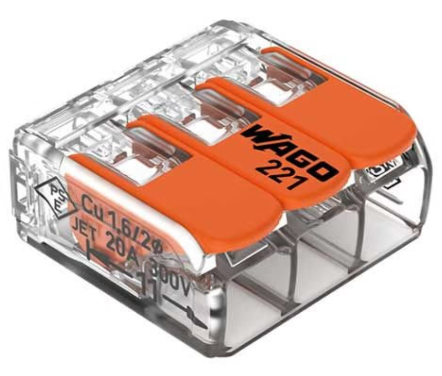
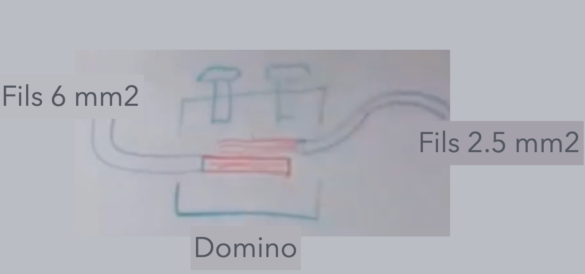
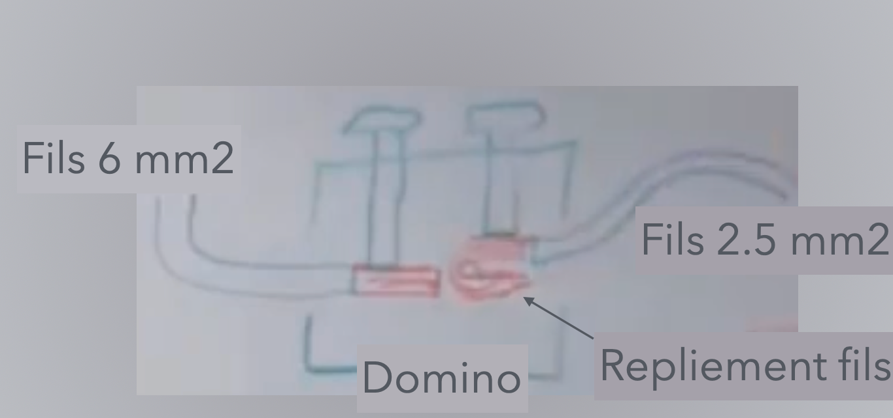

# CAP Elec 1.18 Plaque de cuisson
## Foley Services Elec - [Programme 1ère partie](../1ere_partie/README.md)

### 1.18 Plaque de cuisson

- **Accès à la vidéo** [1.18 Plaque de cuisson](https://youtu.be/VizrZvFazS4)

#### Plaque de cuisson 32A

Plaque de cuisson à ne pas confondre avecle four (câblé en 2,5mm2 avec un disjoncteur 20A, seul sur son circuit).

La plaque peut consommer un courant d'intensité qui dépasse 20A. Or, une prise courant serait endommagée si par exemple on branchait la plaque sur une prise de courant (2,5mm2 disjoncteur 20A), et que la prise était retirée alors que la plaque est en charge. L'arc électrique provoquée par le retrait de la prise l'endommagerait.

Pour éviter cette situation, on utilise pour la plaque de cuisson un ***branchement fixe***.

(Promotelec, édition 2022, page 245)

| Départ | Nb de fils | Section mm2 (min) | Disjoncteur (max) | Type (et coefficient) interrupteur différentiel | Nb points max |
|--------------|---------------|----------|---------|---------|---------- |
| Plaque de cuisson, cuisinière en courant pnophasé | 3 | 6 mm2 | 32A | - | 1 |

Remarqeue. Pour dénuder un fils 6 mm2, on n'utilise pas la pince à dénuder. On sectionne légèrement l'isolant sans marquer le cuivre, et en pliant le fils l'isolant va céder, permettant de dénuder le fils.

Le branchement se fait dans un pot -- *attention*, de taille plus grande que les pots pour les prises (qui sont de taille 68) pour pouvoir recevoir les cables de section 6 mm2.

Pour la connexion, il existe des "wago" de 6 mm2.

- (Sean n'aime pas les wago ... :-) Branchement dans un domino:

 - où on croise les deux fils.
- Sean n'aime pas non plus croiser les fils. Astuce en doublant le fils souple pour adapter au volume du domino qui est "trop grand" pour le fils souple mais suffisant pour le 6 mm2.

[Voir la vidéo à 20 minutes.](https://www.youtube.com/watch?v=VizrZvFazS4&t=1200s&t=20m)

#### Triphasé

Les choses sont différentes si on est en triphasé. La plaque peut alors être cablée en 2.5 mm2 avec un disjoncteur de 20A.
