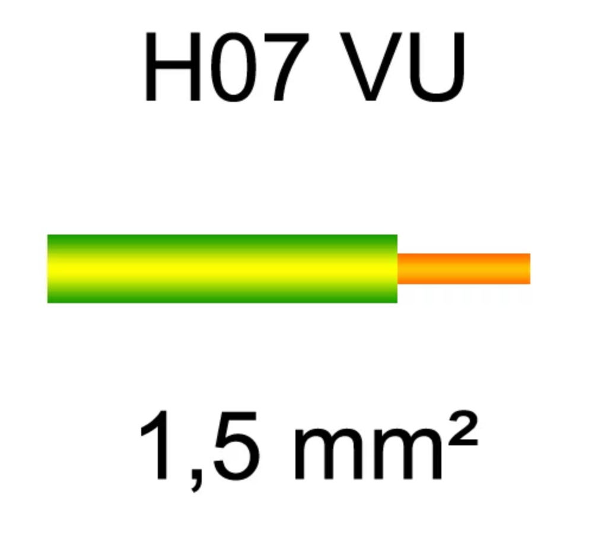
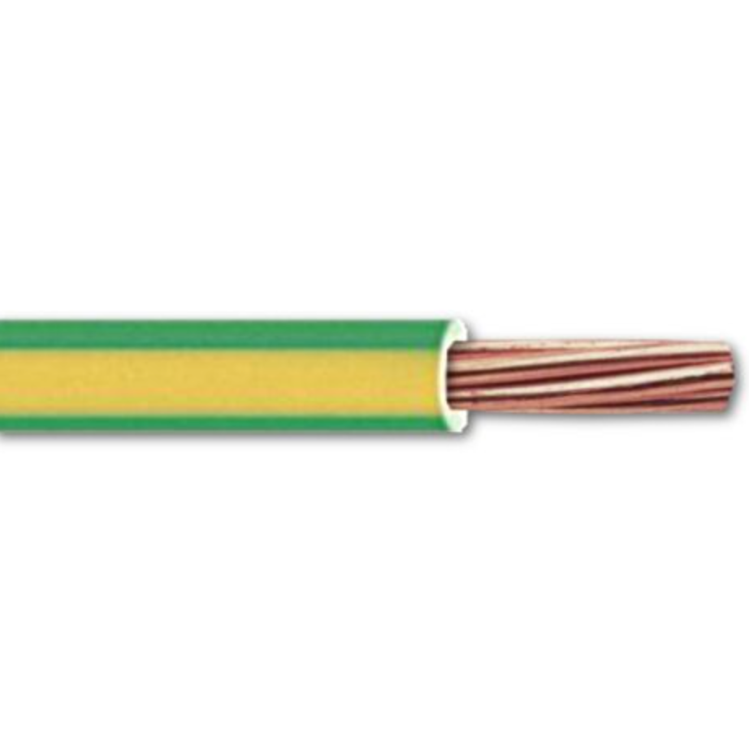
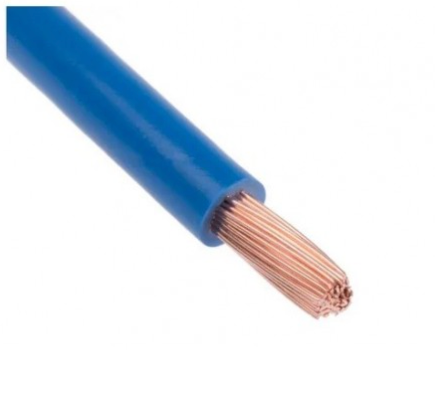
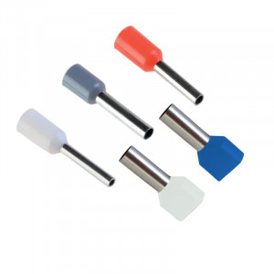
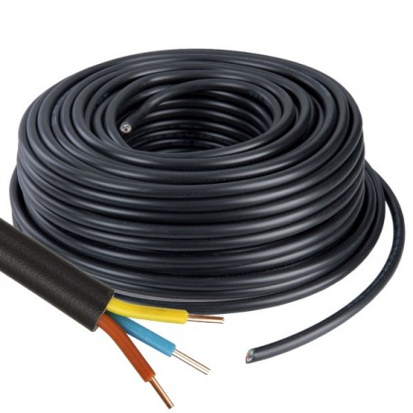
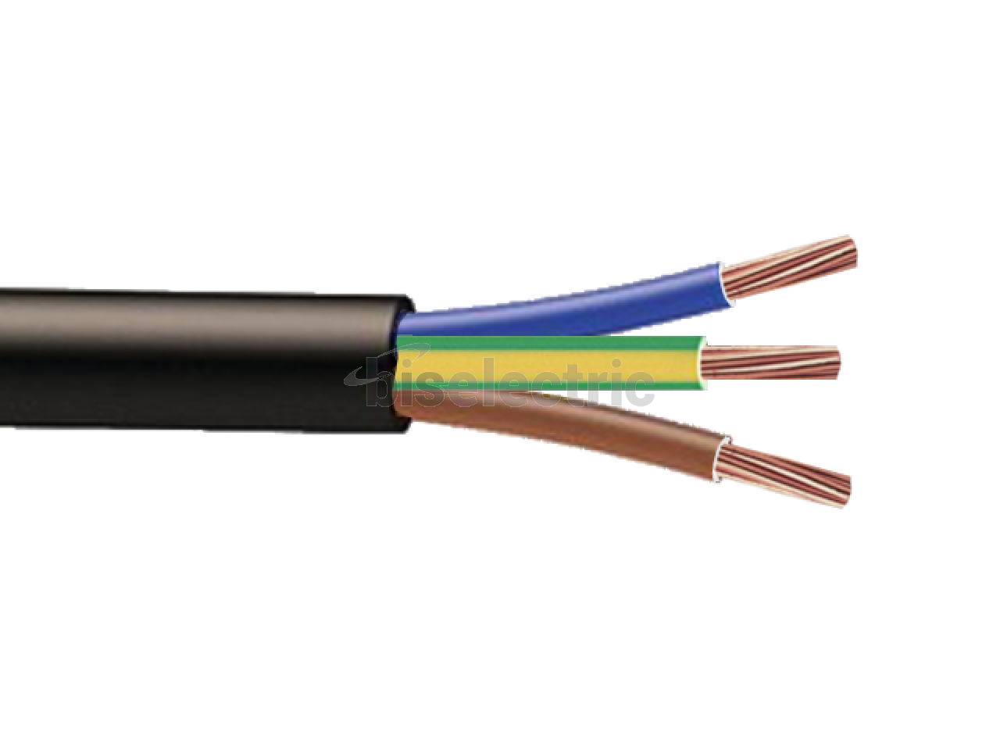
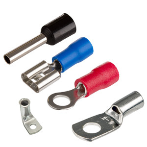
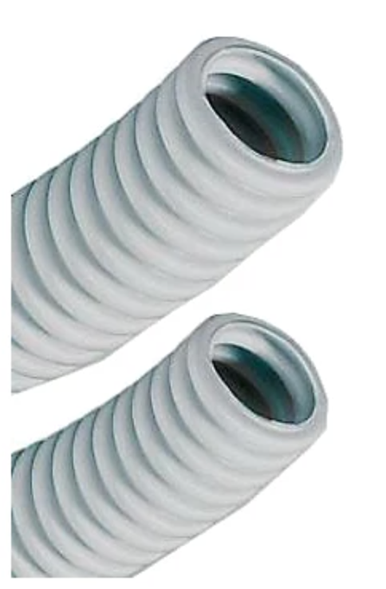
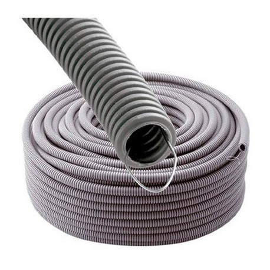
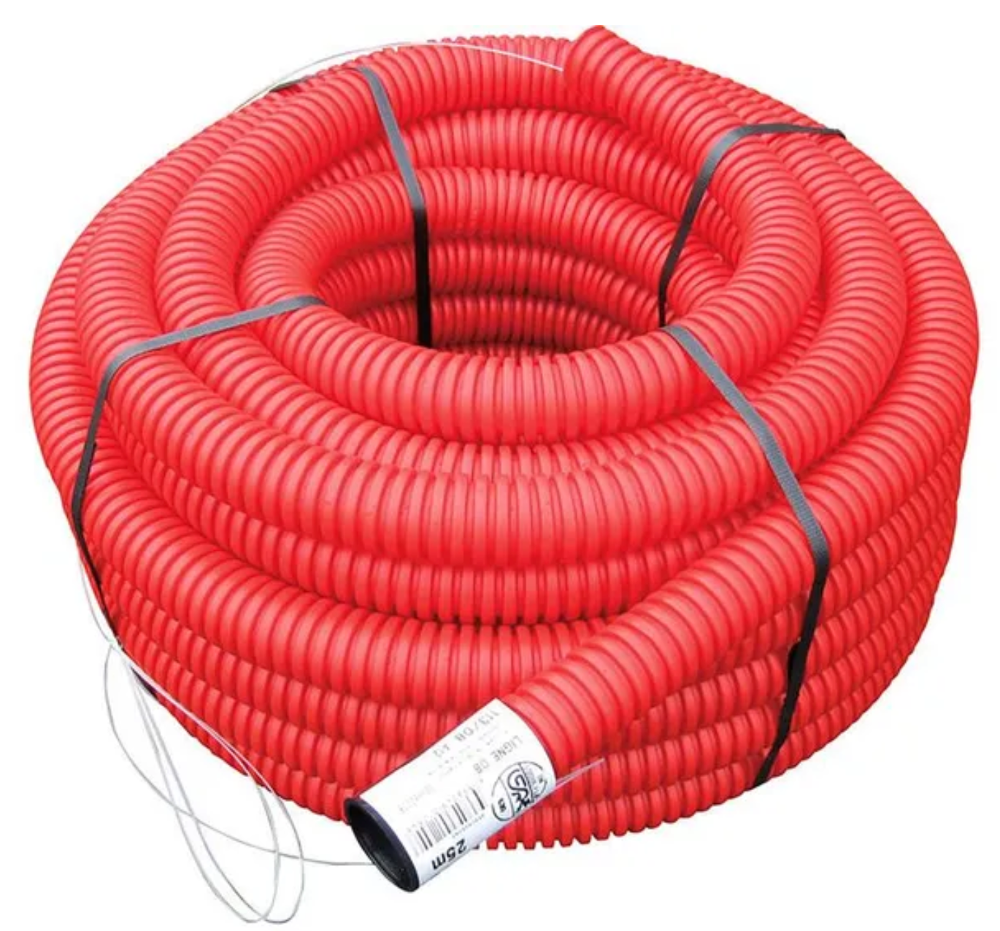

# CAP Elec 1.19 Fils, câbles et gaines
## Foley Services Elec - [Programme 1ère partie](../1ere_partie/README.md)

### 1.19 Fils, câbles et gaines

- **Accès à la vidéo** [1.19 Fils, câbles et gaines](https://youtu.be/7zpijlxw8Jw)

#### Câbles, gaines

Rappel sur les cables et gaines vu jusqu'ici avec un oeil attentif sur les modalités d'installation.

##### H07 VU

Fil ***rigide***,  ***isolé***, mais ***non protégé mécaniquement*** (en 1.5mm2, 2.5mm2 et 6mm2).

Par conséquent, ce fil doit être inséré dans une gaine de protection, un tube, une goulote, ...

VU == un seul brin

##### H07 VR

En 6mm2 et plus. Fil ***rigide***, ***multi-brins***. Encore ici, le fil n'ets pas protégé mécaniquement, il doit être inséré dans une gaine, tube ou goulotte.

##### H07 VK

Utilisé plutôt en tertiaire.

Fil isolé, sans protection mécanique, doit être inséré dans une gaine, tube ou goulotte.

Ce fil est ***multi-brins***, ***souple***.

Le caractère multi-brins de ces cables imposent d'utliser un embout de cablage.

#### Embouts de cablage

#### Câbles

##### U1000 R2V (ou R02V)

R2V = avec bourrage, R02V = sans bourrage

Ces câbles sont utilisés en extérieur (pompe piscine, pome relevage, alimentation portail, ...).

Si le cable passe dans un endroit accessible (combles, extérieur le long d'un mur, etc. il n'est pas nécessaire de l'insérer dans une gaine. Si le cable n'est pas accessible, on doit le gainer.

Il est donc interdit de passer ces cables directement dans les cloisons, ou de les enterrer directement.

##### H07 RNF

Cable industriel mais dont les brins sont souples.

Sur ces cables souples, il faut mettre des cosses

#### Gaines

Il existe trois types de gaines fréquemment installées.

##### Gaine ICA

- Ces gaines souples peuvent être passer dans les cloisons, les combles -- ***mais il est interdit de la passer dans le béton***.
- Souvent de couleur gris clair

##### Gaine ICTA

- Plus costaud que la gaine ICA, ***on peut la noyer dans le béton***.
- Existe en plusieurs couleurs (gris, bleu, noir, ...)

##### Gaine TPC

- Peut être utilisée en extérieur.
- Souvent noir avec une bande rouge.
- La gaine est destinée à être en terrée, sinon elle vieillit mal (pas de portection contre les UV).
- On peut le noyer dans le béton.
- Il est ***interdit de l'utiliser en intérieur*** car ***il est propagateur de la flamme***.