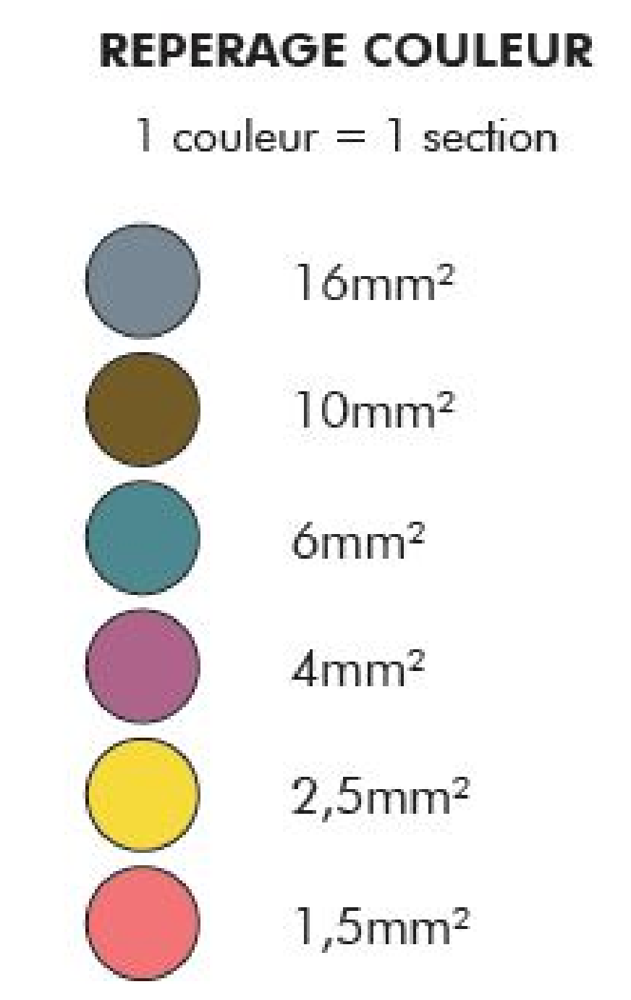

# CAP Elec 1.20 Attacher les fils
## Foley Services Elec - [Programme 1ère partie](../1ere_partie/README.md)

### 1.20 Attacher les fils

- **Accès à la vidéo** [1.20 Attacher les fils](https://youtu.be/qQ7J0bxueS0)

#### Passer les fils dans les gaines ...

Passage de fils dans des gaines TPC ou ICTA ...

##### 3 fils en 1.5 mm2 dans une gaine de 20

- On replie les fils pour accrocher l'aiguille.
- Si trop d'épaisseurs, on dénude les fils sur la partie repliée, tant pis si on doit recouper les cables à la fin

N.B. Trans'Lub ou Yellow : un gel qui permet de lustrer les cables au départ pour faciliter leur glissement dans la gaine.

- Marquage de repère sur les gaines (ne pas entourer la gaine de scotch !)

##### Cable R2V

- Et gaine TPC
- Boucles (3) qui serrent la gaine noire du cable
- Attention si le filin est en nylon, ne pas hésiter à le remplacer par un filin en acier pour permettre de tirer avec force sans crainte de casser.

Alternative:

- On dénude le cable sur une dizaine de 10cm
- On se ramène au cas précédent

##### DIstingo code couleurs

Pour repérer la section de fil dans le cable

