# CAP Elec 1.23 Outillage d’électricien(ne)
## Foley Services Elec - [Programme 1ère partie](../1ere_partie/README.md)

### 1.23 Outillage d’électricien(ne)

- **Accès à la vidéo** [1.23 Outillage d’électricien(ne)](https://youtu.be/Uoy_TMYy3Yw)

#### Caisse d'outils a minima

- Agence d'intérim, il faut avoir un minimum d'outillage
- Impact sur le jury de l'épreuve, du sérieux de la cnadidature, en capacité d'aller travailler dès l'obtention du diplôme

Budget global environ 200€

| Outil | Prix approx. | Photo |
|-------|--------------|-------|
|Caisse ou sac à outils | 15€ - 30€ | 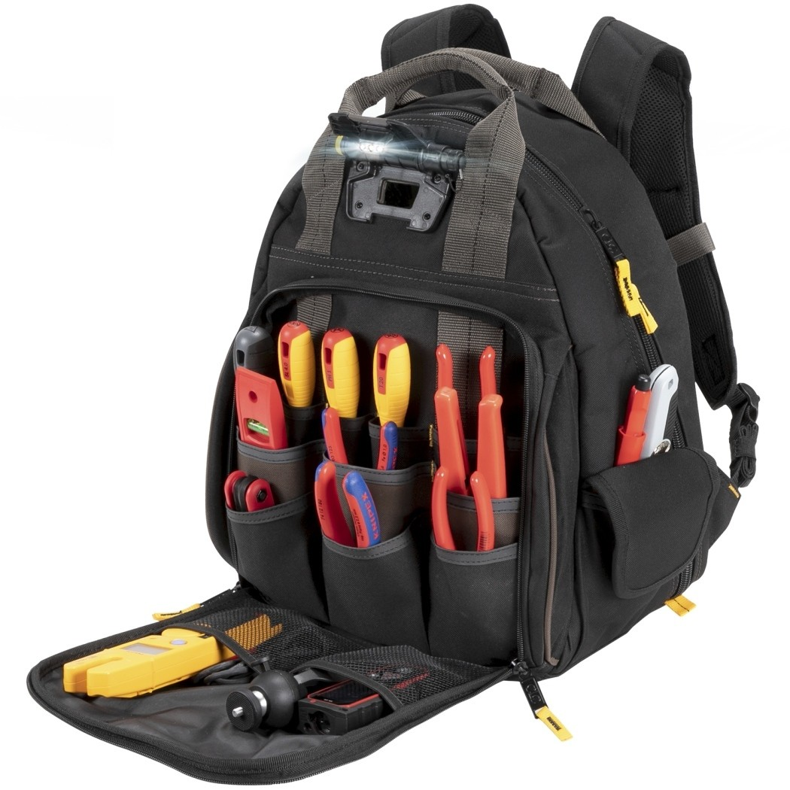 |
| Jeu de tournevis (isolés) | 20€ | 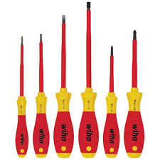 |
| Pinces coupantes |  |  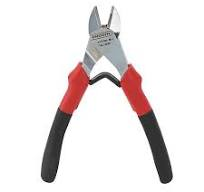|
| *Coupe câbles* (à ne pas confondre avec les pinces coupantes pour couper les ***fils***) | - | 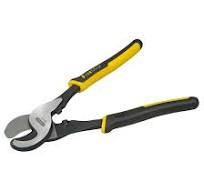 |
| Pince à bec long ("classique") | - | 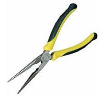 |
| Pince universelle | - | 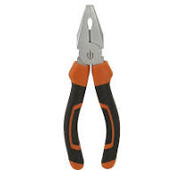 |
| Pince multiple (crocodile) | - | 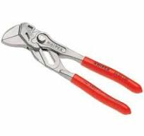 |
| Clés (pipes 10, 13, 17 | - | 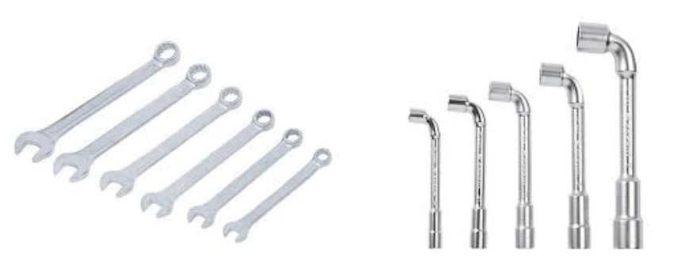 |
| Marteau | - | 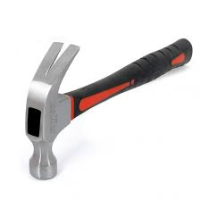 |
| Mètre 5€ | - | 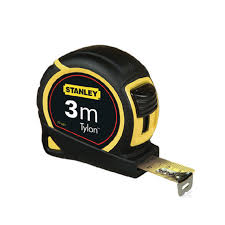 |
| Niveau (court) | - | 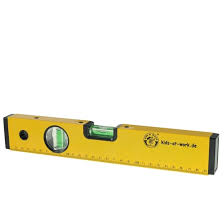 |
| Marqueur permanent | - | 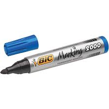 |
| Crayon papier (de menuisier) | - | 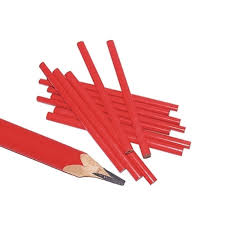 |
| Equerre | - | 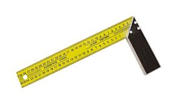 |
| Pince à dénuder | - | 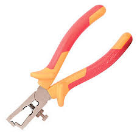 |
| Jokari pour dénuder les câbles | - | 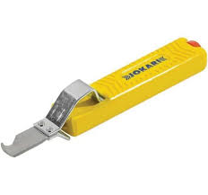 |
| Scie à guichet | - | 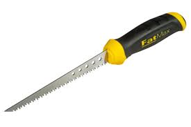 |
| Scie à métaux | 10€ - 15€ | 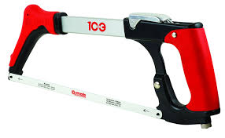 |

#### Un petit plus

| Outil | Prix approx. | Photo |
|-------|--------------|-------|
| Pince pour cheville Molly 15€ | - | 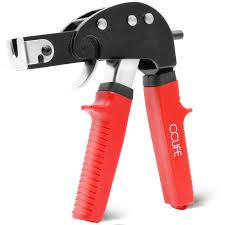 |
| Cisaille 15€ - 20€ | - | 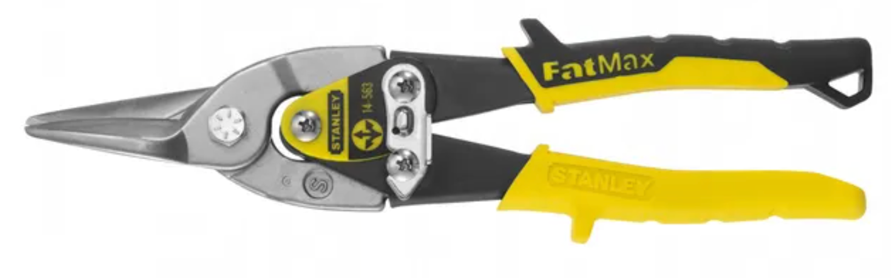 |
| Pince Colson | - | 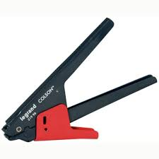 |
| Multimètre (à pince ampèremétrique) | - | 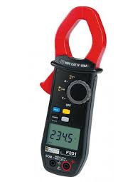 |

