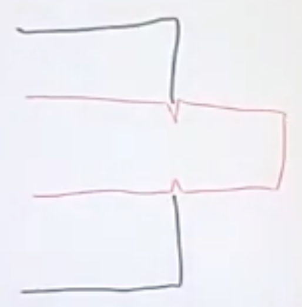

# CAP Elec 1.24 Dénuder fils & câbles
## Foley Services Elec - [Programme 1ère partie](../1ere_partie/README.md)

### 1.24 Dénuder fils & câbles

- **Accès à la vidéo** [1.24 Dénuder fils & câbles](https://youtu.be/eELPhmZnZrU)

#### Dénuder ... mais avec quel outil ?

Exemple de fil H07 VU dénudé avec une pince coupante, qui abîme le cuivre à l'intérieur, qui introduit le risque que le cuivre se casse après quelqeus manipulations.

Dénudeur automatique, mais avec le problème de fragilisation de l'isolation (la partie sur laquelle la pince a "mordu").

La pince à dénuder "traditionnelle" est peut-être à favoriser pour éviter les problèmes évoqués prédédemment.

- Pourquoi ne pas avpoir deux pinces, l'une réglée en 1.5, l'autre en 2.5 ?

#### Dénuder un câble

Le cas du câble R2V (assez commun).

Démonstration de l'usage du Jokari, exemple de mauvaise utilisation (lame qui fend l'isolation des fils !).

Découpe le long du câble sans aller trop profondément pour éviter de toucher les fils qui sont logés à l'intérieur de la gaine extérieure.

##### Câble HO7 RNF

Le jokari ne doit âs êrte utilisé pour faire une découpe le long du câble, il faut plkutôt découper légèrement la gaine perpendiculairment à l'axe du cylindre, puis en plian le câble la gaine va céder.
