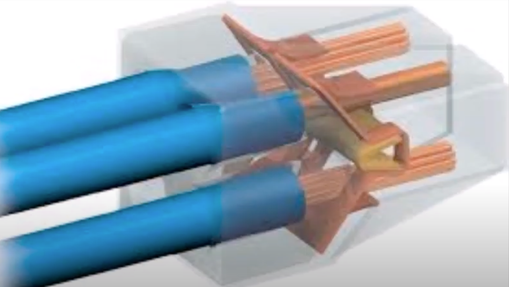
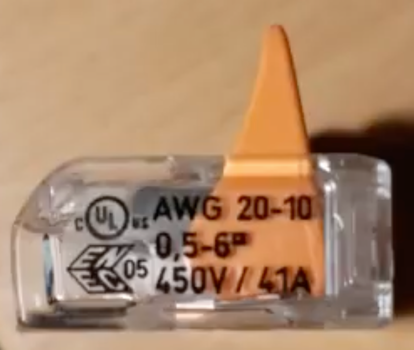
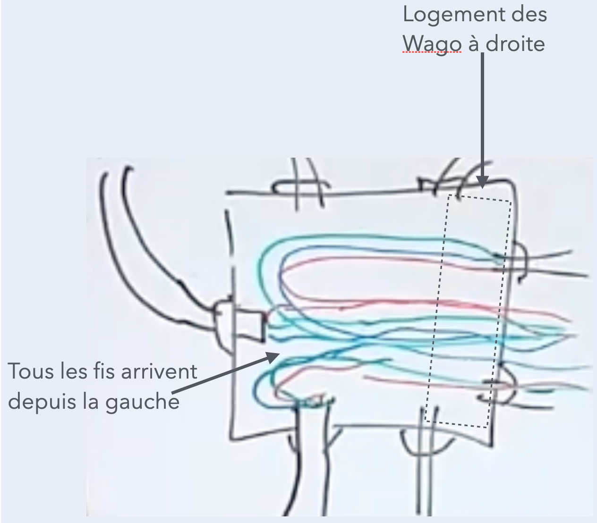
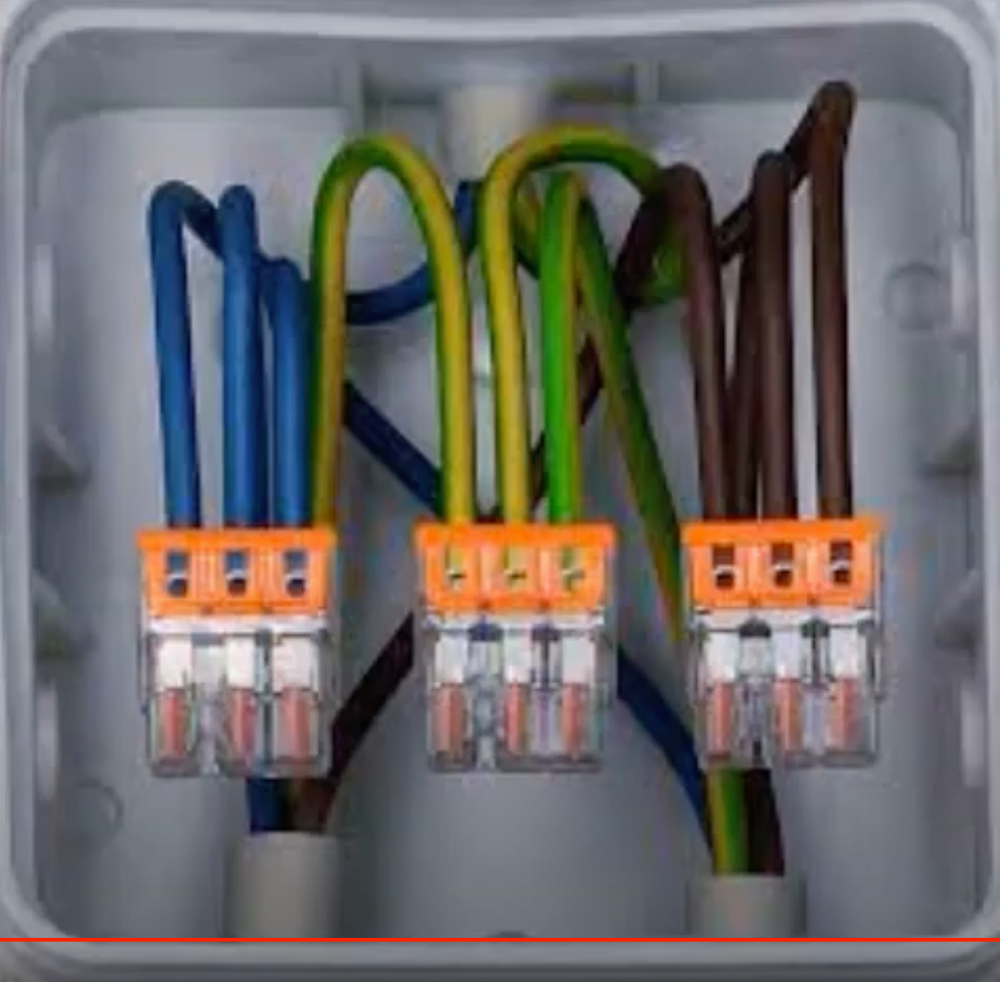

# CAP Elec 1.25 Faire des boîtes de dérivation
## Foley Services Elec - [Programme 1ère partie](../1ere_partie/README.md)

### 1.25 Faire des boîtes de dérivation

- **Accès à la vidéo** [1.25 Faire des boîtes de dérivation](https://youtu.be/6ADzZg6S6-4)

#### Les connecteurs

##### Les dominos

(connexions à visser isolées)

- Avantage:
  - réutilisable;
  - on peut agencer des fils de nature différente;
  - calibré de manière corrrespondante au calibrage des disjoncteurs.

On les utilisait beaucoup, on les utilise de moins en moins ...

##### Wago rigide

Introduit par la marque Wago (Allemand), le petit boitier contient une plaque métallique tenu par un ressort qui pince et maintient les fils.

- Avantage:
  - les vis d'un domino finissent par se désserer au fil du temps, ce phénomène ne se manifeste pas (les fils sont "pincés");
  - on peut ponter deux wagos pour avori des capacités qui n'existent pas nativement (2, 3, 4, 5, 8).

##### Nouveau Wago

Connexion avec un petit levier, on peut mélanger des fils de nature différente.

A noter l'intensité des Wago qui est indiqué sur les dispositifs, avec une préconisation sur les intensités qui appellent la prudence pour éviter que les dispositifds ne chauffent.

##### Astuce(s)

Usage d'un wago de 2 pour rallonger un fil, il est si petit qu'on peut le loger dans un moulure.

#### Les boîtes de dérivation

(On les appelle aussi des Plexo)

- A noter les valeurs IP associé aux boîtes.

- Dans une pièce qui peut être humide ou carrément mouillée, il faut privilégier l'arrivée des câbles par le bas pour éviter que l'eau n'entre dans la boîte.

- A prendre en compte so on doit insérer deux cable spar l'un des presse-étoupes de la boite, car alors on n'a pas étanchéité (on n'est pas IP55).

- Pour être conforme, le câble ou la gaine doit entrer dans la boîte, les fils ne doivent pas être visibles, car ils ne seraient alors pas protégé mécaniquement.

##### Méthodo

Penser la configuration des connexions dans la boite avant l'implémentation.

- Disposer les wago systématiquement du même côté, et faire arriver les fils depuis le même côté.
- Couper les fils à 1 cm du bord de la oîte avant d'insérer les wago.

- Répéter le même principe pour d'autres fils alientant un autre cicruit, en disposant les wago à l'opposé. En cas d'intervention on pourra "déplier" les couches de fils pour accéder au circuit concerné.

--

[Exemple d'un boîte de dérivation contenant 5 câbles R2V 3G1.5](https://youtu.be/6ADzZg6S6-4&t=29m25s)

- Astuces, écrire derrière le couvercle de la boîte
- Le wago comporte un trou qui permet d'insérer le pico d'un multimètre