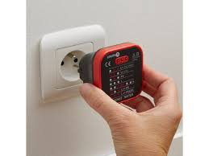
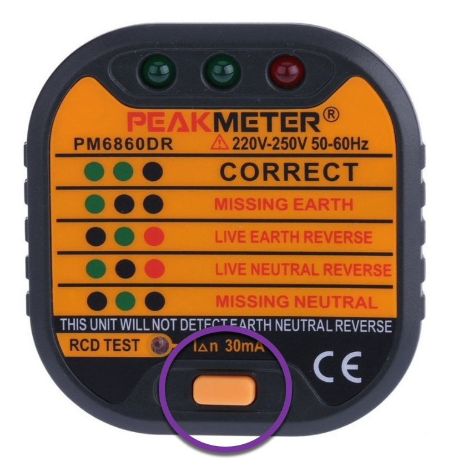

# CAP Elec 1.26 Testeur des prises
## Foley Services Elec - [Programme 1ère partie](../1ere_partie/README.md)

### 1.26 Testeur des prises

- **Accès à la vidéo** [1.26 Testeur des prises](https://youtu.be/UkJkzR5oeZg)

#### Testeur de prise

Test RCD (différentiel, *en anglais Residual-Current Device*), un bouton au bas de la façade du dispositif.

L'appareil indique si le différentiel détecte bien le $$\Delta$$ réglementaire, mais n'indique pas si la détection se fait dans le temps réglementaire.

