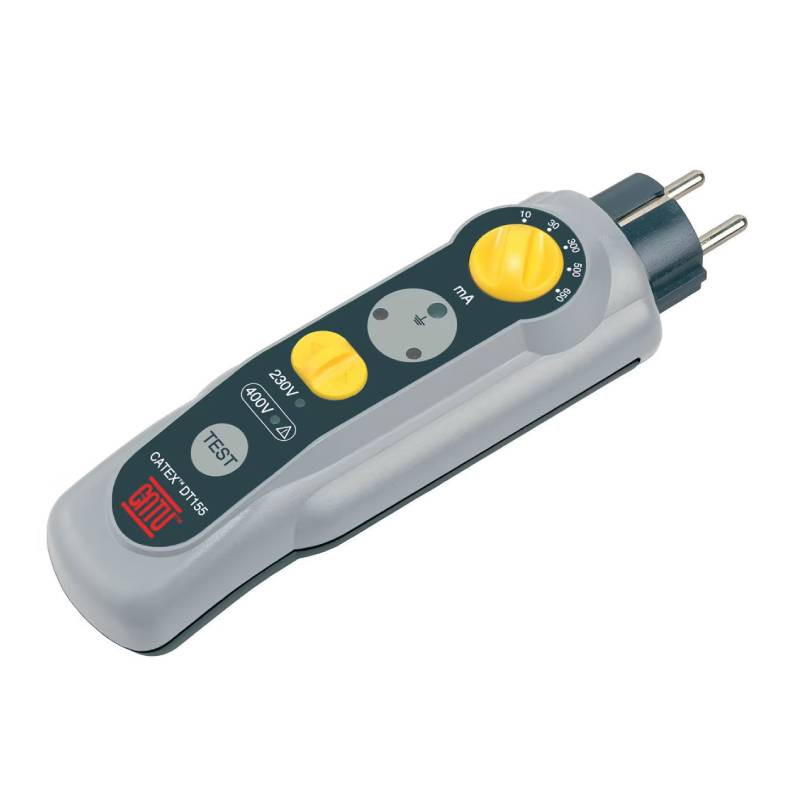
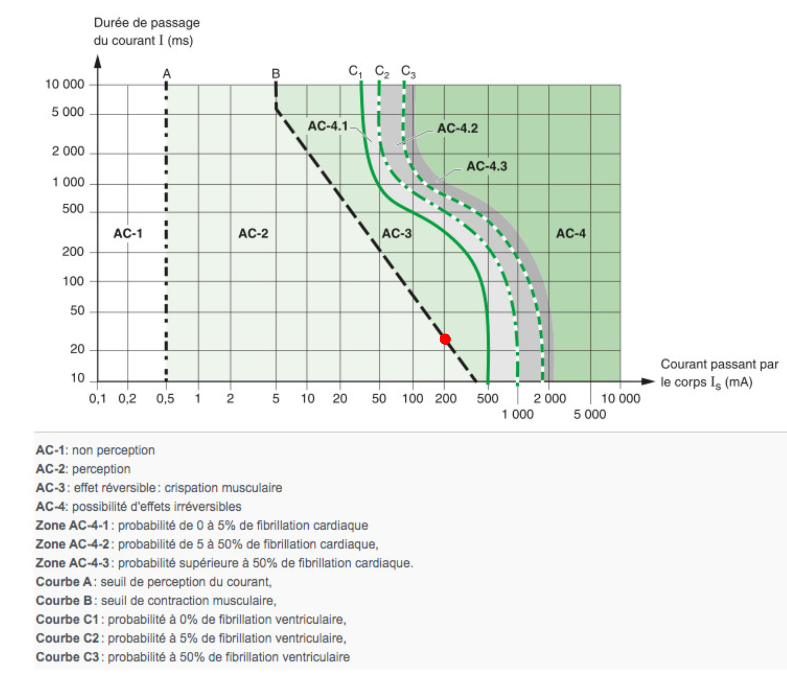

# CAP Elec 1.27 Testeur de différentiels
## Foley Services Elec - [Programme 1ère partie](../1ere_partie/README.md)

### 1.27 Testeur de différentiels

- **Accès à la vidéo** [1.27 Testeur de différentiels](https://youtu.be/9i7WhVqjMvo)

#### Tester un différentiel

Remarque sur des vidéos illustrant des test de différentiel en les alimentant soit par le haut, soit par le bas. Réaction de Sean: respectez le sens de raccordement imposés par le fabricant.

Un raccordement inversé pourra peut-être fonctionné, mais la responsabilité de l'installateur est engagée si le raccordement ne se plie pas aux exigences du fabricant.

Pour tester le fonctionnement d'un différentiel, il ne suffit pas de provoquer un court-circuit. Il faut un appareil dédié:

- tester le déclenchement mesurant la sensibilité (max 30mA),
- et le temps de réaction au déclenchement
  - moins de 30ms si l'intensité est 10 fois la sensibilité: différentiel de 30mA avec un défaut de 300mA
  - ***sur le graphique plus bas: moins de 30ms si défaut de 200mA*** (point rouge sur l'image)

Il faut donc un appareil spécifique: un testeur de différentiel

Il s'agit de tester l'intensité qui fait déclencher le différentiel (mode mA), et le temps de réaction (mode ms) qui doit se situer dessous la courbe fonction de l'intensité utilisée lors du test.

