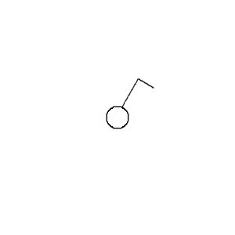

# CAP Elec 1.29 Les plans électriques
## Foley Services Elec - [Programme 1ère partie](../1ere_partie/README.md)

### 1.29 Les plans électriques

- **Accès à la vidéo** [1.29 Les plans électriques](https://youtu.be/18_gyriwtQ4)

#### Lecture de plans électriques

Rappel, dans une chambre, la norme impose:

- Minimum 3 prises de courant et 1 prise / 4m2
- 1 commande à l'entrée de la pièce avec au moins un point lumineux au plafond ***ou*** deux appliques ***ou*** deux prises de courant commandée
- 1 prise de communication (RJ45)

Symboles à connaître:

| Symbole | Icône |
|---------|-------|
| Simple allumage |  |
| Double alllumage |  |
| Va-et-vient |  |
| Bouton poussoir |  |
| Alimentation |  |
| Symbole prise de courant |  ou  |
| Symbole éclairage | Lumière plafond  ou applique  |

[Voir aussi la liste des symboles prposés sur le site shcema-electrique.net](https://schema-electrique.net/symboles-electriques-normalises-plan-electricite-maison-batiment-domestique.html), disponible dans des documents pdf par catégorie:

- [Symboles électriques circuits PCS](./docs/symboles-electriques-circuits-pcs.pdf)
- [Symboles électriques éclairages](./docs/symboles-electriques-eclairages.pdf)
- [Symboles électriques commandes](./docs/symboles-electriques-commandes.pdf)
- [Symboles électriques équipements](./docs/symboles-electriques-equipements.pdf)
- [Symboles électriques divers](./docs/symboles-electriques-divers.pdf)
- [Symboles électriques PC réseau antenne](./docs/symboles-electriques-pc-reseau-antenne.pdf)

##### Positionnemenent des commandes et PCs

Le plan ne donne pas nécessairement d'indication de hauteur.

- Par exemple, deux symboles voisins pour une commande d'clairage (VV) et de prise n'oblige pas à avoir la prise à la même hauteur que la commande d'éclairage. On pourra mettre la commande à 1,10m, et la prise à 30cm, les deux étant alignés verticalement.

- Autre exemple, d'une indication de prises voisines PC et RJ45 qui seront positionnées à 30cm si elle sont destinées à un bureau, mais éventuellement positionnées  plus haut si elles sont destinées à un téléviseur ancré sur le mur.

- Cas de prises qui doivent être alignées (de part et d'autre d'un lit, plan de travail dans la cuisine). ***Attention*** à l'alignement, qui ne doit pas se faire par rapport à un sol non fini et pas au niveau, il vaut mieux prendre référence par rapport au plafond qui lui est forcément au niveau.

