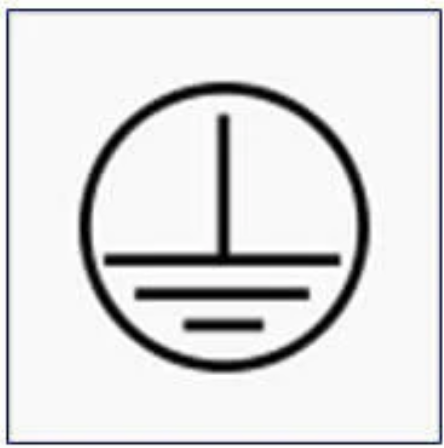
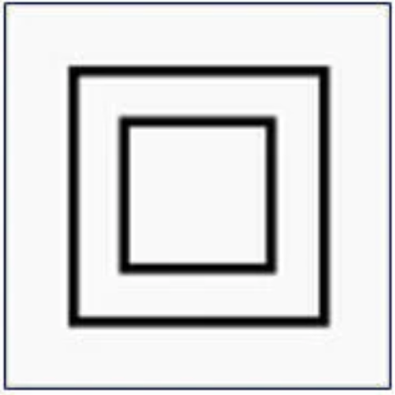
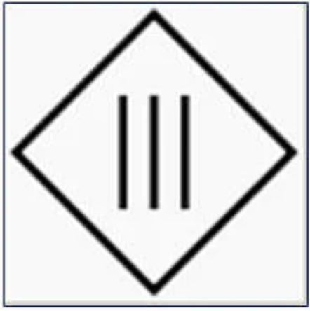
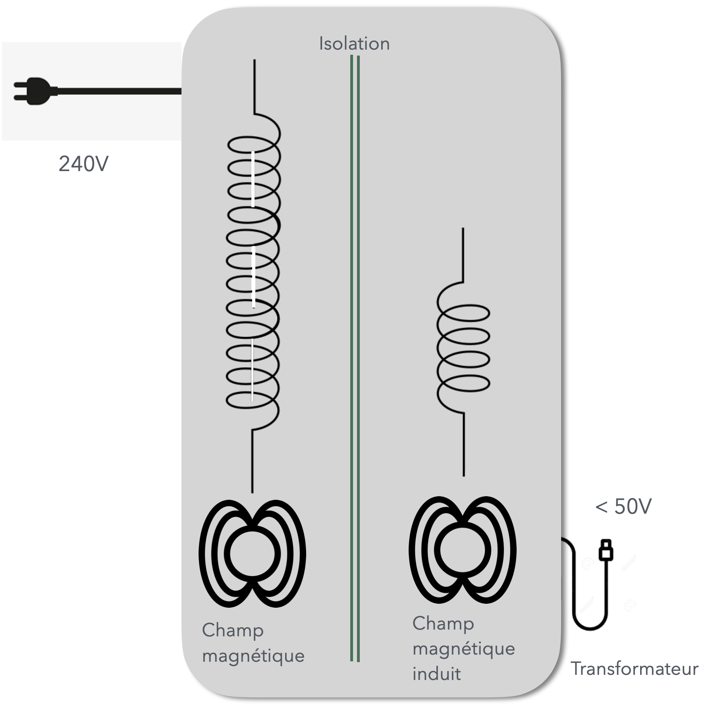
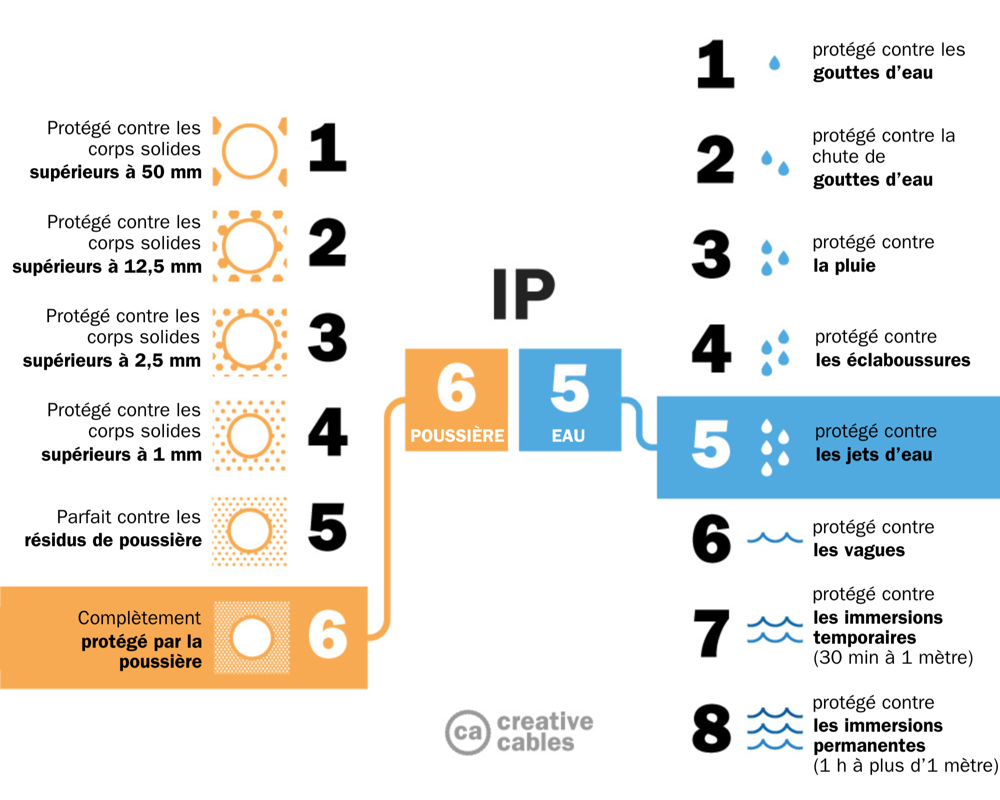
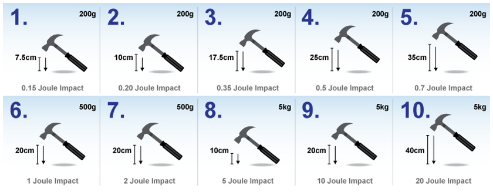
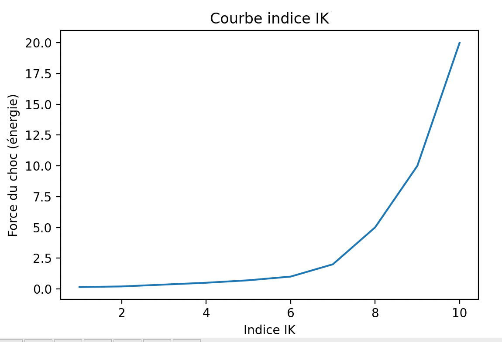

# CAP Elec 1.31 Classes de protection
## Foley Services Elec - [Programme 1ère partie](../1ere_partie/README.md)

### 1.31 Classes de protections

- **Accès à la vidéo** [1.31 Classes de protections](https://youtu.be/CYTlxeuK7Bc)

#### Classes 0, 1, 2, 3

##### Classe 0 - interdit aujourd'hui.

"""

*... pas de conducteurs de protection (PE) assurant la connexion entre la terre et les parties métalliques de l'équipement ou de l'appareil électrique. La protection contre les chocs électriques est assurée par l'isolation des équipements/appareils électriques. À titre d'exemple, on peut citer les appareils de type ventilateurs, télévisions, radios portables, etc.*

*Dans de nombreux pays comme en France, la vente de produits de la classe électrique 0 est actuellement interdite, car une simple panne peut provoquer un choc électrique ou des dommages matériels. La CEI (Commission électrotechnique internationale) est en train de supprimer dans ses normes l'utilisation de la classe électrique 0 des équipements électriques. On s'attend à ce que le concept de classe 0 disparaisse, laissant la place aux produits contenant une protection de classe II.*

"""

(source https://www.silamp.fr/pages/classe-electrique)

--

##### Classe 1 - appareils obligatoirement relié à la terre.

*... le châssis de l'équipement/appareil électrique doit être relié à la terre à l'aide d'un conducteur de protection (PE) identifié par la couleur verte ou verte-jaune. Une défaillance de l'isolation de l'appareil qui provoque un contact électrique entre un conducteur sous tension et le châssis de l'équipement générera un courant électrique qui passera à travers le conducteur de protection (PE). Ce courant de défaut doit également passer par un dispositif de protection contre les surcharges (fusibles ou disjoncteurs) ou un DR (dispositif différentiel) qui coupera l'alimentation électrique de l'appareil.*

--

##### Classe 2 - doublement isolé, pas relié à la terre

*... « à double isolation » est un appareil conçu pour ne pas nécessiter l'utilisation d'un conducteur de protection (PE) connecté à la terre. L'exigence de base est que toute défaillance unique ne provoque pas de tensions électriques dangereuses exposées dans les équipements/appareils électriques (qui peuvent provoquer des chocs électriques), sans avoir besoin d'un conducteur (PE) connecté à la terre.*

##### CLasse 3 - T.B.T.S. Très Basse Tension Séparée

***Très basse tension, moins de 50V.***

Bobine tension 240V, induction d'une tension sur une bobine voisine proportionnelle au ratio des "longueurs" des bobines. Si 20 fois moins "longue", on obtient en sortie une tension de 12V.

##### Résistance, tension et sécurité

- Résistance moyen d'un être humain est de 5000 $$\Omega$$ (5K$$\Omega$$).
- Intensité moyenne minimale à laquelle réagit un humain par contraction musculaire involontaire est de 10mA (= 0,01A).
- Par suite, on voit bien que la tension maximale que peut supporter un être humain est de 50V.

Cette intensité de 10mA est aussi appelée *le "seuil de non-lâcher"*. Ou la tension correspondante de 50V, la *limite conventionnelle de sécurité*, $$U_L = 50V$$.

Si on "prend le jus" à la sortie d'un transfo de 12V, on ressent une intensité de $$I = U/R = 12/5000 = 24mA$$.

#### Niveau de protection IP

IP XY constitué de deux indices de protections, X et Y:

- X : protection contre les corps solides
- Y : protection contre les corps liquides

- IP2Y: protection contre les corps solides qui font plus de 12,5mm (taille moyen d'un doigt)

- IP3Y: 2,5mm
- IP4Y : 1mm
- IP5Y : "parfait" contre les résidus de poussière
- IP6Y : complètement protégé de la poussière

--

- IPX1 : protégé contre l'eau arrivant à la verticale (gouttes d'eau)
- IPX2 : projection formant un angle d'incidence de 15o avec le dispositif
- IPX3 : projection formant un angle d'incidence de 60o avec le dispositif (pluie)
- IPX4 : projection d'eau dans toutes les directions (éclaboussures)
- IPX5 : protection contre les jets d'eau à la lance ("coup de karcher"). Exemple, les interrupteur, boutons poussoirs Plexo, neufs, sont IP55.
- IPX6 : protection contre les vagues (gros volumes d'eau)
- IPX7 : protégé contre les immersions temporaires
- IPX8 : protégé contre les immersions permanentes

Il y a une corrélation entre les deux indices. Par exemple, on ne trouvera jamais d'indice IP28, mais plutôt IP68 (éclairage piscine). IP67: spots encastrés au niveau du sol dans les lieux publics (immersion en cas de forte pluie) - alors pourquoi ne pas installer du IP68 ? à cause du dégagement de chaleur qui se diffuse dans l'eau mais qui provoquera l'éclatement du dispositif dans l'air.

#### Indice de protection IK contre les chocs mécaniques

La progression de l'énergie du choc par rapport à l'indice suit une courbe exponentielle:

