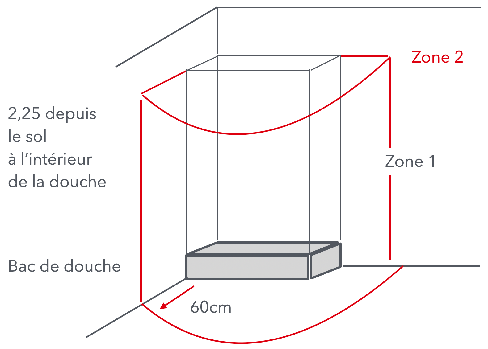
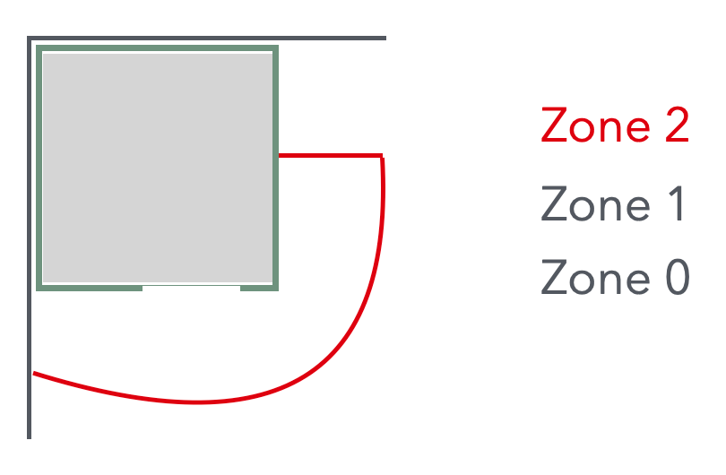
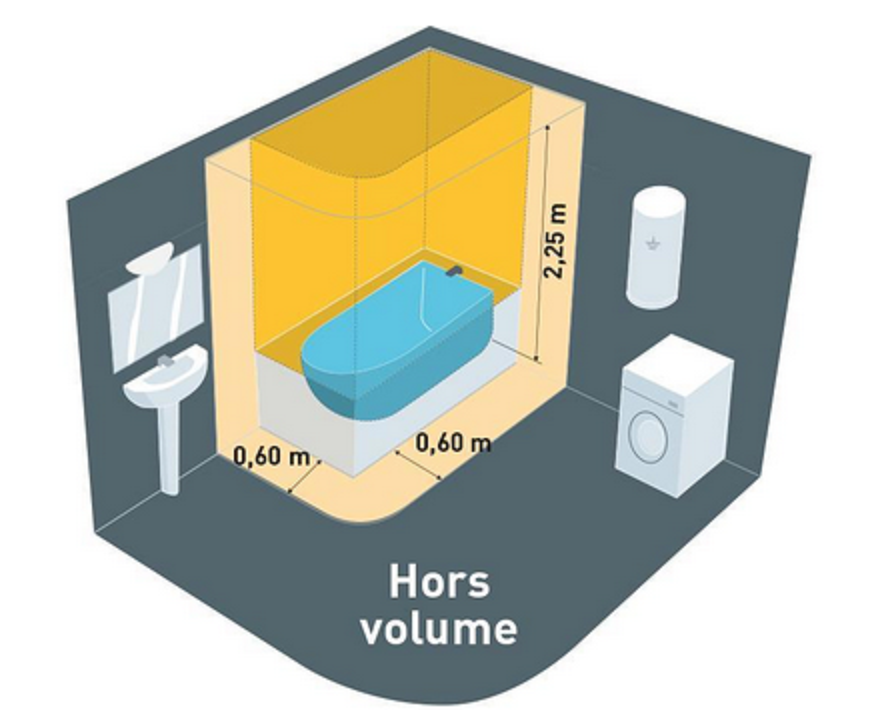
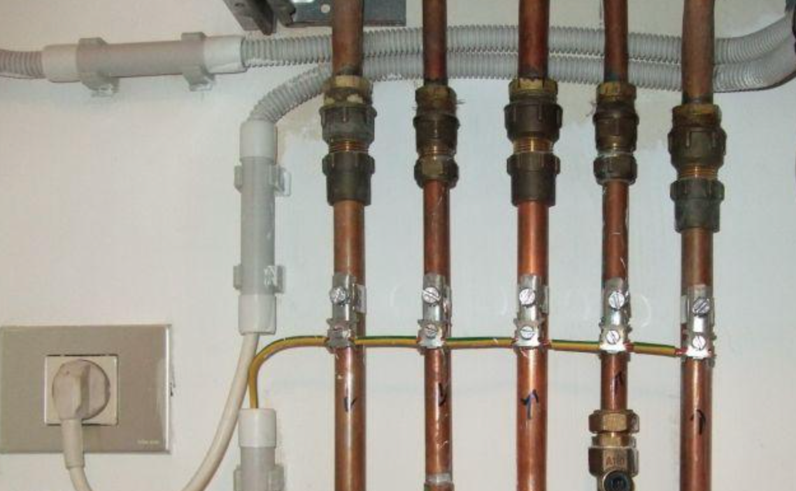

# CAP Elec 1.32 La salle de bains
## Foley Services Elec - [Programme 1ère partie](../1ere_partie/README.md)

### 1.32 La salle de bains

- **Accès à la vidéo** [1.32 La salle de bains](https://youtu.be/6hM56Hh6bjE)

*Voir Promotelec, installation électrique parties privatives / Emplacements pséciaux, p.256 et ss. (édition 2022)*

#### Prise de courant et points d'eau

Y a-t-il une distance à respecter ? Oui et non, ça dépend.

Point d'eau:

- Robinet, lavabo, baignoire, douche, spa, piscine ?

La norme n'impose rien par rapport aux points d'eau.

A l'inverse de la cuisine où les 4 prises imposées au niveau du plan de travail doietn se trouver à 5cm du sol ou du plan de travail minimum - elles ne doive tpas être situées derrière l'évier ou derrière la plaque de cuisson.

La prise qui alimente le lave-vaisselle peut se trouver à côté du point d'eau alimentant le lave-vaisselle (en eau). Idem pour le lave-linge.

On peut tout-à-fait poser une prise de courant à proximité de la vasque dans une salle d'eau.

--

#### Où mettre les prises, les interrupteurs et les points d'éclairage

##### Cabine de douche

- La ***zone 0*** désigne la zone où il peut y avoir une accumulation d'eau (on y trempe les pieds).
- La ***zone 1*** est le volume qui s'élève au-dessus du volume 0 et jusqu'à 2,25m de hauteur au-dessus du "plan d'eau" du volume 0.
- La ***zone 2*** est le volume (jusqu'à 2,25m de hauteur) atteignable depuis l'accès aux zones 0 et 1, et jusqu'à 60cm de portée

Pour une baignoire:

- Le ***volume 0*** consiste en la baignoire, y compris les bordures (et leur projection au sol),
- Le ***volume 1*** va jusqu'à 2,25cm depuis le fond de la baignoire
- Le ***volume 2*** est  périphérique, de 60cm autour du profil de la baignoire.

N.B. Une baignoire doit avoir obligatoirement un panneau de visite.

##### Volume caché

Sous une baignoire "habillée", le volume peut être considéré ***caché*** -- et recevoir des équipements comme la pompe du balnéo, par exemple -- s'il un outil est nécessaire pour y accéder. 

- Un panneau avec une fermeture magnétique n'est pas un volume caché.

--

#### Liaisons équipotentielles secondaires

- Page 258 Promotelec - volume caché.

Les parties métalliques de la SdB doivent être mises à la terre par des liaisons équipotentielles, par une fil de 2,5mm^2 (si portégé mécaniquement dans une gaine -- 4mm^2 si non protégé mécaniquement)

- Il est préférable de ne pas faire de pontage entre les appareils mais de prévori une liaison indépendant pour chacun.
- Au niveau des tuyaux d'alientaiotn en eau (cuivre), on ne doit pas couper les fils assurant le pontage mais seuement les dénuder our maintenir la liaison à la terre même si 'lun des tuyaux devait être supprimé.

--

##### Quel équipement dans quel volume ?

*Voir tableau Promotelec, page 263 (édition 2022)*

Appareils TBTS (très basse tension de sécurité)

- 50V AC maximum - milieu sec
- 25V AC maximum - milieu humide
- 12V AC maximum - immersion dans l'eau (typiquement éclairage)

[Voir préconisations Promotelec](https://www.promotelec.com/professionnels/fiche/immeubles-existants-equipements-electriques-des-petites-salles-de-bains/)

[Voir aussi la fiche du site schema-electrique](https://www.schema-electrique.net/norme-electrique-volume-salle-de-bain.html)

***Cas exceptionnels*** Cas des petits appartements parisiens, chauffe-eau dan sle volume 1 (chauffe-eau à accumulation, avec IPxy élevé ?)