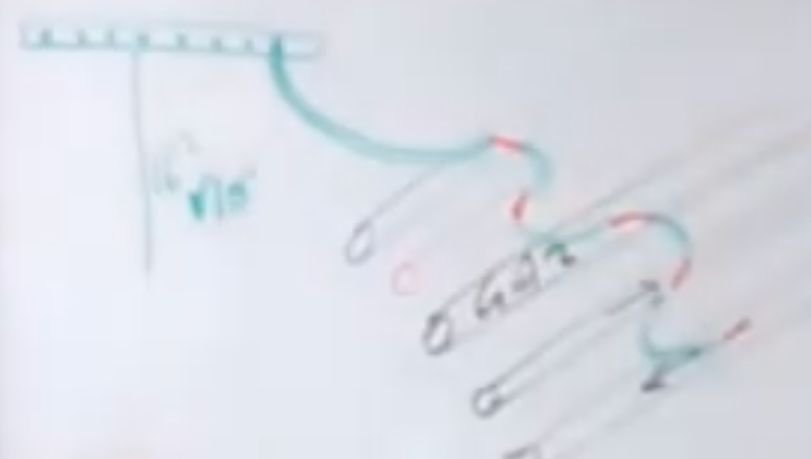

# CAP Elec 1.33 Liaison Equipotentielle Principale
## Foley Services Elec - [Programme 1ère partie](../1ere_partie/README.md)

### 1.33 Liaison équipotentielle Principale

- **Accès à la vidéo** [1.33 Liaison Equipotentielle Principale](https://youtu.be/n4e2tvvMp3g)

#### Retour sur la salle de bain

Toutes le sparties métalliques doivent être mises à la terre.

Cas particulier (et en réalité plutôt rare) des menuiseries en aluminium, lorsqu'elles sont dans  le volume 1.

Les douches et baignoires, si elles sont en résine et non en métal, ne sont pas mises à la terre, mais la liaison doit être mise en attente (elle est là, non connetcée, mais déjà installée si dans le futur on change la douche ou la baignoire pour un modèle métallique).

Si la liaison équipotentielle secondaire est protégée mécaniquement, le diamètre de 2,5mm^2 suffit, sinon (pas protégée mécaniquement) il faut passer en diamètre 4mm^2.

#### Liaison équipotentielle principale

Liaison entre le tableau, et le répartiteur de terre du bâtiment, minimum 16mm^2.

Répartiteur dans le tableau.

On met à la terre toutes les canalisations (*Promotelec, page 90 - édition 2022*):

- eau froide
- eau chaude
- gaz
- tuyaux alimentant le circuit eau chaude du chauffage (aller et retour)

Autres cas possibles:

- géothermie
- réservoir fioul
- etc.

On installe une liaison équipotentielle qui court sur chacun des tuyaux sans discontinuité. Le fil est dénudé (partie rouge sur l'image) sur la partie qui assure la connexion au tuyau. *C'est imposé parla norme.*

La liaison équipotentielle principale doit être d'un *diamètre au moins égale à la moitié de la plus grande section de l'installation*, et au minimum 6mm^2.

*Promotelec, page 235 (édition 2022)*

La section des fils qui vont de l'AGCP (appareil général de commande et de protection) jusqu'au tableau doivent être dimensionnés en fonction de l'ampérage maximum que peut supporter l'AGCP. 

La dimension de la liaison équipotentielle des appareils dépend de la seciton uitlisée pour les alimenter, avec une borne supérieure à 16mm^2.

***Remarque***. AVec l'installation de recharge pour les véhicules électriques, les AGCP passent parfois à un amérage supérieure à l'installation initiale. Par conséquent, le câble le dimensionnement des liaisons AGCP - tableau, et le dimensionnement des liaisons équipotentielles peuvent alors s'avérer inférieures à ce qui est nécessaire, exposant à un risque de surchauffe.

[Un rappel du tableau de correspondance entre section des câbles et intensité du courant s'impose.](CAP_Elec_Tableaux_Recapitulatifs.md)

***Remarque***. Les parties métalliques de la structure d'un bâtiment doivent être mis à la terre. Exemple d'un hangar dont la structure est en métal.