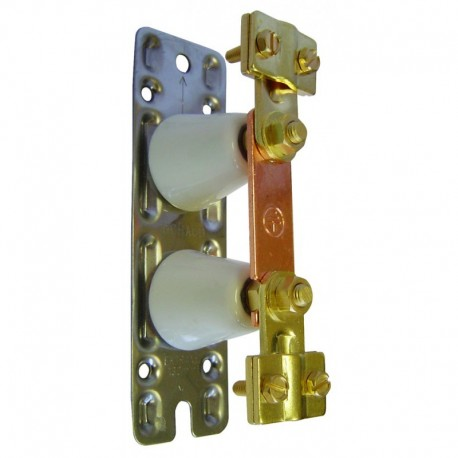
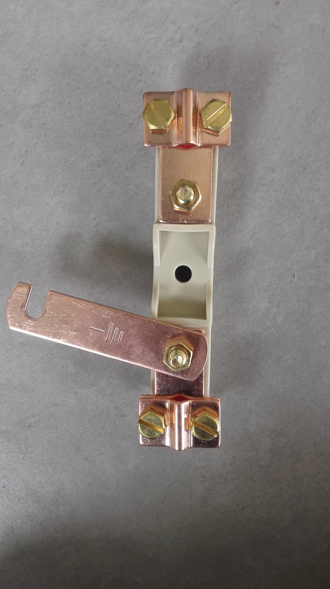
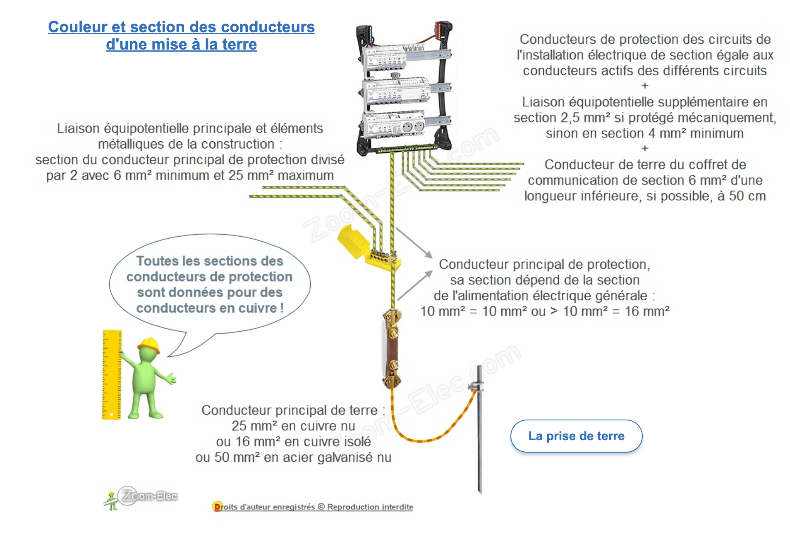
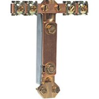

# CAP Elec 1.34 Réalisation terre
## Foley Services Elec - [Programme 1ère partie](../1ere_partie/README.md)

### 1.34 Réalisation terre

- **Accès à la vidéo** [1.34 Réalisation terre](https://youtu.be/XEFzNvb5wEM)

#### Régime TT

- Le premier **T**: que fait-on du neutre du transformateur (au niveau du réseau de distribution), on le met à la **T**erre
- Le second **T**: que fait-on des liaisons équipotentielles côté privatif, on les met à la **T**erre

C'est le régime imposé pour les installations d'habitations privées en France.

Comment réaliser la mise à la terre, c'est-à-dire la liaison (connexion) depuis le tableau et jusqu'à la terre (dan sle sol):

- quel procédé ?
- quel dimension de câble ?
- comment on le mesure ?
- etc.

##### Piquet de terre

On plante un piquet qui fait 1,50m (dans Promotelec, on mentionne "environ 2m", voir page 235 édition 2022), accessible 'ou non) depuis un regard, et une connexion avec un câble qui remonte jusqu'à une ***barette de coupure*** (un interrrupteur pour la connexion de terre).

La barrette qui pivote permet d'ouvrir le cricuit de terre à des fins de test.

Le schéma de Leroy-Merlin ([vidéo sur la pose d'une mise à la terre d'une installation électrique](https://www.youtube.com/watch?v=fubaZVyvwGs&ab_channel=LeroyMerlin)) fait apparaître une borne principale de terre, et un conducteur principal de protection qui n'ets pas systématiquement présent (remarque de Sean).

[Voir aussi la page du site schém-électrique.net](https://www.schema-electrique.net/mise-a-la-terre-installation-electrique-norme-NF-C-15-100.html)

##### Fond de fouille

Cable de 25mm^2 qui est enfoui dans les fondations (noyé dans el béton) tout autoru du bâtiment, et qui vient se connecter à la barrette de coupure.

Une barrette de coupure qui fait en même temps répartiteur général.

| Section $$S$$ des conducteurs actifs | Section $$S'$$ des conducteurs de protection |
|--------------------------------|---------------------------------------|
| Section $$S \leq 16$$ | Section $$S' = S$$ (même section) |
| Section $$S \in \{ 25, 35 \}$$ | Section $$S' = 16$$ |
| Section $$S > 35$$ | Section $$S' = 0,5 S$$ |

##### Retour sur le piquet

Mise en situation lors de la construction d'une maison

- piquet planté dans le sol,
- avec le câble de 25mm^2 qui va du piquet en direction du GTL
- le câble remonte vers l'intérieur de la maison, à l'endroit où le GTL sera installé
- on peut ensuite fixer la barrette de coupure au GTL et la lier au répartiteur de terre du tableau
- la résistance induite par cette installation ne doit pas excéder 100 $$\Omega$$

Q. Et si par malheur, on a un dispositif dont la résistance excède 100 $$\Œmega$$ ?
R. Rappel, si on a deux résistances en parallèle, la résistance résultante est inférieure au minimum des deux. Si les deux résistances sont égales, la résistance résultante est égale à la moitié.

Anoter, que le dispositif décrit plus haut résulte plutôt en une résistance qui se situe entre 10 $$\Omega$$ et 20 $$\Omega$$. La résistance dépend des qualités du sol, si le sol est argileux elle sera moindre que si le sol est sabloneux et humide (la présence de l'eau en fai tun bon conducteur).

Pourquoi 100 $$\Omega$$ ? La résistance est définie par le ratio $$R = U / I$$ où $$U$$ est la tension limite conventionnelle de sécurité, et $$I$$ est la variation d'intensité la plus défavorable de l'installation, qui correspond à la sensibilité des dispositifs de l'AGCP, soit 500mA = 0,5A. On trouve donc $$R = 100\Omega$$.

- En d'autres mots, en assurant d'avoir une résistance qui n'excède pas 100$$\Omega$$, on garantit que la tension limite conventionnelle de sécurité ne dépassera pas 50V.
- Si on a une résistance de 80$$\Omega$$, la tension provoquée par un défaut (différentiel de 500mA) = 40. On ne dépasse donc pas la tension limite conventionnelle de sécurité.
- Si la résistance excède 100$$\Omega$$, la tension excèdera la limite conventionnelle de 50V.
- Si en dépit des solutions de parallélisation des piquets, on n'arrive pas à diminuer la résistance, on peut avoir recourt à l'installation d'un AGCP plus sensible, par exemple de 0.35mA (on aura alors U = RI = 49V).