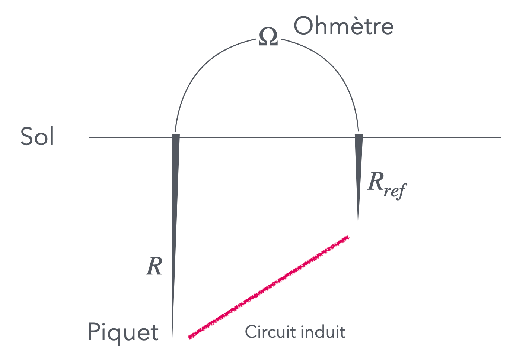
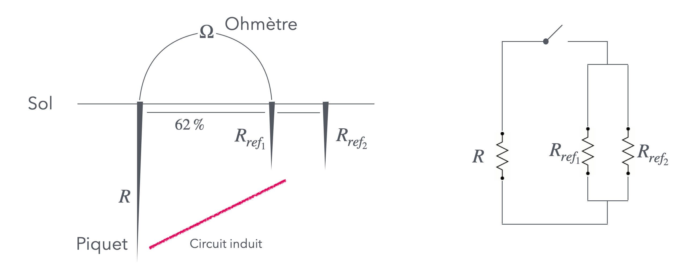

# CAP Elec 1.35 Mesure de prise de terre
## Foley Services Elec - [Programme 1ère partie](../1ere_partie/README.md)

### 1.35 Mesure de prise de terre

- **Accès à la vidéo** [1.35 Mesure de prise de terre](https://youtu.be/6RQQ4GZxY0w)

#### Rappels

- Résistance du corps humain (en milieu sec) 5000 $$\Omega$$
- Seuil de "non lâcher" est de 10mA = 0.01A (*en courant alternatif !*)
- U = RI, donc I = 10mA
- Ce qui détermine la tension conventionelle de sécurité à 50V

Cela permet de déterminer la résistance maximum de la prise de terre:

- Qui ne doit pas induire une tension excédant 50V,
- Prenant en compte l'intensité détéerminée parle dispositif le plus défavorable de l'installation
 - Qui est de 500mA = 0.5A qui correspond au disjoncteur différentiel de l'AGCP

La résistance de la prise de terre doit donc au maximum être de 100 $$\Omega$$.

#### Mesurer la résistance de la prise de terre

On veut mesurer la résistance $$R$$ associée à un piquet.
 
Si on plante un second piquet, de résistance $$R_{ref}$$, on peut brancher un appareil de mesure (Ohmètre) qui va mesurer la résistance du circuit induit par les deux piquets (branchement via l'appareil, et connexion induite par la terre).

 
Mais on ne connait alors que la valeur $$R + R_{ref}$$.

--

On plante un second piquet de référence, on a donc deux résistances de références $$R_{ref_1}$$ et $$R_{ref_2}$$ qui sont alors branché en parallèle.

C'est le scénario qui est implicitement utilisé dans l'appareil de mesure , le telluromètre.

Il est utile de convenir d'un protocole lros de la mesure de la terre

- Tester la batterie de l'appareil
- Connecter les câbles sur les piquets (pinces crocodiles)
- Vérifier d'absence de tension (V.A.T.)
 - Pour s'assurer que les piquets ne sont pas soumis à une tension induite d'un piquet voisin (avec une installaiton en défaut) 
- Connecter ensuite les câbles sur l'appareil
- Effectuer la mesure

On reprend le même test

- On déplace le premier piquet plutôt à 50%
- On déplace ensuite le piquet plutôt à 70%

Il faut s'assurer que les résistances mesurées sont quasi-identiques.

##### Pouruoi une barette de coupure ?
