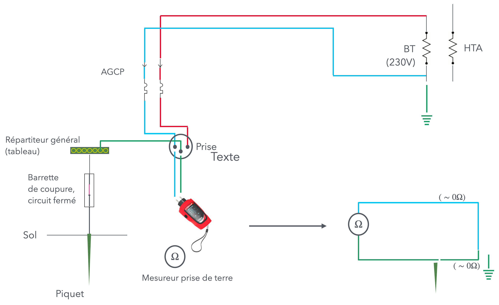
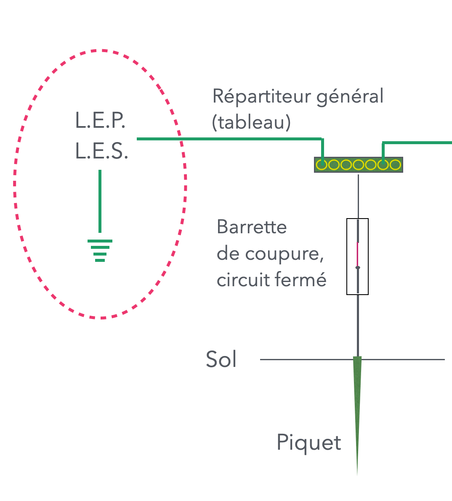
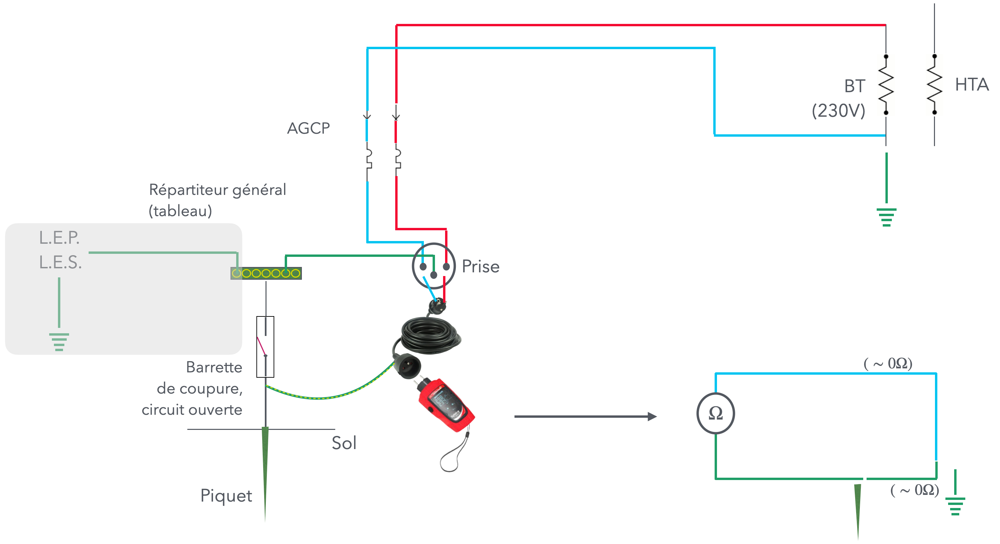
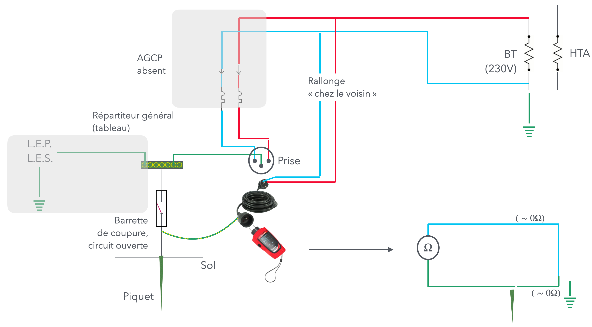

# CAP Elec 1.35 Mesure de prise de terre
## Foley Services Elec - [Programme 1ère partie](../1ere_partie/README.md)

### 1.35 Mesure de prise de terre

- **Accès à la vidéo** [1.35 Mesure de prise de terre](https://youtu.be/6RQQ4GZxY0w)

#### Rappels

- Résistance du corps humain (en milieu sec) 5000 $$\Omega$$
- Seuil de "non lâcher" est de 10mA = 0.01A (*en courant alternatif !*)
- U = RI, donc I = 10mA
- Ce qui détermine la tension conventionelle de sécurité à 50V

Cela permet de déterminer la résistance maximum de la prise de terre:

- Qui ne doit pas induire une tension excédant 50V,
- Prenant en compte l'intensité détéerminée parle dispositif le plus défavorable de l'installation
 - Qui est de 500mA = 0.5A qui correspond au disjoncteur différentiel de l'AGCP

La résistance de la prise de terre doit donc au maximum être de 100 $$\Omega$$.

#### Mesurer la résistance de la prise de terre

[Voir aussi la fiche Chauvin & Arnoux](./docs/Chauvin_Arnoux_guide_terre.pdf)

On veut mesurer la résistance $$R$$ associée à un piquet.
 
Si on plante un second piquet, de résistance $$R_{ref}$$, on peut brancher un appareil de mesure (Ohmètre) qui va mesurer la résistance du circuit induit par les deux piquets (branchement via l'appareil, et connexion induite par la terre).

 
Mais on ne connait alors que la valeur $$R + R_{ref}$$.

--

On plante un second piquet de référence, on a donc deux résistances de références $$R_{ref_1}$$ et $$R_{ref_2}$$ qui sont alors branché en parallèle.

C'est le scénario qui est implicitement utilisé dans l'appareil de mesure , le telluromètre.

Il est utile de convenir d'un protocole lros de la mesure de la terre

- Tester la batterie de l'appareil
- Connecter les câbles sur les piquets (pinces crocodiles)
- Vérifier d'absence de tension (V.A.T.)
 - Pour s'assurer que les piquets ne sont pas soumis à une tension induite d'un piquet voisin (avec une installaiton en défaut) 
- Connecter ensuite les câbles sur l'appareil
- Effectuer la mesure

On reprend le même test

- On déplace le premier piquet plutôt à 50%
- On déplace ensuite le piquet plutôt à 70%

Il faut s'assurer que les résistances mesurées sont quasi-identiques.

##### Pourquoi une barette de coupure ?

Pour isoler la mesure qui est faite (de la réisitance de la prise de terre) d'autres résistances que pourraient induire des équipements de la maison (typiquement la baignoire en métal, dont les pieds auraient uncontact avec le sol). Idem avec des tuyaux d'aliemntation en eau qui pourraient passer par le sol (la dalle).

La baignoire (tuyaux) se retrouveraient alors connectés en parallèle avec la piquet, faussant le résultat et donc la mesure de la résistance de la prise de terre.

Le protocole à suivre est donc à revoir pour ouvrir la barrette. Et deplus, si l'installation est alimentée, il faut obligatoirement une mise à la terre -- interdisant d'ouvrir la barrette de coupure. Il faudrait docn dans ce cas procéder à la consignation de l'AGCP.

Le premier piquet est placé à une distance du piquet de terre équivalent à 62% de la distance du piquet le plus éloigné (voir schéma). (Le second piquet est à 100%.)

1. Consignation AGCP (si nécessaire)
2. Ouverture de la barrette de coupure
3. Tester la batterie de l'appareil
4. Faire une V.A.T. (vérification d'absence de tension)
 - Pour s'assurer que les piquets ne sont pas soumis à une tension induite d'un piquet voisin (avec une installaiton en défaut) 
5. Faire la mesure
 - Connecter les câbles sur les piquets (pinces crocodiles)
6. Connecter ensuite les câbles sur l'appareil
7. Effectuer la mesure

On reprend deux autres mesures:

- On déplace le premier piquet plutôt à 52% de distance du piquet de terre
- On déplace ensuite le piquet plutôt à 72%  de distance du piquet de terre
- Si les trois mesures sont comparables, on peut conclure à la validité de la mesure, qui doit être inférieure à 100 $$\Omega$$

##### Quel autre situation ?

Petite maison de ville, la cave vient d'être bétonné, pas de jardon. Où peut-on planter le piquet de terre ?

Le piquet de terre peut être cacher dans un placard de la cave. Mais impossible de planter les piquets de référence pour procéder comme expliqué précédemment.

On utilise laors la "mesure par la boucle", à l'aide d'un mesureur de la boucle de terre.

ON fait l'hypothèse d'une résistance nulle entre l'AGCP et le neutre (basse tension) du fournisseur, et de la liaison à la terre du fournisseur (mise à la terre du neutre). AInsi, parce que toutes les résistances sont en série, la mesure de la résistance sur ce circuit est égale à la résistance induite du piquet de terre (en réalité, c'est la somme des résistances qui sont rencontrées, mais avec nos hypothèses, on ne retient que la résistance du piquet).

N.B. ***Cette méthode ne fonctionne que s'il n'y a pas de dispositif formant de liaisons équipotentielles principale et/ou secondaire.*** Celles-ci seraient alors considérées comme connectées en parallèle avec le piquet de terre, biaisant alors la méthode exposées précédemment.

##### Magouille de Sean Foley

Pour isoler les liaisons équipotentielles principale et secondaire, on utilise un dispositif "ad hoc".

- On utilise une prise dont la terre est "dériver" et connecter au piquet de terre (en amont de la barrette de coupure).
- On ouvre la barrette de coupure pour occulter les liaisons équipotentielles principale et/ou secondaire.
- On retrouve ainsi un circuit à l'image de celui exposé précédemment, comme dan sla situation où il n'y a pas de L.E.P. ou de L.E.S.

N.B. Cette méthode peut aussi être utiliser en branchant le câble "magouillé" sur le secteur d'un voisin (si par ailleurs, il n'y a pas d'alimentation dans le domicile où la terre est testée).

Il y a un bémol à cette méthode: si on ne fait rien, les équipements de l'habitation ne sont plus reliés à la terre le tmeps de l'intervention (parce que la barrette de coupure est ouverte).

Il faut donc bien choisir la prise sur laquelle on branchele dispositif "magouillé", et ouvrir tous les circuits (au niveau du tableau) sauf celui qui alimente la prise en question.

- On peut, par exemple, utiliser la prise du lave-linge (interrupteur différentiel de type A).
- On peut aussi utiliser les prises disponibles au niveau du tableau.

