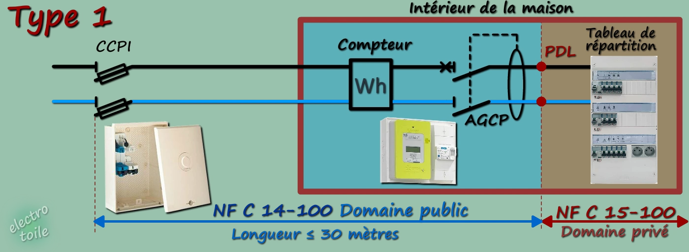
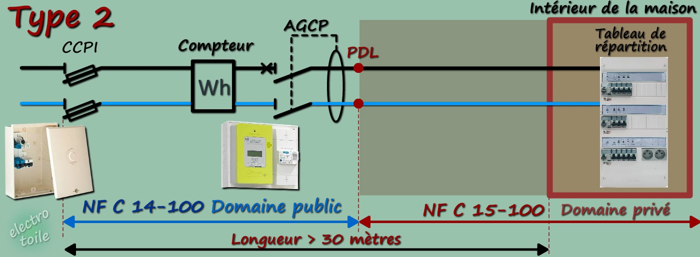

# CAP Elec 1.40 SLT (régime de neutre)
## Foley Services Elec - [Programme 1ère partie](../1ere_partie/README.md)

### 1.40 SLT (régime de neutre)

- **Accès à la vidéo** [1.40 SLT (régime de neutre)](https://youtu.be/y-40KXzLjjk)

#### Schéma de liaison à l aterre

##### Régime de neutre T-T

Type 1 -- lorsque le CCPI est à moins de 30 mètres de l'habitation (le point de livraison PDL), AGCP dans la maison.

Type 2 lorsque le CCPI est à plkus de 30 du PDL (point de livraison)

[(Images reprise du site "electrotoile")](https://electrotoile.eu/branchement-individuel-electrique-souterrain.php)

##### Régime de neutre TN-C, TN-S

- On crée un chemin pour que le courant de défaut soit remis sur le réseau en amont de l'AGCP, le courant de défaut (T) et le neutre (N) sont confondus (C)

- Si on achemine le coura tde défaut jusqu'au transformateur du réseau de distribution, le courant de défaut (T) et le neutre (N) ne sont pas confondus mais bien séparés (S)

##### Régime de neutre IT

