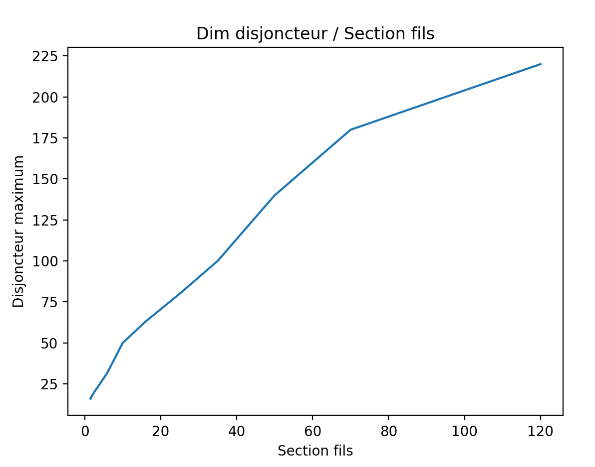
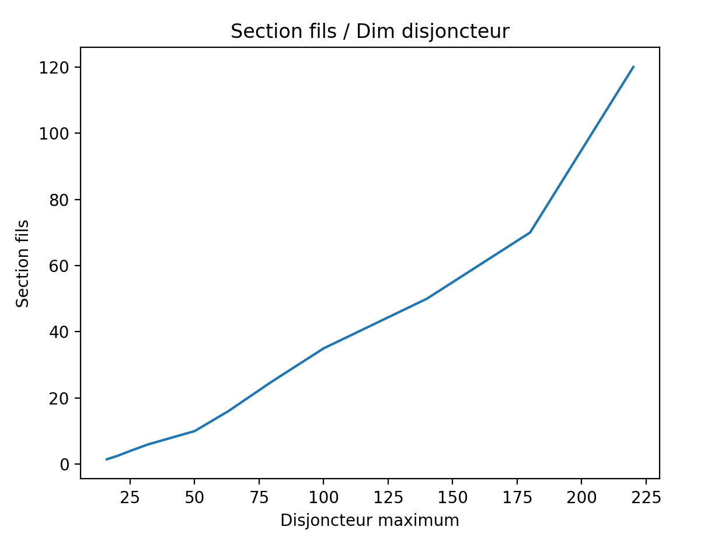

# CAP Elec Tableau récapitulatif câblage prises de courant
## Foley Services Elec - [Programme 1ère partie](../1ere_partie/README.md)

[Voir aussi la vidéo sur le dimensionnement des tableaux et départs en domestiques.](./CAP_Elec_1_07B.md)

### Tableau récapitulatif Ampérage et dimension des câbles

| Section de fil minimum en mm² | Disjoncteur Calibre maximum en Ampères | Porte fusible Calibre maximum en Ampères |
| ----------------------------- | ----------------------------- |------|
|              1.5              |                  16A          | 10A |
|              2.5              |                  20A          | 16A |
|              4                |                  25A          | 20A |
|              6                |                  32A          | 25A |
|              10               |                  50A          | 32A |
|              16               |                  63A          | 50A |
|              25               |                  80A          | - |
|              35               |                  100A         | - |
|              50               |                  140A         | - |
|              70               |                  180A         | - |
|              95               |                  200A         | - |
|              120              |                  220A         | - |

Les valeurs sur les sections/ampérage au-delà de 16mm2/63A sont reprises d'un groupe FB (à prendre avec précaution).

### Tableau récapitulatif câblage prises de courant

Contraintes de câblage des prises de courant.

| Départ | Nb de fils | Section mm2 (min) | Disjoncteur (max) | Type | Coefficient interrupteur différentiel | Nb points max |
|--------------|---------------|----------|---------|---------|---------|---------- |
| Eclairage | 3 (P,N,T) | 1,5 mm2 | 10A (16A) | AC | 0.5 | 8 |
| PC 1.5 | 3 | 1,5 mm2 | 16A | AC | 0.5 | 8 |
| PC 2.5 | 3 | 2,5 mm2 | 16A (20A) | AC | 0.5 | 12 |
| PC cuisine | 3 | 2,5 mm2 | 20A | AC | 0.5 | 6 (= 4 plan de travail + 2) |
| Lave-linge | 3 | 2,5 mm2 | 20A | A | 0.5 | 1 |
| Sèche-linge | 3 | 2,5 mm2 | 20A | AC | 0.5 | 1 |
| Lave-vaisselle | 3 | 2,5 mm2 | 20A | AC | 0.5 | 1 |
| Four | 3 | 2,5 mm2 | 20A | AC | 0.5 | 1 |
| Plaque de cuisson | 3 | 6 mm2 | 32A | A | 0.5 | 1 |
| PC tableau | 3 | 1,5 mm2 | 16A | AC | 0.5 | 2 min |
| IRVE | 3 | 6 mm2 | 32A | AC | 1 | 1 |

(Promotelec, pages 245, 247)

### Section des conducteurs de protection

| Section $$S$$ des conducteurs actifs | Section $$S'$$ des conducteurs de protection |
|--------------------------------|---------------------------------------|
| Section $$S \leq 16$$ | Section $$S' = S$$ (même section) |
| Section $$S \in \{ 25, 35 \}$$ | Section $$S' = 16$$ |
| Section $$S > 35$$ | Section $$S' = 0,5 S$$ |
