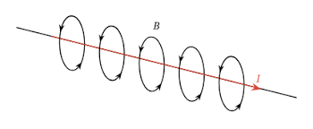
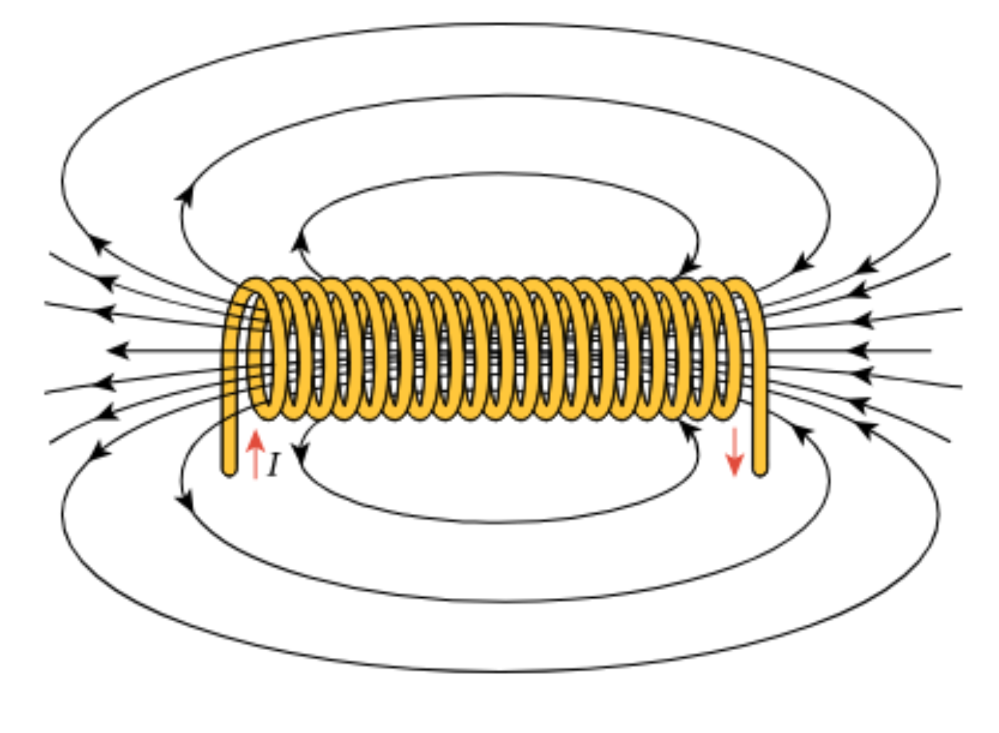

# CAP Elec 1.41 Transformateurs
## Foley Services Elec - [Programme 2ème partie](../2eme_partie/README.md)

### 1.41 Transformateurs

- **Accès à la vidéo** [1.41 Transformateurs](https://youtu.be/3l55DdoqlK4)

#### Objectifs

- Sécurité: réduire la tension < 50V

Lien entre puissance / tension / intensité / section

| Puissance | Tension | Intensité | Section |
|-----------|---------|-----------|---------|
| 4600 W    | 230 V   | 20 A      | 2.5mm2  |
| 4600 W    | 46 V    | 100 A     | >> mm2  |
| 4600 W    | 460 V    | 10 A     | 1.5mm2  |

En modificant la tension, on agit sur l'intensité du courant, qui peut avori un impact sur la section de fils à utiliser pour transporter le courant -- qui peut avoir une incidence au niveau technique mais aussi financière.

##### Champ magnétique induit

- Un courant électrique induit un champ magnétique "autour" du conducteur
- La pince ampérimétrique mesure précisément ce champ magnétique et calcule l'intensité du courant à l'origine de ce champ magnétique

- Une bobine permet de "compresser" le conducteur et avoir une longueur importante dans un volume réduit

"*Loi de proportionalité*"

- Soit une première bobine de tension $$U_p$$ (bobine et tension primaires),
- avec un nombre de tours $$N_p$$,
- et une seconde bobine (secondaire) avec un nombre de tours $$N_s$$
- La tension $$U_s$$ induite sur la seconde bobine est alors proportionnelle au ratio $$\frac{N_s}{N_p}$$, c'est-à-dire $$U_s = \frac{N_s}{N_p} \cdot U_p$$.

##### Trois vidéos avec animations

- [Comment fonctionnent les transformateurs](https://youtube.com/watch?v=7P6iBscQB8s)
- [Les transformateurs électriques expliqués](https://www.youtube.com/watch?v=eBIVzRNZXb0)
- [Comment fonctionne un transformateur](https://www.youtube.com/watch?v=-fcqcpBq34E)
