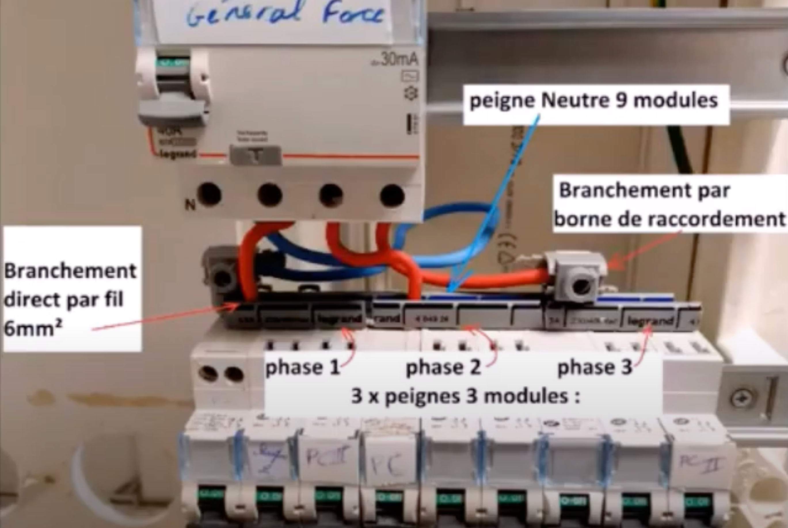
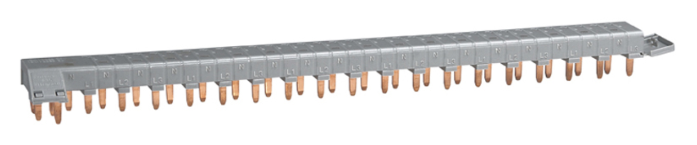

# CAP Elec 1.42 Triphasé / Tétraphasé
## Foley Services Elec - [Programme 2ème partie](../2eme_partie/README.md)

### 1.42 Triphasé / Tétraphasé

- **Accès à la vidéo** [1.42 Triphasé / Tétraphasé](https://youtu.be/Z-q5bp78TiA)

#### Tri et tétra

- Triphasé parce qu'il y a 3 conducteurs
- Tétraphasé parce qu'il y a 4 conducteurs

Réseau HTA triphasé en France, tension 20kV entre toutes les paires de phase.

*Rappel*. Equation d'équilibre au niveua des transformateurs.

La puissance $$P$$ (primaire) est conservée (perte marginale) et est égale à la fois à:

$$P = U_{\text{primaire}} \cdot I_{\text{primaire}} = U_{\text{secondaire}} \cdot I_{\text{secondaire}}$$

--

- Règle générale, la tension entre les phases en triphasé est de 400V
- Représentation des tensiosn entre phase à l'aide d'une distance: les phases forment les sommets d'un triangle équilatérial de côté 400
- Le neutre est équidistant (même tension) de toutes les phases, il est donc au milieu du triangle
  - la distance $$L$$ d'une phase au neutre satisfait $$cos(30 \deg) * L = 200$$, c'est-à-dire $$\frac{\sqrt{3}}{2} \cdot L = 200$$, d'où $$L = 230$$.

En triphasé, on parle donc de

- *tension simple*, entre le neutre et une phase, égale à V = 230V
- *tension composée*, entre deux phases, égale à U = 400V

##### Installation triphasée domestique

- Parce que certains appareils nécessitent une almentation triphasée
  - Exemple de la scie à bois, des machines d'un artisan (tour à bois du menuisier)
- On utilisera l'une des phases pour les appareils monophasés,
  - En veillant à équilibré chacune des phases (pas si facile)

- Difficulté: comparé à un abonnement monophasé d'intensité max A, un abonnement triphasé limitera chacune des phases à A/3, empêchant d'y faire reposer des appareils qui dépasserait une intensité de A/3 s'ils étaient en marche simultanément
  - La solution consiste à passer à un abonnement d'intensité supérieure , induisant un coût mensuel plus élevé ...

Avec la nécessité de disposer les peignes en fonction de la distribution des circuits (disjoncteurs) sur les pahses, ou d'utiliser un peigne où les phases sont isolées

*Remarque* sur la manière de procéder lorsqu'on insère simultanément les fils en 6mm2 venant de l'interrupteur difféntiel et le peigne, qui doit être posé du côté fixe du disjoncteur (partie fixe versus partie vissée qui vient se plaquer contre la partie fixe) -- pour éviter d'avoir le peigne qui part en quinconces ...
