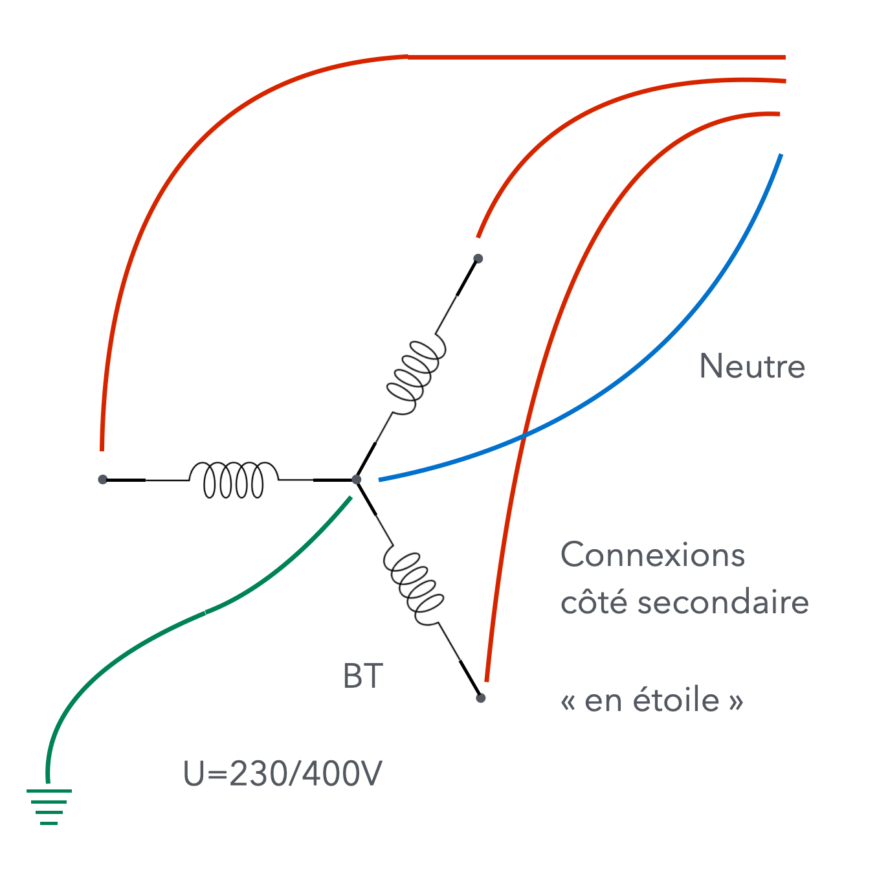
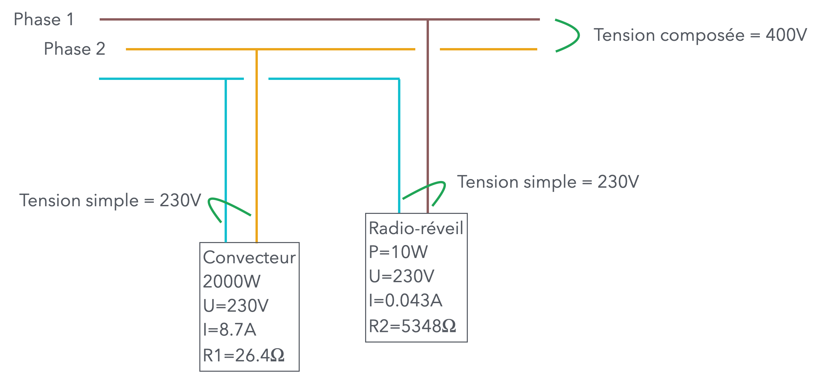
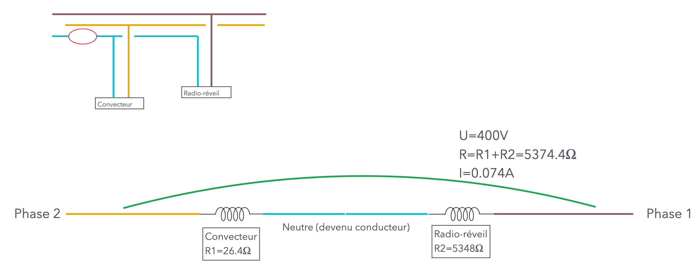
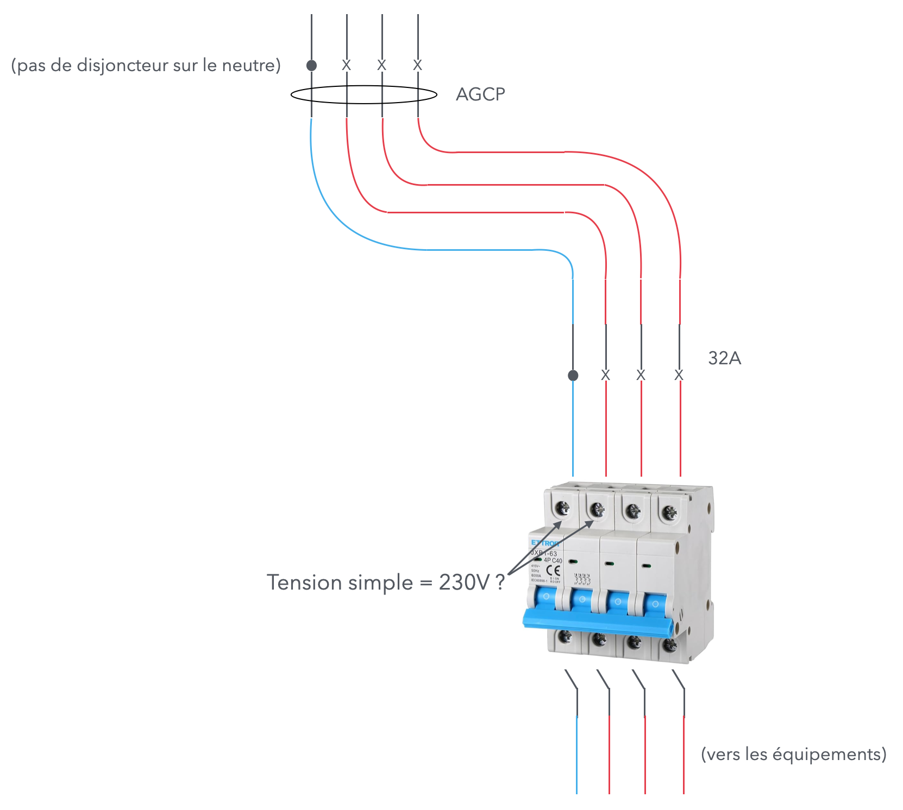

# CAP Elec 1.44 Rupture du neutre
## Foley Services Elec - [Programme 1ère partie](../1ere_partie/README.md)

### 1.44 Rupture du neutre

- **Accès à la vidéo** [1.44 Rupture du neutre](https://youtu.be/lqpS-oGQVwA)

#### Rappels

- Phase 1, 2 et 3 et le neutre côté secondaire (transformateur HTA vers BT)
- Tension composée : 400V entre les phases,
- Tension simple : 230V entre phase et neutre

##### Scénario pratique

[Voir seconde partie de la vidéo](https://www.youtube.com/watch?v=lqpS-oGQVwA&t=33m50s)

Imaginons deux appareils alimentés sur deux phases distinctes

- Un convecteur 2000W
- Un radio-réveil 10W

--

Si rupture du neutre, le conducteur neutre renvoie sur la phase 1 le courant circulant sur la phase 2:

- Le convecteur $$26.4 \Omega$$ et le radio-réveil $$5348 \Omega$$, en série sur ce circuit 
  - Sous une tension de 400V
  - Le courant qui circule est donc de $$\frac{400}{26.4 + 5348} = 0.0744A$$
  - La tension éprouvée par le radio-réveil est alors de $$5348 \cdot 0.0744 = 398V$$, celle éprouvée par le convecteur est de 2V (qui du coup, ne chauffera pas beaucoup)

- Le radio-réveil ne tiendra pas une telle intensité, ses conducteurs internes chaufferont et provoqueront un court-circuit
  - Sans toutefois qu'aucune protection (disjoncteur, interrupteur différentiel) n'ait détecté cette anomalie

- Par conséquent, au moment ou le court-circuit arrive au niveau du radio-réveil, il n'y a plus que le convecteur comme résistance sur le circuit
  - L'intensité du courant traversant le convecteur est alors de $$\frac{400}{26.4} = 15.15A$$, et celui-ci subit une tension de 400V
  - Encore une fois, un disjoncteur 16A ne détectera pas cette panne

--

Il n'existe pas de protection contre cette éventualité.

Il est préconisé:

- Alors que les disjoncteurs AGCP sont fermés, mais que ceux du tableau sont ouverts, de bien vérifier (au niveau du module différentiel qui reçoit les trois phases et le neutre)
  - Que la tension entre les phases est de 400V
  - Que la tension entre chaque phase et le neutre est de 230V
  - Si ça n'est pas le cas, celle-ci se reporte sur la tension entre phases et terre (puisqu'en installation TT le neutre est mis à la terre)
