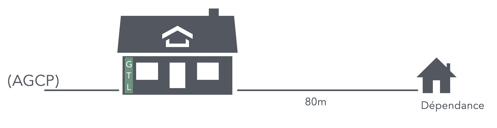
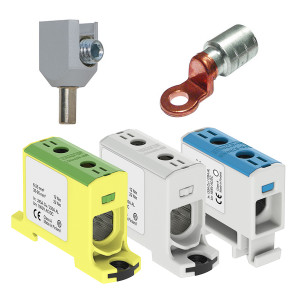

# CAP Elec 1.47 Câble aluminium
## Foley Services Elec - [Programme 1ère partie](../1ere_partie/README.md)

### 1.47 Câble aluminium

- **Accès à la vidéo** [1.47 Câble aluminium](https://youtu.be/e_nsy8G_vWw)

#### Longueur, section et chute de tension

On suppose avoir une dépendance située à 80m de l'habitation principale.

On rattache la dépendance à l'habitation principale par un câble R2V cuivre de section 35m2.
Le prix unitaire au mètre linéaire d'un tel câble est approx. 20€/m

- On peut envisager d'utiliser plutôt un câble aluminium, moins onéreux, mais il faut alors tenir compte de larésistivité plus élevé de ce matériau, et utiliser alors une section plus grande pour maintenir la cute de tension dans les marges autorisées (3% tension nominale AGCP).

- Ainsi, on utilisera une section de 50mm2, dont le prix unitaire est autour de 8€/m

- Le câble aluminium présente le désavantage de sa taille/section qui ne convient pas aux différents dispositifs (disjoncteurs, par exemple).
- L'usage combiné du cuivre te de l'aluminium est à éviter en raison des réactions électro-chimiques possibles entre ces deux matériaux.
- Il faut alors utiliser des adaptateurs bi-matériaux (et réducteur de section).

--

La fin de la vidéo montre le montage de ces adaptateurs en situations réelles.
