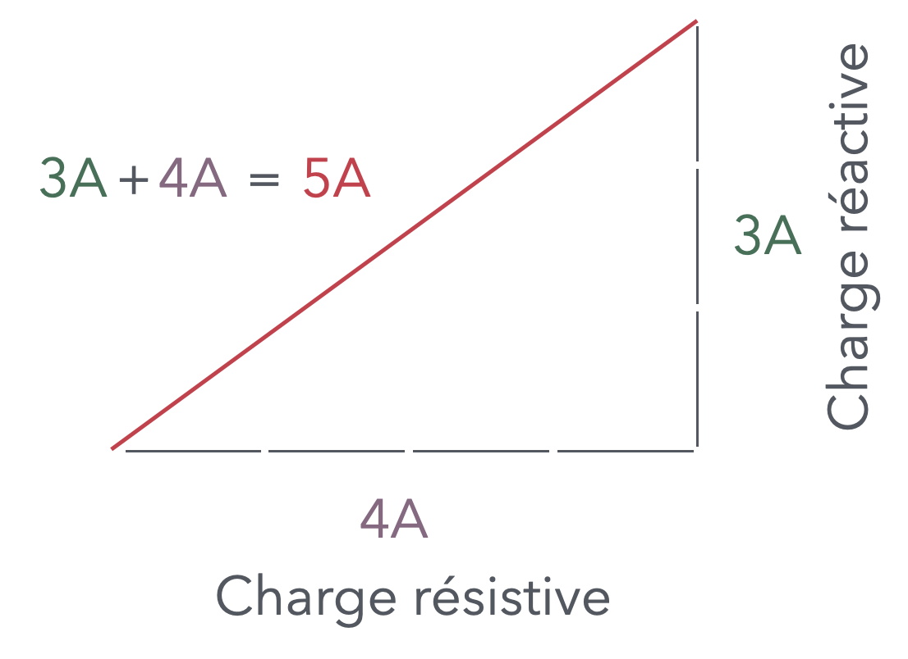
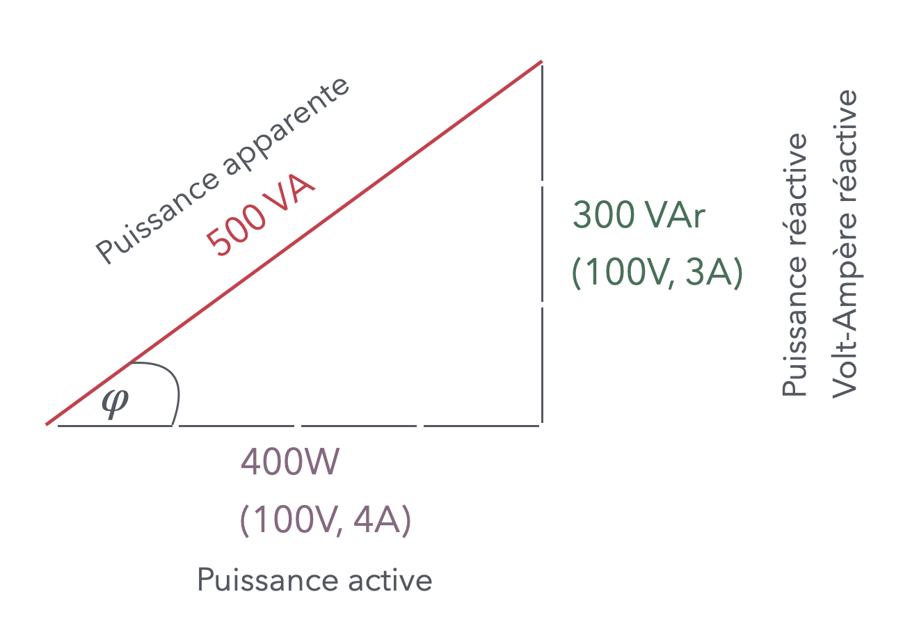

# CAP Elec 1.48 Facteur de puissance
## Foley Services Elec - [Programme 2ème partie](../2eme_partie/README.md)

### 1.48 Facteur de puissance

- **Accès à la vidéo** [1.48 Facteur de puissance](https://youtu.be/8dPOf_TP2os)

#### Remarque introductive

Différence entre volt-ampère et watt $$P = UI$$:

- ils sont identiques si on est en courant continu
- en courant alternatif si on a une charge purement résistive

On va expliquer tout ça ...

On est invité à visionner les vidéos des shadocks sur l'électricité

- [Episode 19 (électricité en sandwich)](https://www.youtube.com/watch?v=2eBUTJCwmoY)
- [Episode 20 (électricité en bobine)](https://www.youtube.com/watch?v=Gl-vCsOKiJc)

#### Bobines - rappels

- Courant alternatif 50 Hz, courbe sinusoïdale
- Bobine de fils (autour d'une pièce métallique), créationd'un champ magnétique
  - Donc création, destruction, création (inversion de sens) d'un champ magnétique 100 fois par seconde
- La création/destruction de ce champ magnétique consomme une certiane puissance: *puissance réactive*
- Nous avons vu que le calcul de puissance dépend essentiellement des équations $P = UI, U = RI$, qui sont valident lorsqu'on a une charge résistive
  - alors qu'il faut les "adapter" lorsqu'on a aussi une charge inductive, etc.

- Exemple du sèche-cheveux:
  - Charge résistive asociée au dispositif créant la chaleur
  - Charge réactive correspondant au dispositif actionnant le vetilateur

- L'intensité nécessaire pour chauffer l'élément, et l'intensité nécessaire pour faire tourner le moteur sont déphasées dans le temps

Le facteur de puissance - aussi appelé $$\cos \varphi = \frac{\text{Puissance active}}{\text{Puissance apparente}} = \frac{Watt}{VA}$$

#### La puissance inductive

L'intensité réactive (moteur, typiquement puissance induite d'un système à bobines, donc magnétique) est *en retard* par rapport à la tension (ou à l'intensité associée) donc *négative*, alors que l'intensité inductive (condensateur) est *en avance*, donc *positive*

On a intérêt à ce que le facteur de puissance soit proche de 1 ($\varphi \sim 0$), pour que la puissance active soit au plus près de la puissance apparente. D'où la présence combinée de condensateurs et de bobines (moteurs).