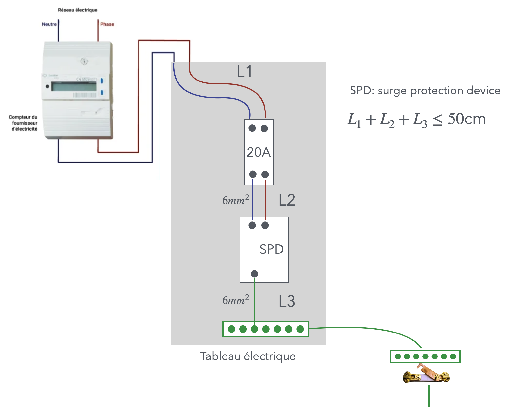

# CAP Elec 1.49 Parafoudre domestique
## Foley Services Elec - [Programme 2ème partie](../2eme_partie/README.md)

### 1.49 Parafoudre domestique

- **Accès à la vidéo** [1.49 Parafoudre domestique](https://youtu.be/PvcWnjI9txw)

#### Parafoudre ou paratonnerre ?

Un *paratonnerre* est une tige métallique qui se met sur la partie haute d'un bâtiment.

Un *parafoudre* s'installe aujourd'hui dans le tableau électrique. IL y a deux types de parafoudre:

- Pour les bâtiments équipés d'un paratonnerre

Préconisation voire obligation dans certains départements (dont la Gironde).

- Le parafoudre ne doit pas être protégé par un interrupteur différentiel, il est donc en amont du tableau (entre le réseau de distribution d'électricité et le tableau de distribution principal).
- Le parafoudre doit être protégé par un disjoncteur de 20A
- La longueur totale des fils reliant le disjoncteur à l'alimentation de l'habitation $L_1$, le disjoncteur au parafoudre $L_2$, et le parafoudre au répartiteur de terre du tableau $L_3$, ne doit pas dépasser 50 cm:

Voir aussi Promotelec, volume 1, page 70 (édition 2022).

Note: certains parafoudre sont "auto-protégés" (le disjoncteur est intégré au dispositif). Dans ce cas, on a $L_2 = 0$.
