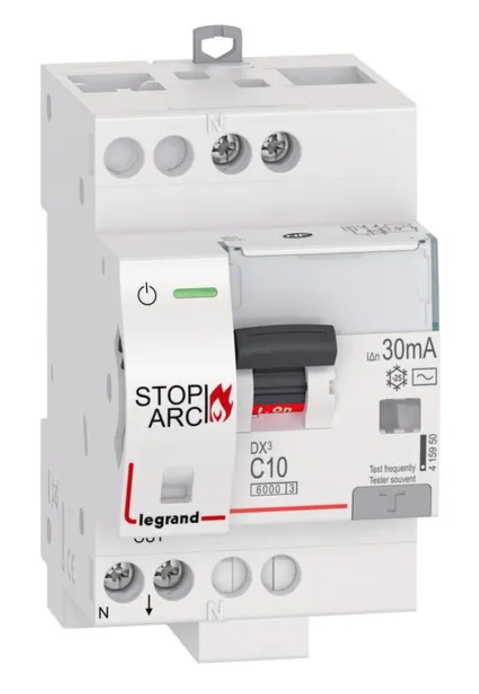

# CAP Elec 1.49B Intro dimmensionnement tableau & détecteur d'arc
## Foley Services Elec - [Programme 2ème partie](../2eme_partie/README.md)

### 1.49B Intro dimmensionnement tableau & détecteur d'arc

- **Accès à la vidéo** [1.49B Intro dimmensionnement tableau & détecteur d'arc](https://www.youtube.com/watch?v=1BrWSIsZ2Cs)

#### Détecteur d'arcs DPDA (Dispositif de Protection contre les Défauts d’Arc)

[Ou en anglais AFCI (Arc Fault Circuit Interruptor)]

- 1er cas, arc provoqué par un défaut entre neutre et phase: détecté par le disjoncteur ou interrupteur différentiel

- 2ème cas, arc entre phase et phase
  - Le disjoncteur ne détectera vraisemblablement pas ce défaut.
  - Risque d'incendie associé à un conducteur qui chauffe: domino mal serré, mauvaise connexion au niveau d'un wago, câble abîmé, rallonge mal branchée, ...

La norme NF C-15000, recommandation d'installer un détecteur d'arcs dans les locaux

- où le risque d'incendie est élevé (granges),
- ou ceux avec présence de produits chimiques inflammables
- ou ceux contenant des objets de valeur (inestimable) et irremplaçables (exposition de tableaux dans un musée)

Recommandations en milieu domestique

- Là où des appareils tournent en permanence (pompe de piscine, par exemple)

##### Installation

La vidéo n'aborde pas leur installation, et il y a une raison: ce dispositif est intégré soit à un disjoncteur, soit à un interrupteur différentiel que l'on installe pour protéger un circuit en lieu et place d'un dijoncteur ou interrupteur diff classique.

