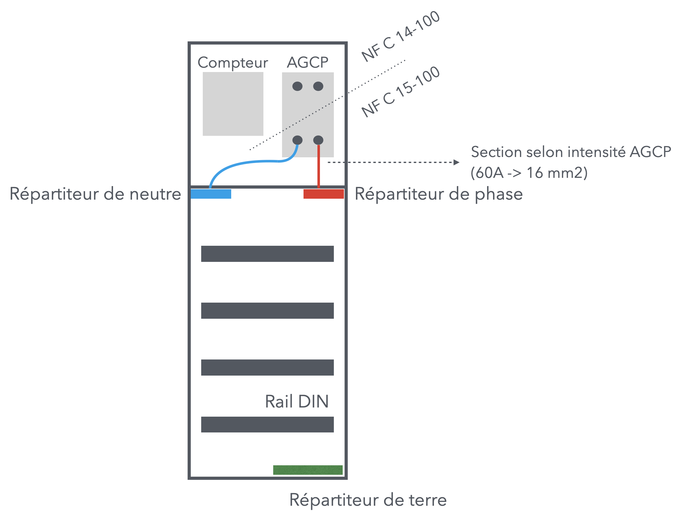
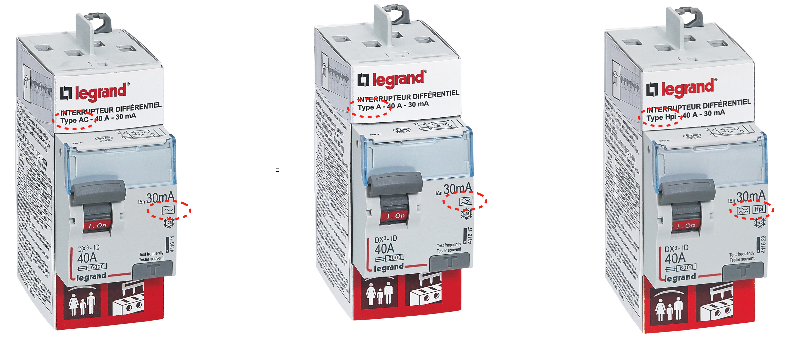

# CAP Elec 1.50 Dimensionnement tableau 1
## Foley Services Elec - [Programme 2ème partie](../2eme_partie/README.md)

### 1.50 Dimensionnement tableau 1

- **Accès à la vidéo** [1.50 Dimensionnement tableau 1](https://youtu.be/8fg6fAb5ePg)

#### Retour parafoudre

Retour sur la [leçon 1.49](./CAP_Elec_1_49.md): on indiquait que la liaison du disjoncteur vers le parafoudre, et du parafoudre vers le bornier de terre (au nivau du tableau) doit se faire en 6 mm2.

- La norme ne précise rien à ce sujet
- [Un document de Schneider recommande une section d'au moins 4 mm2](https://fr.electrical-installation.org/frwiki/Raccordement_des_parafoudres)

#### Organisation d'un tableau

- Répartiteur de terre, souvent placé au bas du tableau
- Le AGCP se trouve soit en bas des rail DIN (*), soit en haut

(*) Un rail DIN est un profilé support standardisé, généralement métallique, largement utilisé pour le support mécanique des appareillage électriques (comme les disjoncteurs) et leurs accessoires. DIN est l’acronyme de Deutsches Institut für Normung, organisme qui est à l'origine de ce standard. [Source Wikipedia](https://fr.wikipedia.org/wiki/Rail_DIN)

- *Contrainte de hauteur maximum* pour la pose du tableau: les rails doivent rester accessibles sans avoir à disposer d'un escabeau, par exemple.
- *Contrainte de hauteur minimum* pour éviter que le tableau soit accessible aux jeunes enfants.

- La section des câbles allant de l'AGCP vers le répartiteur de phase/neutre dépend de l'intensité, par exemple:
  - 16 mm2 si l'intensité est de 60A
  - 10 mm2 si l'intensité est de 45A
- Cette section détermine à son tour la section à utiliser pour la terre qui va vers la barette de terre et ultimement "à la terre" (piquet ou fond de fouille). Voir leçon [1.34 Réalisation terre](../1ere_partie/CAP_Elec_1_34.md)

En habitation domestique, *tout tableau aujourd'hui doit comporter au moins deux interrupteurs différentiels*, donc deux rails DIN.

--

- Chaque rail comporte un interrupteur différentiel, alimenté depuis les répartieurs phase/neutre, avec un fil de section

##### Interrupteurs différentiels

Ils sont de trois types:

- Type AC qui détectent les fuites sur les appareils "classiques"
- Type A qui détectent les fuites sur les appareils qui se comportent comme des appareils en courant continu
- Type F qui protègent les appareils les plus sensibles au coupure de courant intempestives (ordinateurs, par exemple)

Les appareils cité par la norme:

- Lave-linge (possibilités de certains défauts qui se comportent comme des courants continus - lé defaut déforme l'onde sinuoïdale): nécessite un interrupteur différentiel de type A
- Lave-vaisselle, sèche-linge, volet roulant
- La norme semble ignorer les appareils électroniques

Interrupteur encore plus performant (Promotelec, types de'interrupteurs différentiels, page 232) Hpi (F)

La section allant des répartiteurs de phase/neutre à l'interrupteur différentiel dépend de l'intensité de celui-ci.

**Quelle intensité** pour un interrupteur différentiel ?

- Rappel de la fonction "différentielle" de l'interrupteur, soutenant une certiane intensité maximum.
- Calcul de l'intensité requise d'un interrupteur fonction des circuits qu'il "supervise". (Promotelec page 2"2)
  - 8 disjoncteurs maximum sur un rail DIN protégé par interrupteur différentiel (DDR dispositif différentiel résiduel, DDR HS haute sensibilité = 30 mA)
  - N.B. Télérupteur, minuterie ne sont pas assimilés à un disjoncteur

*Remarque*. Mettre prises et éclairage d'une même pièce sur des DDR différents (si jamais l'éclairage tombe, on peut toujours brancher une lampe).

(A suivre)