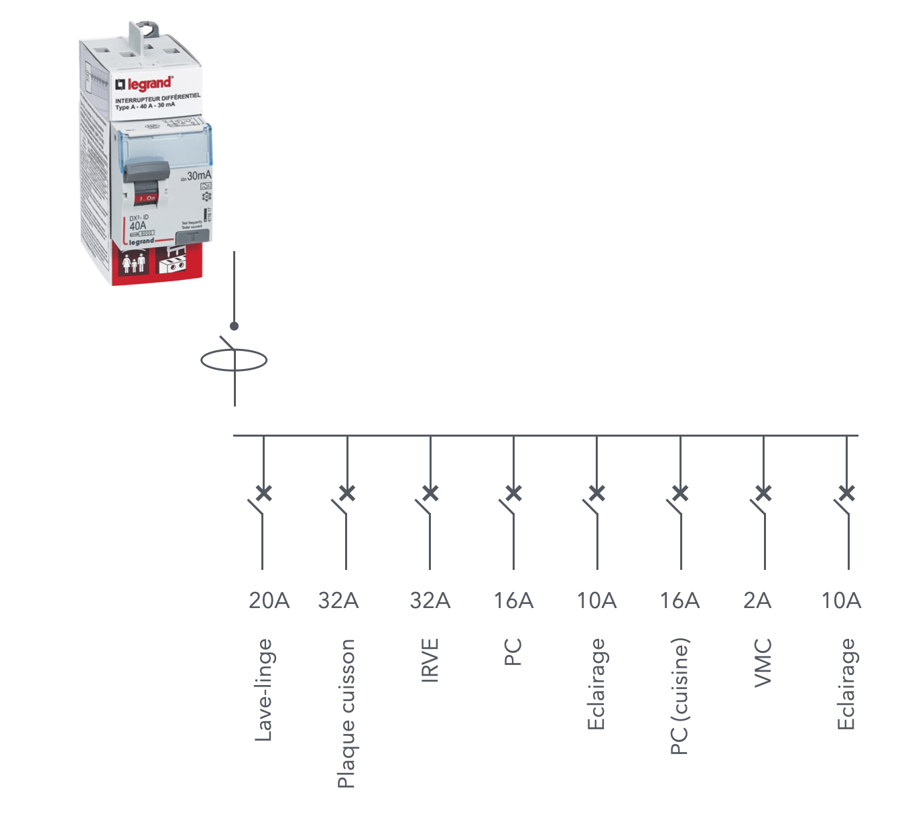

# CAP Elec 1.51 Dimensionnement tableau 2
## Foley Services Elec - [Programme 2ème partie](../2eme_partie/README.md)

### 1.51 Dimensionnement tableau 2

- **Accès à la vidéo** [1.51 Dimensionnement tableau 2](https://youtu.be/kSIwx_Da0PM)

#### Dimensionnement tableau (suite)

- Minimum 2 différentiels au tableau (Promotelec page 238, édition 2022)
- circuits cuisson, lave-linge et IRVE (recharge véhicule électrique) doivent être protégés par un disspositif de type 
- les autres circuits sont protégés par un DDR de type A (au moins)
- nombre de maximum de circuits (disjoncteurs) protégés par DDR est 8
- les circuits d'éclairage et les circuits de prises de courant doivent être répartis sous au moins deux DDR

##### Ne pas trop charger les DDRs

Imaginons un scénario de branchement sous un DDR de type A, intensité maximum 40A,

- sous lequel on peut brancher 8 cricuits, disons:

- La somme des intensités des disjoncteurs des circuits dépassent largement l'intensité maximum que peut supporter le DDR
  - Elle est égale ici à 122A
- Mais pour rappel, si l'intensité maximum délivrer par l'AGCP est de 60A
  - Et en utilisant un DDR de 63A maximum
  - On ne pourra jamais avoir une intensité qui dépasse 60A,
  - En quelque sorte l'AGCP protège -- en amont -- le DDR de 63A contre la surcharge

- Et si on installe plutôt un DDR 40A ?
  - Il n'est pas protégé en amont par l'AGCP, il faut donc regarder en aval (les disjoncteurs protégeant les circuits)
  - A noter que les appareils ne fonctinonent pas tous en même temps, et pas toujours en intensité maximale (queqlues pointes pour un lave-linge, par exemple, surtout lorsqu'il chauffe l'eau)
  - On va donc retenir pour ces disjoncteurs un coefficient de 0.5
  - Sauf pour le disjoncteur IRVE puisque la recharge du véhicule s'étend sur une période assez longue, dans ce cas on prend coefficient 1
  - Le total qu'on obtient est de 73A
  - Le DDR 40A ne peut donc pas être utilisé dans ce cas, on retombe donc sur le cas du DDR 63A protégé en amont par l'AGCP
- A noter qu'on doit prévoir une réserve d'environ 20% de modules libres en cas d'évolution de l'installation
  - Les disjoncteurs qui sont installés mais en attente compte dans la réserve
  - A noter qu'on ne peut installer plus de 8 disjoncteurs par DDR

Règle amont/aval, page 233 Promotelec

(A suivre)