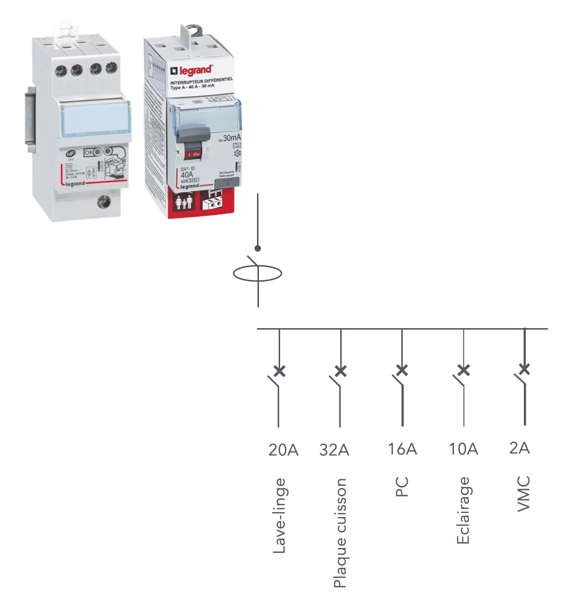

# CAP Elec 1.53 Dimensionnement tableau 4
## Foley Services Elec - [Programme 2ème partie](../2eme_partie/README.md)

### 1.53 Dimensionnement tableau 4

- **Accès à la vidéo** [1.53 Dimensionnement tableau 4](https://youtu.be/KVZfmLhppeQ)

#### Dimensionnement tableau (suite)

Parafoudre auto-protégé de Legrand, ne nécessite pas de disjoncteurs (pour le protéger),

- mais il est limité à une intensité max de 40A
- on peut donc viser une distribution de circuits typique comme sur la figure

Pour en savoir plus sur l'installation du parafoudre protégé monophasé de type 2, [voir aussi la vidéo (incluse dans la vidéo)](https://youtu.be/bPBI5mxx2j8?si=NGvlpFbEHyC5gkn3&t=146&t=141).