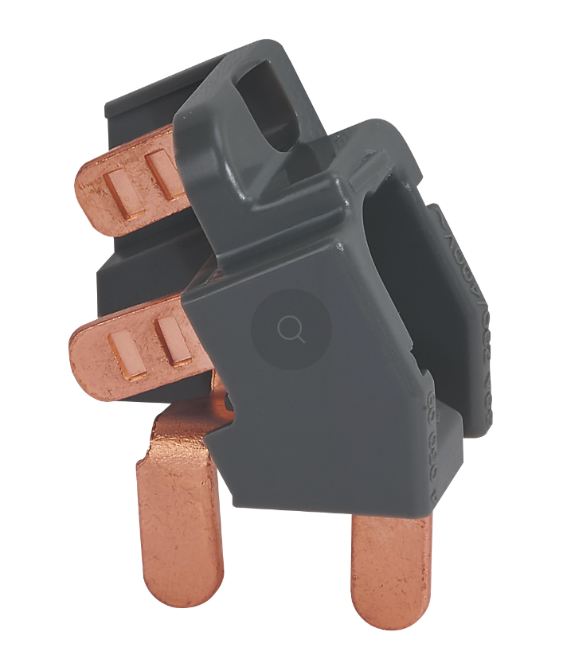

# CAP Elec 1.53 Bis maj parafoudre
## Foley Services Elec - [Programme 2ème partie](../2eme_partie/README.md)

### 1.53 Bis maj parafoudre

- **Accès à la vidéo** [1.53 Bis maj parafoudre](https://youtu.be/N7zTI1mvZ0o)

#### Parafoudre - mise-à-jour

Parafoudre auto-protégé de Legrand, ne nécessite pas de disjoncteurs (pour le protéger),

- il existe désormais un modèle avec intensité max de 63A ([voir notice Legrand](https://media.adeo.com/media/1542147/media.pdf) accessible depuis le site de Leroy-Merlin, par exmeple)
- on peut donc installer en aval un interrupteri différentel de 63A

- pratique aussi <a href="https://www.legrand.fr/catalogue/peigne-et-accessoires-de-raccordement/accessoire-de-raccordement-inter-differentiel-ou-parafoudre-63a-et-peigne-vertical" target="_blank">l'accessoire de raccordement</a> (connexion entre le peigne vertical (depuis AGCP) et le parafoudre)

