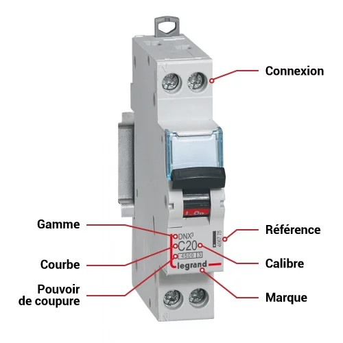
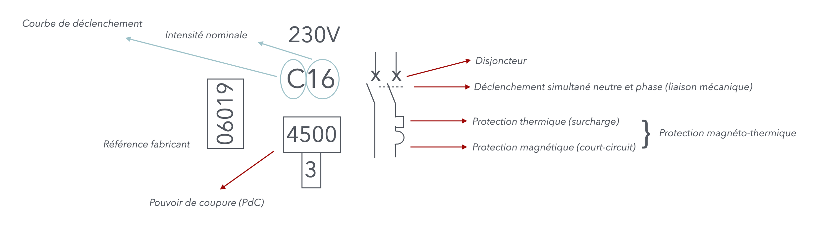
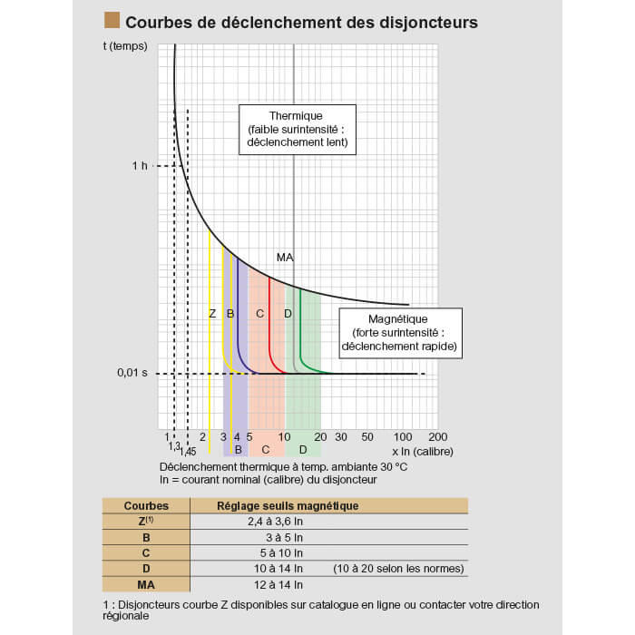

# CAP Elec 1.54 Pouvoir de coupure & courbes
## Foley Services Elec - [Programme 2ème partie](../2eme_partie/README.md)

### 1.54 Pouvoir de coupure & courbes

- **Accès à la vidéo** [1.54 Pouvoir de coupure & courbes](https://youtu.be/eCK39U4HOTg)

#### Informations Disjoncteur

Un court-circuit qui se produit en aval du disjoncteur va provoquer le passage d'un courant d'une très grande intensité dans le disjoncteur (typiquement, si un transformateur peut fournir 4500A dans un quartier, c'est l'intensité qu'un disjoncteur est susceptible de connaître).

Le *pouvoir de coupure* du disjoncteur est cette intensit maximale à laquelle il peut réagir et couper le circuit, sans être détruit.

Le pouvoir de coupure (PdC) doit donc toujours être au moins égale à l'intensité de court-circuit (ICC)

$$ICC \leq PdC$$

En domestique, en tarif bleu, on peut se baser sur un ICC de 3000A.

#### Courbe de déclenchement

Le schéma contieint à lui seule plusieurs courbes.

- La courbe noire indique le temps de déclenchement de la partie thermique du disjoncteur en fonction de l'intensité (exprime en fonction de l'intensité nominale du disjoncteur)
- La courbe de couleur (rouge = courbe des disjoncteurs de type C, vert = rouge = courbe des disjoncteurs de type D) indique le temps de déclenchement de la partie magnétique du disjoncteur -- qui prend donc le relais sur la partie thermique