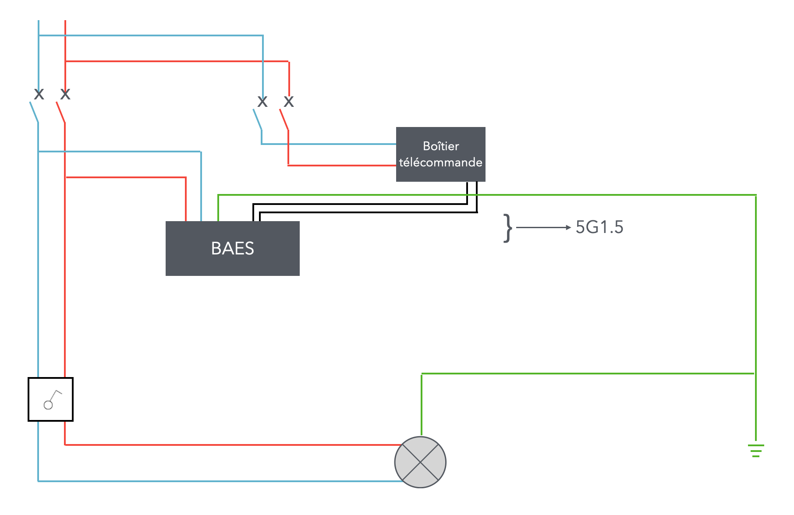

# CAP Elec 1.59 Éclairage de sécurité
## Foley Services Elec - [Programme 2ème partie](../2eme_partie/README.md)

### 1.59 Éclairage de sécurité

- **Accès à la vidéo** [1.59 Éclairage de sécurité](https://youtu.be/V8duOcuLCEs)

#### BAEH Bloc Autonome Eclairage Habitation
  - Imposé dans les habitations (résidence) ayant un certain nombre d'étages
  - Ces équipements sont de classe II (mais on y amène la terre quand même qu'on laisse en attente)
- Le dispositif comprend une (des) batterie(s) rechargeables, et un dispositif de surveilance de l'alimentation 230V
  - Dès lors que le BAEH n'est plus almenté, les ampoules du dispositif s'allument pour éclairer à minima
  - La norme impose que l'éclairage doit pouvoir tenir au ***minimum 5 heures***
- Le dispositif doit être alimenté en aval de la commande (mais en amont du disjoncteur du circuit pour lequel agit le BAEH) - voir Promotelec page 137 (édition 2022)

#### BAES Bloc Autonome Eclairage de Sécurité

Dans un établissement recevant du public (ERP) ou des travailleurs (ERT)

- Même logique de connexion du dispositif (en aval de la dernière protection et en aval de la commande)
- La norme impose que l'éclairage doit pouvoir tenir au ***minimum 1 heures***

On partage le BAES en deux catégories d'utilisation

- Evacuation ou balisage
- Un bloc doit être installé:
  -  Tous les 15 mètres
  -  Aux changements de direction
  -  A chaque sortie ou issue de secours
  -  A chaque obstacle
  -  A chaque changement de niveau (étage)
  -  Aux sorties des salles et locaux

**Question**. Et pour des pièces comme des salles de spectacle, salles des fêets, etc. qui font plus de 15m d'envergure ?

**Réponse**. On est pour l'instant sur des pièces de capacités réduites (20 personnes), une règlementation particulière s'applique pour les salles de psectacles etc.

#### Phare anti-panique

Typiquement au plafond d'une piscine publique, pour prévenir une situation où on se trouve dans l'obscurité et en milieu présentant un niveau de dangerosité.

Le bloc secours anti-panique présente un éclairage (pas seulement un balisage) -- cinéma, restaurant, etc.

- Cas simple, d'un commerce d'une surface modeste (30 m2, exemple du kebab), 10 m2 local employé, quelques tables, une seule entrée/sortie pour le public.
- Un seule bloc secours à installer, au-dessus de la porte d'entrée (à l'intérieur);
  - Eventuellement un second bloc secours si le local des employés a un accès autonome sur l'extérieur.

#### Technologies

- **Bloc bête**, son dispositif surveille l'alimentation 230V
  - Seul moyen de tester le dispositif, couper el disjoncteur d'alimentation, constater que l'éclairage de secours se met en marche
- **Bloc BAES SATI de base** (Système Automatique de Test Intégré)
- **Bloc BAES SATI** ***adressable***
  - On attribue une adresse unique au bloc, qui envoie l'information suite à chacun de ses auto-tests

- Bloc BAPI (Bloc Autonome Portatif d'Intervention)
  - Un spot dont on peut se saisir et le porter à la main pour circuler librement

### Télécommande de mise au repos

Scénario "petit papi"

- Scénario de changement d'ampoules dans une salle (des fêtes)
- Le(s) circuit(s) d'éclairage ets mis hors tension avant de changer l'ensemble des ampoules
  - Les blocs BAES se mettent en marche
  - L'intervetion dure plus que la durée pendant laquelle les blocs doivent restés allumés
  - Fin de l'intervention, les blocs se remettent en charge
- Cependant, si la salle est utilisée avant la remise en charge, il y a un risque de défaut du BAES en situation d'évacuation, et tous les risques et problèmes que cela peut entraîner

#### Solution: télécommande filaire

- La télécommande de mise au repos (boîtier) qui s'installe au niveau du tableau
  - Il est sur un disjoncteur (C2) distinct du circuit éclairage
  - Il permet d'envoyer un signal au BAES pour éviter qu'ils ne se mettent en marche

Le principe

- Le BAES s'allume suite à une coupure de son alimentation
  - On envoie un signal de mise au repos (via le boîtier)
- Imaginons un autre BAES, alimenté via un autre disjoncteur
  - Non concerné par la première coupure, il ne s'est pas allumé
  - Il n'a pas non plus réagi au signal de mise au repos (puisqu'il n'était pas en état de marche)
  - Si son circuit vient à être coupé, il s'allumera
  - On pourra envoyer un signal de mise au repos (envoyé à tous les blocs BAES du bâtiment), pour qu'il soti à son tour mis en repos

- A noter que le boitier télécommmande contient lui-même une pile (rechargeable), ce qui permet d'utiliser l'envoi du signal même lorsque la coupure se fait en amont du disjoncteur qui alimente le boitier.

- A noter que courant fort et courant fiable sont transportés dans un memecâble (non recommandé) (voir figure)
  - En effet, si on utilise un 5G1.5 pour rassembler l'ensemble des fil snécessaire au montage (phase neutre pour le bloc BAES, noir/gris pour les bornes +/- du boitier de télécommande + vert-jaune pour la terre

  ### Source centralisée
  
  Système d'éclairage de sécurité centralisé
  
  Cas de l'éclairage des arches du chateau (ancienne chapelle converti en chai), voir fin de la video