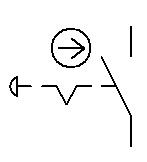

# CAP Elec 1.66 Arrêt d’urgence 1 et &amp; mt
## Foley Services Elec - [Programme 2ème partie](../2eme_partie/README.md)

### 1.66 Arrêt d’urgence 1 et &amp; mt

- **Accès à la vidéo** [1.66 Arrêt d’urgence 1 et &amp; mt](https://youtu.be/nefQDojra7Y)

#### Arrêt d'urgence par contacteur

Symboles pour désigner un contacteur , ou encore  

Si le symbole comporte une clé, c'est qu'il faut une clé pour réenclencher le circuit.

On trouve ces systèmes dans les anciennes installations. Leur défaut: une bobine qui est alimentée en permanence, qui avec le temps doit être changée.

Leur installation est aujourd'hui _déconseillée_.

#### Arrêt d'urgence par émission de tension (ET) -- bobine mx

Tout disjoncteur possède une petite cavité sur le côté, qui permet de forcer (très facilement) l'ouverture du circuit.

Il existe un appareil qui vient se poser contre le disjoncteur et qui insère une pièce dans le logement, qui lorsque l'émetteur est activé, "force" l'ouverture du circuit:

- Un bloc dispositif d'urgence qui vient se bloquer contre le disjoncteur: une *émmetteur de tension*  (anciennement on parlait de "bobine mx")

Exemple de montage qui, à l'aide d'un émmetteur de tension, et d'un contacteur "coup de poing", de couper une partie des circuits d'une installation. Sur le schéma, l'activation de l'émetteur (via la fermeture du circuit prpovoqué par l'activation du contacteur), coupe les circuits "plaque de cuisson", "four" et "PC" (cuisine, par exmeple), sans couper les autres circuits.

On peut installer les contacteur d'arrêt d'urgence en parallèle pour actionner l'émeytteur de tension depuis plusieurs endroits (à proximité des portes d'accès d'une même pièce, par exemple).

#### Arrêt d'urgence par minimum (ou manque) de tension (MT) -- bobine mn

Cette fois, la bobine est alimentée en permanence et provoque un *manque* de tension lorsque le circuit est *ouvert* (et déclenche au niveau du tableau le dispositif qui ouvre le circuit).

Par conséquent, si on installe plusieurs contacteur coup de poing, *il faut les brancher en série*.

#### Avantages/Inconvénients des deux approches

Inconvénient MT:

- Le dispositif minimum de tension peut être ajusté pour ne pas être sensible aux micro-coupures. (S'il était instantané, la micro-coupure provoquerait l'ouverture du circuit). On peut donc régler la sensibilité du dispositif, qui se mesure en ms (millisecondes).

Avantage MT:

- Si par mégarde, l'un des contacteurs est mal connectés, mauvais branchements, câble abîmés, etc. on ne porura pas enclenché le général (puisque les contacteurs sotn branchés en série).

#### Arrêt d'urgence par émission de tension (ET) avec deux voyants (vert/rouge)

Les deux voyants pour indiquer si le dispositif est en fonction (prêt à être déclenché) ou déclenché (et nécessitant d'être réarmé, par exemple).

- Dans ce cas, parce que la pression coup de poing ouvre le circuit, les voyants ne peuvent pas être aliemntés par celui-ci, mais doivent être alimentés en amont du cricuit qui sera coupé par le dispositif.

- L'utilisation d'un contact auxilliaire permet de simuler un "effet va-et-vient" entre les deux voyants.

***Remarque importante***. Le câble alimentant les voyants restent sous tension même après la coupure "générale" (soir par coup de poing, soit manuellement).