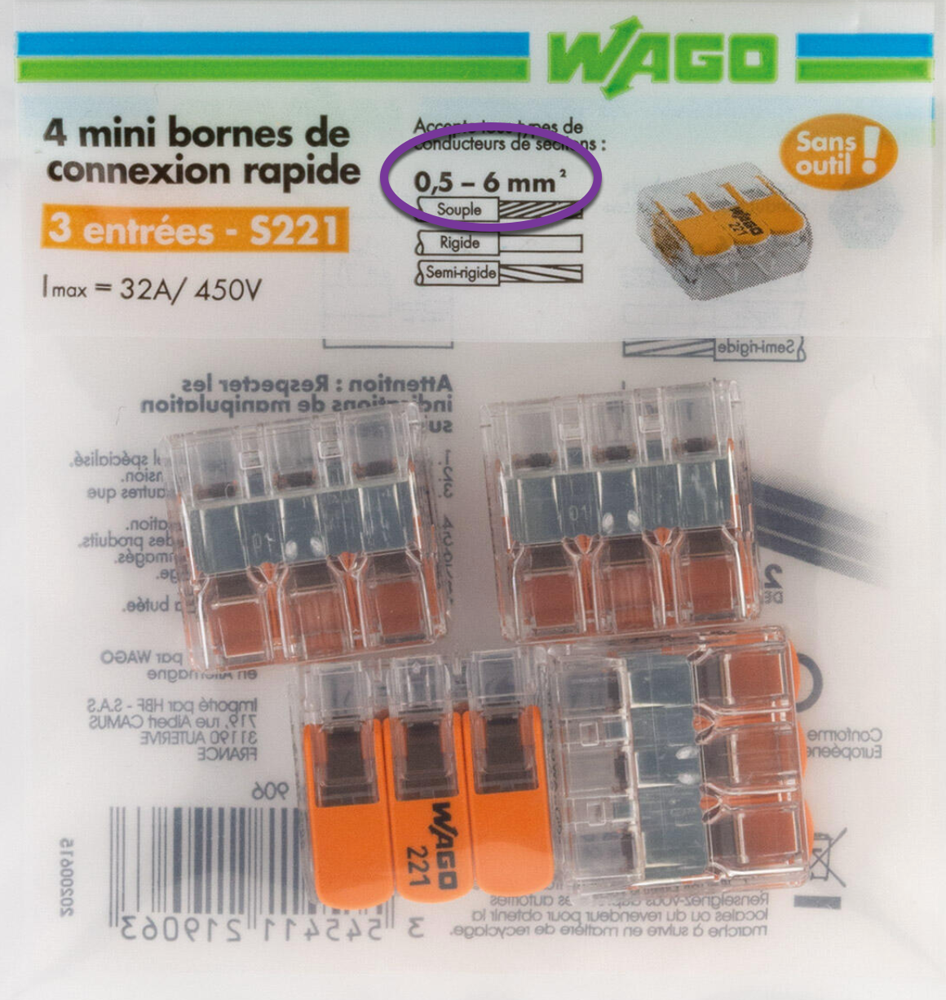

# CAP Elec 1.67 Arrêt d’urgence 2 mnx
## Foley Services Elec - [Programme 2ème partie](../2eme_partie/README.md)

### 1.67 Arrêt d’urgence 2 mnx

- **Accès à la vidéo** [1.67 Arrêt d’urgence 2 mnx](https://youtu.be/dvejGrUoQ3c)

#### Arrêt d'urgence mnx

Le cas d'une recharge de véhicule électrique.

La bobine inclut deux dispositifs, minimum de tension et émission de tension.

Remarque. Le dispositif de recharge est câblé en 6mm2 alors que l'appareil mnx doit être câblé en 1.5G. Il faut alors utiliser un appareil permettant de raccorder le câble 6mm2 à un câble 1.5mm2 (puisque la bobine ets alimenté en aval du dispositif de coupre, donc sur le même circuit que le chargeur (wago, par exemple).

