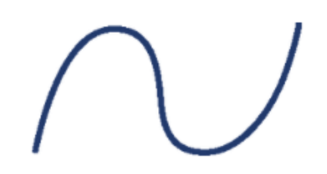
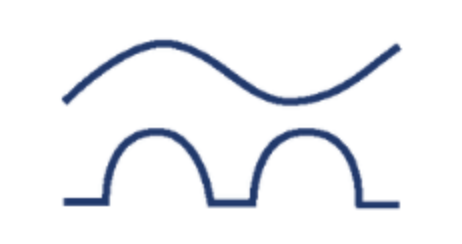
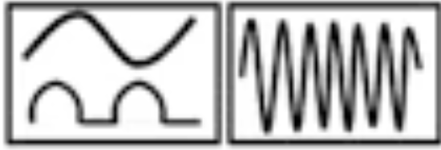
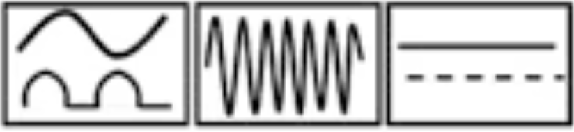

# CAP Elec 1.70 Types de différentiels
## Foley Services Elec - [Programme 2ème partie](../2eme_partie/README.md)

### 1.70 Types de différentiels

- **Accès à la vidéo** [1.70 Types de différentiels](https://youtu.be/NNVNwgB-Tfo)

#### Types de différentiels (rappels)

- Type AC (classique) adapté au courant alternatif, d'où le symbole d'onde apposé sur ce type d'appareil 
- Type A adapté au courant alternatif, et au courant continu pulsé d'où le symbole d'une onde tronquée (et aussi de l'onde du type AC) apposé sur ce type d'appareil 
- Type F adapté au courant alternatif, courant continu pulsé et aussi aux courants à haute fréquence (induits par les appareils électroniques), d'où le symbole d'une onde à fréquence élevée apposé sur ce type d'appareil 
  - Ils détectent les fréquence jusqu'à 1 KHz (alors que le courant alternatif classique suit une fréquence de 50 Hz.
- Type B qui détecte aussi les défauts en courant continu, d'où le symbole d'un trait long pointillé/continu apposé sur ce type d'appareil 

Voir Promotelec, pages 233 - 234.
